# Полный список всех затмений XXI века с картинками

## Описание

Главная цель данного списка - показать на картинках в каких местах земного шара произойдут или уже произошли все солнечные затмения в XXI веке. Так же здесь написано время стадий затмения и координаты, где можно наблюдать наибольшее затмение. Остальную информацию можно найти на [Википедии](https://ru.wikipedia.org/wiki/%D0%A1%D0%BE%D0%BB%D0%BD%D0%B5%D1%87%D0%BD%D1%8B%D0%B5_%D0%B7%D0%B0%D1%82%D0%BC%D0%B5%D0%BD%D0%B8%D1%8F_XXI_%D0%B2%D0%B5%D0%BA%D0%B0). Данные здесь и на Вики могут немного отличаться.

На изображении `синим` показаны места, где солнечное затмение будет полным. `Красным` - где будет хотя бы малейшая тень от луны. `Крестиком` показана Москва.

Все картинки и информация о затмении получены благодаря программе [StarCalc](http://homes.relex.ru/~zalex/main1251.htm) и [плагину солнечных затмений](http://homes.relex.ru/~zalex/files/sun.zip) к этой программе.

[Удобный поиск по затмениям здесь.](#Ссылки)

[Удобный поиск по затмениям здесь.](#Ссылки)

[Удобный поиск по затмениям здесь.](#Ссылки)

[Удобный поиск по затмениям здесь.](#Ссылки)

## Частное солнечное затмение `5 февраля 2000г`.

|||
|-|-|
| Начало частного затмения | `10:55:58 UTC` |
| Максимальная фаза | `12:49:21 UTC` |
| Конец частного затмения | `14:43:0 UTC` |

**Наибольшее затмение:**

| Долгота: | Широта: |
|-|-|
| `134° 10.0' Вос.` | `70° 20.4' Южн.` |

## Частное солнечное затмение `1 июля 2000г`.

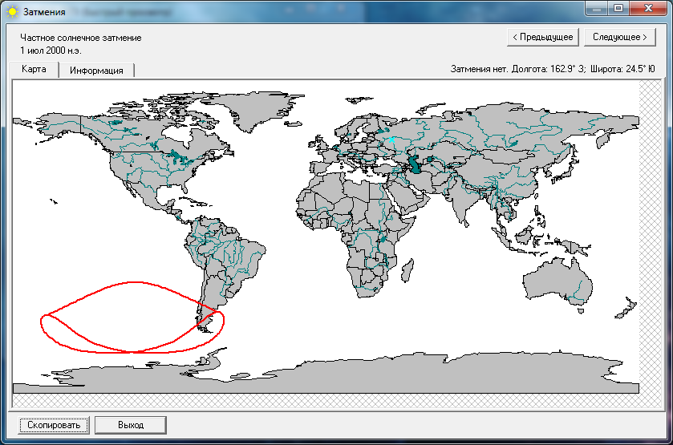

|||
|-|-|
| Начало частного затмения | `18:7:19 UTC` |
| Максимальная фаза | `19:32:29 UTC` |
| Конец частного затмения | `20:57:40 UTC` |

**Наибольшее затмение:**

| Долгота: | Широта: |
|-|-|
| `109° 27.3' Зап.` | `67° 4.3' Южн.` |

## Частное солнечное затмение `31 июля 2000г`.

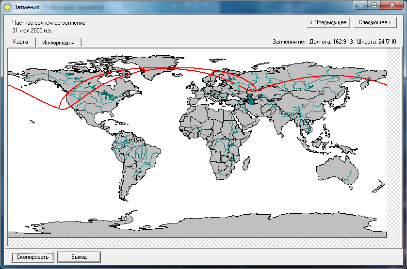

|||
|-|-|
| Начало частного затмения | `0:37:40 UTC` |
| Максимальная фаза | `2:13:3 UTC` |
| Конец частного затмения | `3:48:42 UTC` |

**Наибольшее затмение:**

| Долгота: | Широта: |
|-|-|
| `59° 50.8' Зап.` | `69° 39.3' Сев.` |

## Частное солнечное затмение `25 декабря 2000г`.

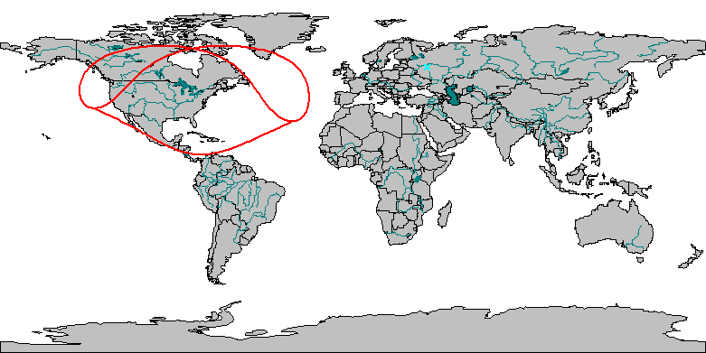

|||
|-|-|
| Начало частного затмения | `15:26:46 UTC` |
| Максимальная фаза | `17:34:48 UTC` |
| Конец частного затмения | `19:42:59 UTC` |

**Наибольшее затмение:**

| Долгота: | Широта: |
|-|-|
| `74° 6.1' Зап.` | `66° 28.7' Сев.` |

## Полное солнечное затмение `21 июня 2001г`.

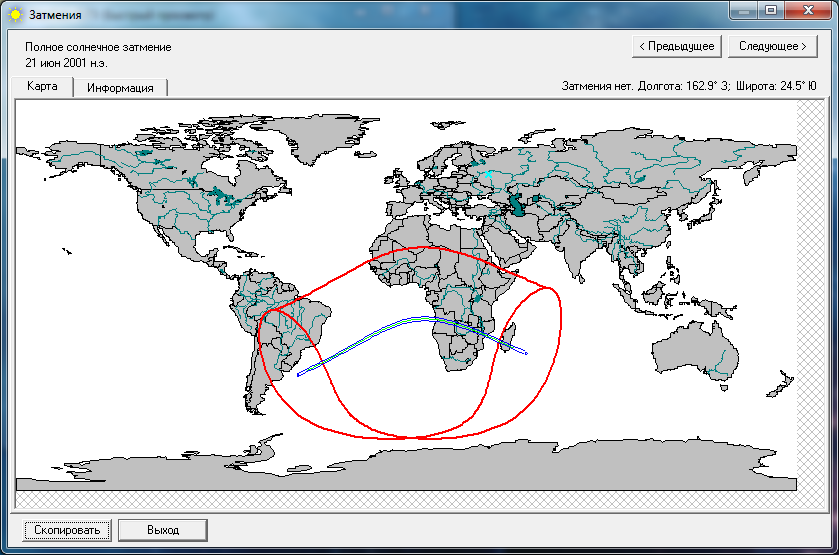

|||
|-|-|
| Начало частного затмения | `9:33:3 UTC` |
| Начало полного затмения | `10:35:55 UTC` |
| Максимальная фаза | `12:3:42 UTC` |
| Конец полного затмения | `13:31:35 UTC` |
| Конец частного затмения | `14:34:21 UTC` |

**Наибольшее затмение:**

| Долгота: | Широта: |
|-|-|
| `2° 45.0' Вос.` | `11° 15.8' Южн.` |

## Кольцеобразное солнечное затмение `14 декабря 2001г`.

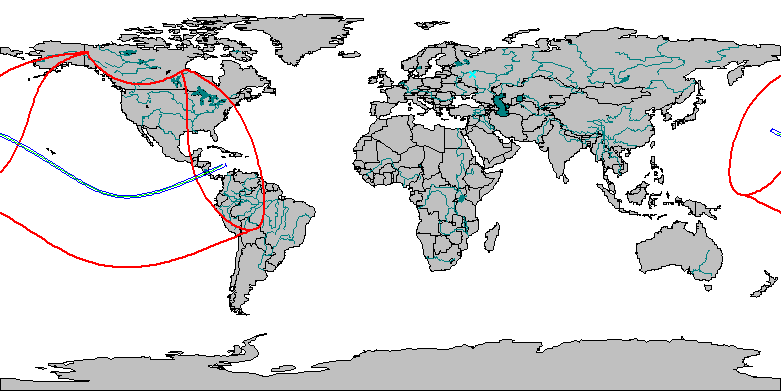

|||
|-|-|
| Начало частного затмения | `18:3:17 UTC` |
| Начало полного затмения | `19:8:5 UTC` |
| Максимальная фаза | `20:51:51 UTC` |
| Конец полного затмения | `22:35:45 UTC` |
| Конец частного затмения | `23:40:36 UTC` |

**Наибольшее затмение:**

| Долгота: | Широта: |
|-|-|
| `130° 40.5' Зап.` | `0° 38.5' Сев.` |

## Кольцеобразное солнечное затмение `10 - 11 июня 2002г`.

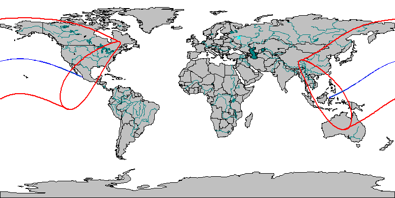

|||
|-|-|
| Начало частного затмения | `20:51:46 UTC` |
| Начало полного затмения | `21:53:48 UTC` |
| Максимальная фаза | `23:44:14 UTC` |
| Конец полного затмения | `1:34:33 UTC` |
| Конец частного затмения | `2:36:33 UTC` |

**Наибольшее затмение:**

| Долгота: | Широта: |
|-|-|
| `178° 35.9' Зап.` | `34° 32.5' Сев.` |

## Полное солнечное затмение `4 декабря 2002г`.

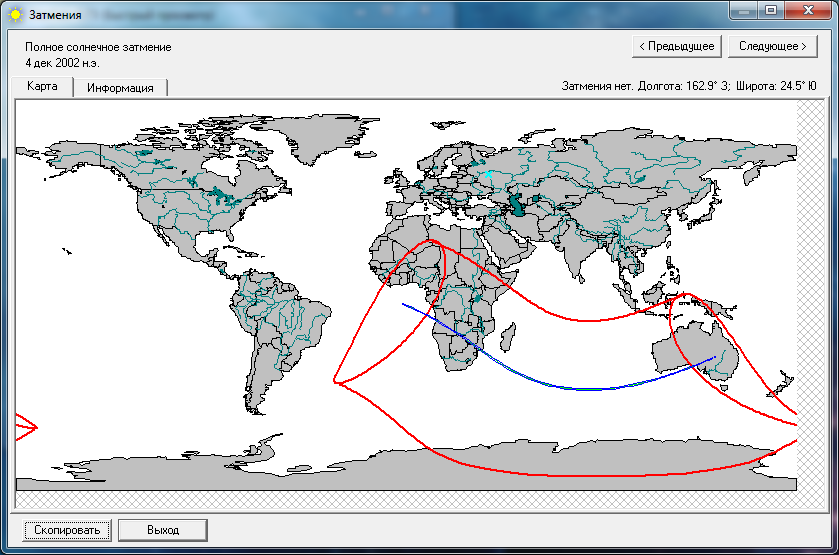

|||
|-|-|
| Начало частного затмения | `4:51:18 UTC` |
| Начало полного затмения | `5:50:13 UTC` |
| Максимальная фаза | `7:31:7 UTC` |
| Конец полного затмения | `9:11:54 UTC` |
| Конец частного затмения | `10:10:55 UTC` |

**Наибольшее затмение:**

| Долгота: | Широта: |
|-|-|
| `59° 35.0' Вос.` | `39° 26.4' Южн.` |

## Кольцеобразное солнечное затмение `31 мая 2003г`.

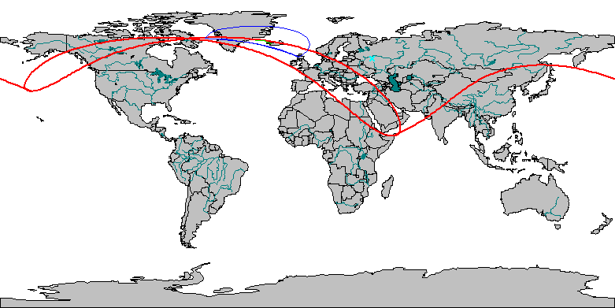

|||
|-|-|
| Начало частного затмения | `1:46:15 UTC` |
| Начало полного затмения | `3:45:1 UTC` |
| Максимальная фаза | `4:8:12 UTC` |
| Конец полного затмения | `4:31:2 UTC` |
| Конец частного затмения | `6:29:46 UTC` |

**Наибольшее затмение:**

| Долгота: | Широта: |
|-|-|
| `25° 1.3' Зап.` | `66° 14.4' Сев.` |

## Полное солнечное затмение `23 - 24 ноября 2003г`.

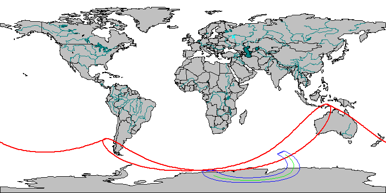

|||
|-|-|
| Начало частного затмения | `20:46:3 UTC` |
| Начало полного затмения | `22:19:6 UTC` |
| Максимальная фаза | `22:49:16 UTC` |
| Конец полного затмения | `23:19:5 UTC` |
| Конец частного затмения | `0:52:8 UTC` |

**Наибольшее затмение:**

| Долгота: | Широта: |
|-|-|
| `88° 42.3' Вос.` | `72° 42.3' Южн.` |

## Частное солнечное затмение `19 апреля 2004г`.

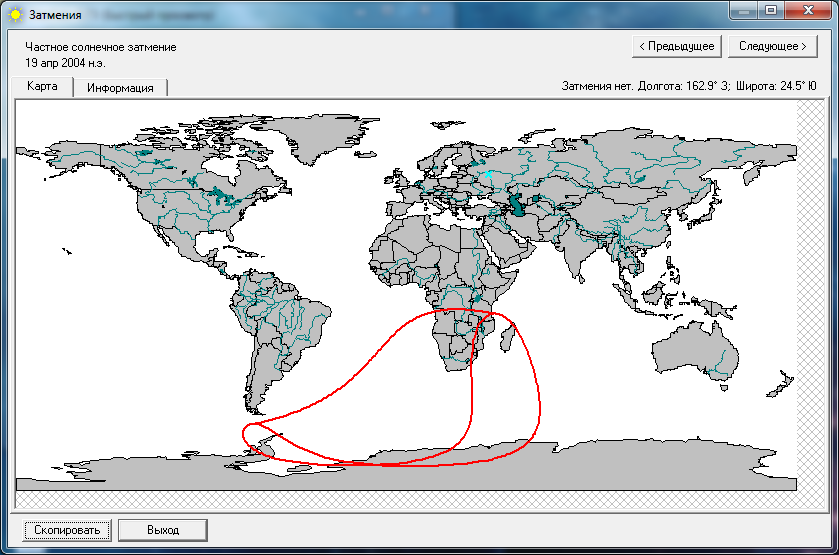

|||
|-|-|
| Начало частного затмения | `11:30:5 UTC` |
| Максимальная фаза | `13:33:56 UTC` |
| Конец частного затмения | `15:38:31 UTC` |

**Наибольшее затмение:**

| Долгота: | Широта: |
|-|-|
| `44° 21.2' Вос.` | `61° 45.2' Южн.` |

## Частное солнечное затмение `14 октября 2004г`.

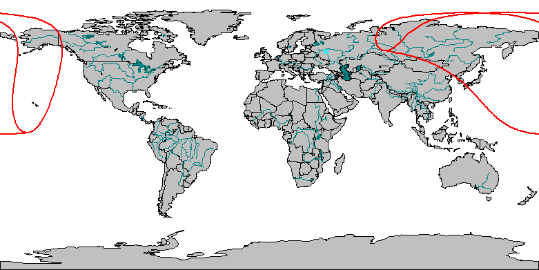

|||
|-|-|
| Начало частного затмения | `0:54:46 UTC` |
| Максимальная фаза | `2:59:11 UTC` |
| Конец частного затмения | `5:4:8 UTC` |

**Наибольшее затмение:**

| Долгота: | Широта: |
|-|-|
| `153° 36.0' Зап.` | `61° 24.8' Сев.` |

## Полное солнечное затмение `8 апреля 2005г`.

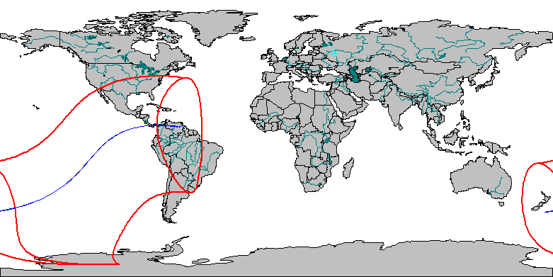

|||
|-|-|
| Начало частного затмения | `17:51:16 UTC` |
| Начало полного затмения | `18:53:19 UTC` |
| Максимальная фаза | `20:35:39 UTC` |
| Конец полного затмения | `22:18:15 UTC` |
| Конец частного затмения | `23:20:20 UTC` |

**Наибольшее затмение:**

| Долгота: | Широта: |
|-|-|
| `118° 57.4' Зап.` | `10° 33.5' Южн.` |

## Кольцеобразное солнечное затмение `3 октября 2005г`.

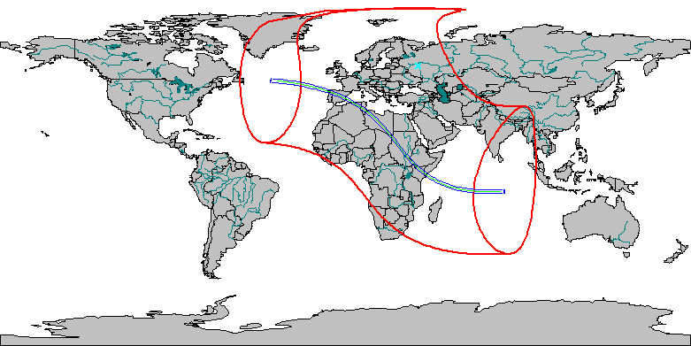

|||
|-|-|
| Начало частного затмения | `7:35:33 UTC` |
| Начало полного затмения | `8:40:54 UTC` |
| Максимальная фаза | `10:31:35 UTC` |
| Конец полного затмения | `12:22:26 UTC` |
| Конец частного затмения | `13:27:44 UTC` |

**Наибольшее затмение:**

| Долгота: | Широта: |
|-|-|
| `28° 46.6' Вос.` | `12° 53.9' Сев.` |

## Полное солнечное затмение `29 марта 2006г`.

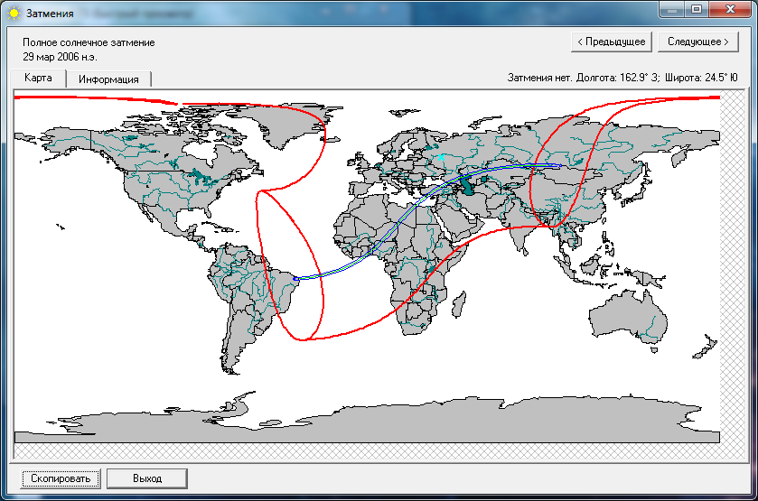

|||
|-|-|
| Начало частного затмения | `7:36:44 UTC` |
| Начало полного затмения | `8:34:18 UTC` |
| Максимальная фаза | `10:11:12 UTC` |
| Конец полного затмения | `11:47:52 UTC` |
| Конец частного затмения | `12:45:30 UTC` |

**Наибольшее затмение:**

| Долгота: | Широта: |
|-|-|
| `16° 46.1' Вос.` | `23° 9.6' Сев.` |

## Кольцеобразное солнечное затмение `22 сентября 2006г`.

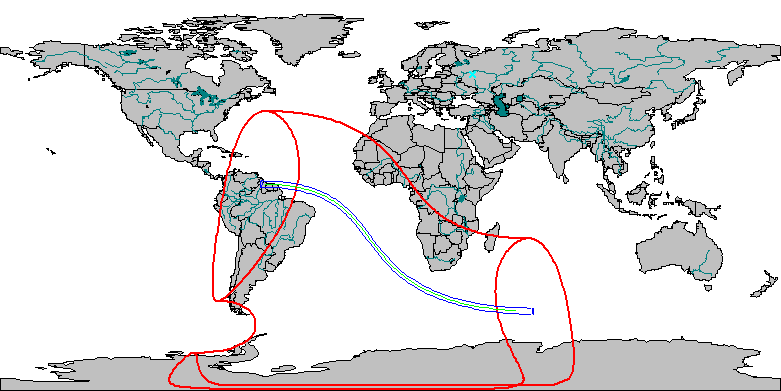

|||
|-|-|
| Начало частного затмения | `8:39:50 UTC` |
| Начало полного затмения | `9:48:26 UTC` |
| Максимальная фаза | `11:40:3 UTC` |
| Конец полного затмения | `13:31:25 UTC` |
| Конец частного затмения | `14:40:0 UTC` |

**Наибольшее затмение:**

| Долгота: | Широта: |
|-|-|
| `9° 2.3' Зап.` | `20° 38.6' Южн.` |

## Частное солнечное затмение `19 марта 2007г`.

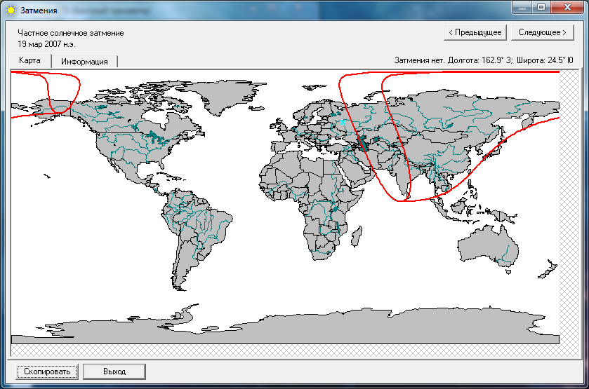

|||
|-|-|
| Начало частного затмения | `0:38:15 UTC` |
| Максимальная фаза | `2:31:44 UTC` |
| Конец частного затмения | `4:24:33 UTC` |

**Наибольшее затмение:**

| Долгота: | Широта: |
|-|-|
| `55° 25.9' Вос.` | `61° 12.8' Сев.` |

## Частное солнечное затмение `11 сентября 2007г`.

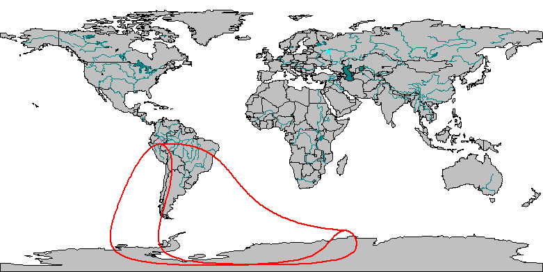

|||
|-|-|
| Начало частного затмения | `10:25:37 UTC` |
| Максимальная фаза | `12:31:12 UTC` |
| Конец частного затмения | `14:36:8 UTC` |

**Наибольшее затмение:**

| Долгота: | Широта: |
|-|-|
| `90° 17.2' Зап.` | `61° 10.0' Южн.` |

## Кольцеобразное солнечное затмение `7 февраля 2008г`.

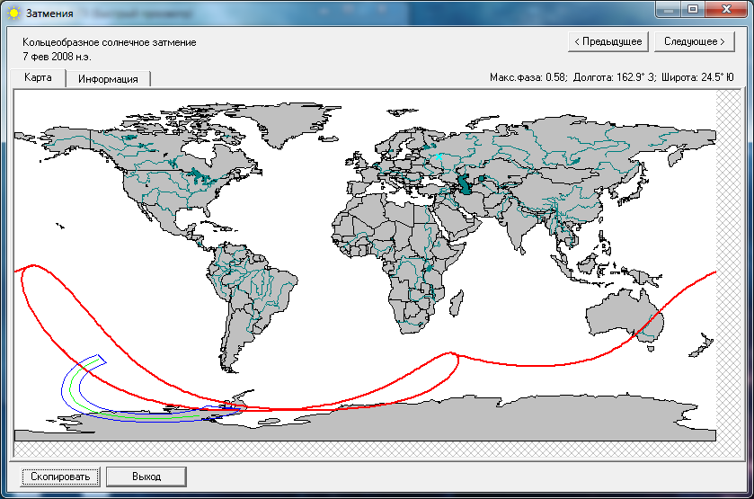

|||
|-|-|
| Начало частного затмения | `1:38:30 UTC` |
| Начало полного затмения | `3:19:38 UTC` |
| Максимальная фаза | `3:54:56 UTC` |
| Конец полного затмения | `4:30:39 UTC` |
| Конец частного затмения | `6:11:44 UTC` |

**Наибольшее затмение:**

| Долгота: | Широта: |
|-|-|
| `150° 31.3' Зап.` | `67° 34.5' Южн.` |

## Полное солнечное затмение `1 августа 2008г`.

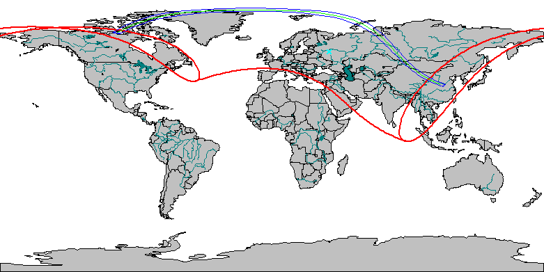

|||
|-|-|
| Начало частного затмения | `8:4:3 UTC` |
| Начало полного затмения | `9:20:54 UTC` |
| Максимальная фаза | `10:20:55 UTC` |
| Конец полного затмения | `11:21:17 UTC` |
| Конец частного затмения | `12:38:14 UTC` |

**Наибольшее затмение:**

| Долгота: | Широта: |
|-|-|
| `72° 21.2' Вос.` | `65° 39.1' Сев.` |

## Кольцеобразное солнечное затмение `26 января 2009г`.

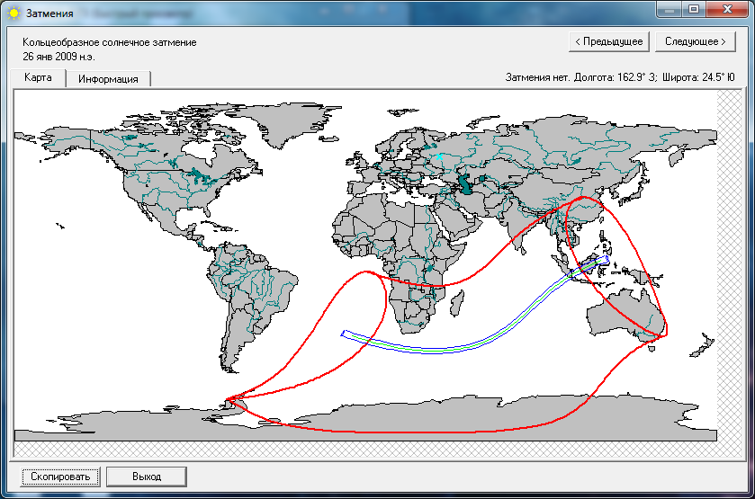

|||
|-|-|
| Начало частного затмения | `4:56:31 UTC` |
| Начало полного затмения | `6:2:31 UTC` |
| Максимальная фаза | `7:58:30 UTC` |
| Конец полного затмения | `9:54:33 UTC` |
| Конец частного затмения | `11:0:32 UTC` |

**Наибольшее затмение:**

| Долгота: | Широта: |
|-|-|
| `70° 16.5' Вос.` | `34° 3.8' Южн.` |

## Полное солнечное затмение `21 - 22 июля 2009г`.

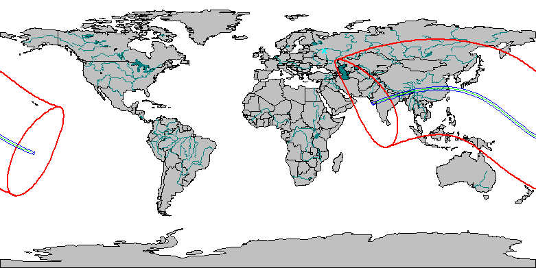

|||
|-|-|
| Начало частного затмения | `23:58:7 UTC` |
| Начало полного затмения | `0:51:3 UTC` |
| Максимальная фаза | `2:35:8 UTC` |
| Конец полного затмения | `4:19:15 UTC` |
| Конец частного затмения | `5:12:12 UTC` |

**Наибольшее затмение:**

| Долгота: | Широта: |
|-|-|
| `144° 10.1' Вос.` | `24° 13.0' Сев.` |

## Кольцеобразное солнечное затмение `15 января 2010г`.

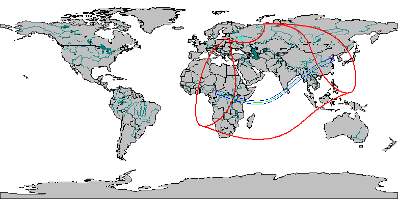

|||
|-|-|
| Начало частного затмения | `4:5:16 UTC` |
| Начало полного затмения | `5:13:45 UTC` |
| Максимальная фаза | `7:6:21 UTC` |
| Конец полного затмения | `8:58:50 UTC` |
| Конец частного затмения | `10:7:20 UTC` |

**Наибольшее затмение:**

| Долгота: | Широта: |
|-|-|
| `69° 20.9' Вос.` | `1° 37.2' Сев.` |

## Полное солнечное затмение `11 июля 2010г`.

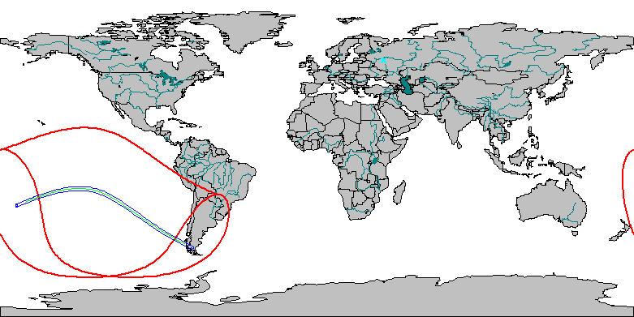

|||
|-|-|
| Начало частного затмения | `17:9:28 UTC` |
| Начало полного затмения | `18:15:1 UTC` |
| Максимальная фаза | `19:33:21 UTC` |
| Конец полного затмения | `20:51:32 UTC` |
| Конец частного затмения | `21:57:0 UTC` |

**Наибольшее затмение:**

| Долгота: | Широта: |
|-|-|
| `121° 49.5' Зап.` | `19° 45.2' Южн.` |

## Частное солнечное затмение `4 января 2011г`.

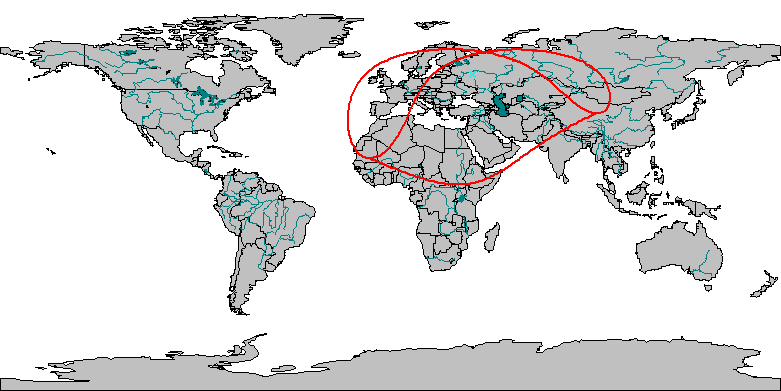

|||
|-|-|
| Начало частного затмения | `6:40:2 UTC` |
| Максимальная фаза | `8:50:22 UTC` |
| Конец частного затмения | `11:0:32 UTC` |

**Наибольшее затмение:**

| Долгота: | Широта: |
|-|-|
| `20° 49.8' Вос.` | `64° 48.0' Сев.` |

## Частное солнечное затмение `1 июня 2011г`.

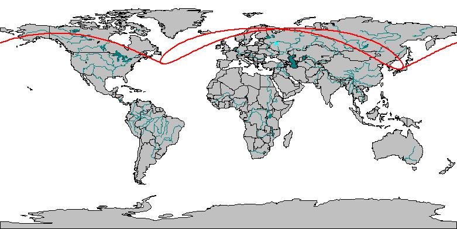

|||
|-|-|
| Начало частного затмения | `19:25:17 UTC` |
| Максимальная фаза | `21:15:59 UTC` |
| Конец частного затмения | `23:6:32 UTC` |

**Наибольшее затмение:**

| Долгота: | Широта: |
|-|-|
| `46° 50.2' Вос.` | `67° 55.0' Сев.` |

## Частное солнечное затмение `1 июля 2011г`.

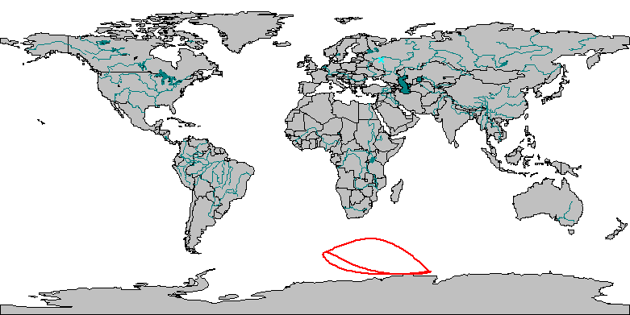

|||
|-|-|
| Начало частного затмения | `7:54:5 UTC` |
| Максимальная фаза | `8:38:14 UTC` |
| Конец частного затмения | `9:22:0 UTC` |

**Наибольшее затмение:**

| Долгота: | Широта: |
|-|-|
| `28° 39.5' Вос.` | `65° 18.2' Южн.` |

## Частное солнечное затмение `25 ноября 2011г`.

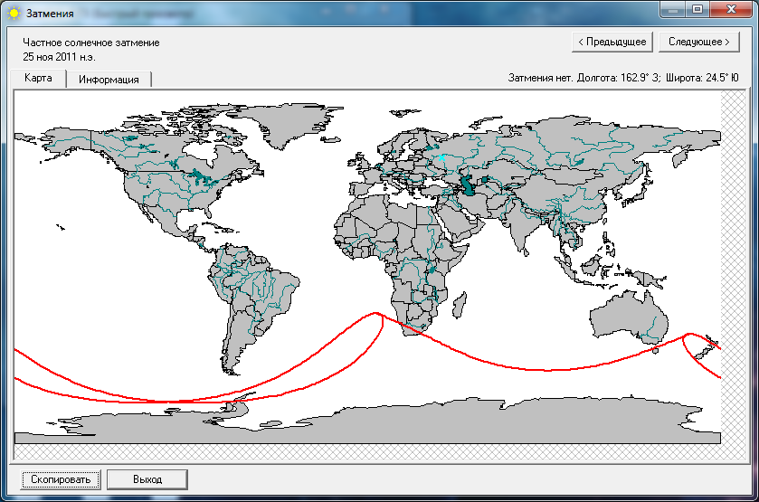

|||
|-|-|
| Начало частного затмения | `4:23:12 UTC` |
| Максимальная фаза | `6:20:6 UTC` |
| Конец частного затмения | `8:16:55 UTC` |

**Наибольшее затмение:**

| Долгота: | Широта: |
|-|-|
| `82° 23.6' Зап.` | `68° 41.9' Южн.` |

## Кольцеобразное солнечное затмение `20 - 21 мая 2012г`.

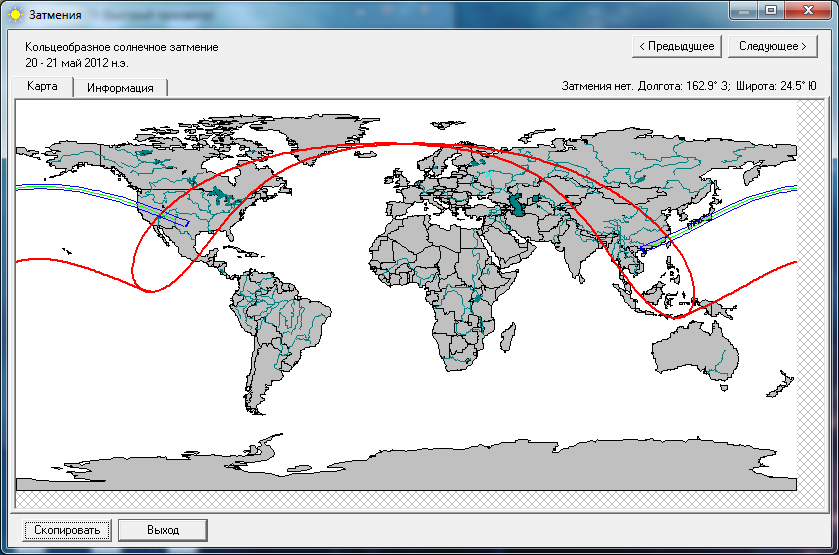

|||
|-|-|
| Начало частного затмения | `20:55:54 UTC` |
| Начало полного затмения | `22:6:5 UTC` |
| Максимальная фаза | `23:52:33 UTC` |
| Конец полного затмения | `1:38:56 UTC` |
| Конец частного затмения | `2:49:6 UTC` |

**Наибольшее затмение:**

| Долгота: | Широта: |
|-|-|
| `176° 20.7' Вос.` | `49° 5.2' Сев.` |

## Полное солнечное затмение `13 - 14 ноября 2012г`.

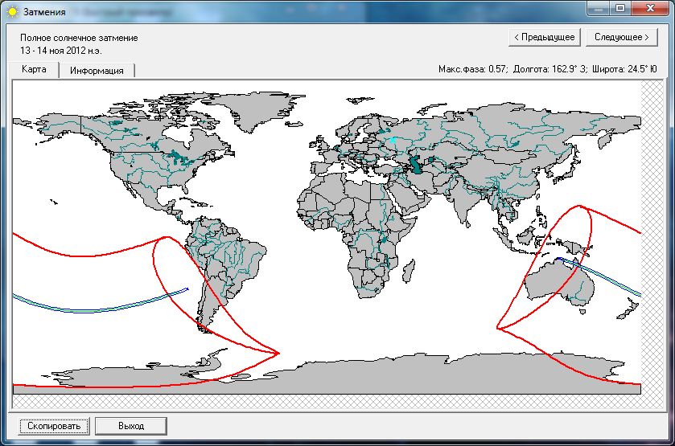

|||
|-|-|
| Начало частного затмения | `19:37:48 UTC` |
| Начало полного затмения | `20:34:58 UTC` |
| Максимальная фаза | `22:11:38 UTC` |
| Конец полного затмения | `23:48:14 UTC` |
| Конец частного затмения | `0:45:21 UTC` |

**Наибольшее затмение:**

| Долгота: | Широта: |
|-|-|
| `161° 17.4' Зап.` | `39° 59.3' Южн.` |

## Кольцеобразное солнечное затмение `9 - 10 мая 2013г`.

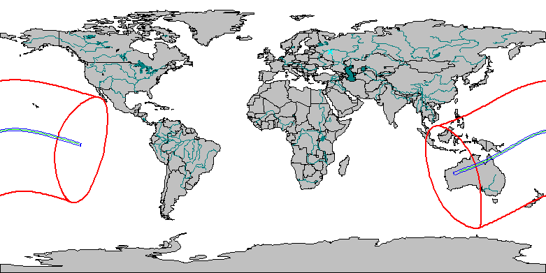

|||
|-|-|
| Начало частного затмения | `21:24:59 UTC` |
| Начало полного затмения | `22:30:24 UTC` |
| Максимальная фаза | `0:25:0 UTC` |
| Конец полного затмения | `2:19:44 UTC` |
| Конец частного затмения | `3:25:10 UTC` |

**Наибольшее затмение:**

| Долгота: | Широта: |
|-|-|
| `175° 31.8' Вос.` | `2° 12.7' Сев.` |

## Полное солнечное затмение `3 ноября 2013г`.

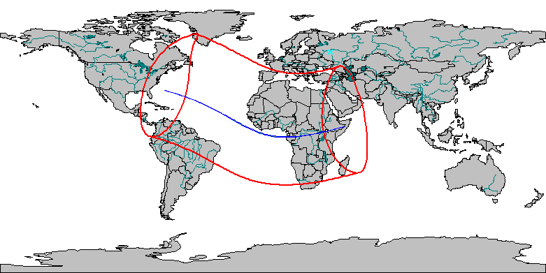

|||
|-|-|
| Начало частного затмения | `10:4:24 UTC` |
| Начало полного затмения | `11:5:7 UTC` |
| Максимальная фаза | `12:46:18 UTC` |
| Конец полного затмения | `14:27:34 UTC` |
| Конец частного затмения | `15:28:11 UTC` |

**Наибольшее затмение:**

| Долгота: | Широта: |
|-|-|
| `11° 38.8' Зап.` | `3° 28.3' Сев.` |

## Нецентральное кольцеобразное солнечное затмение `29 апреля 2014г`.

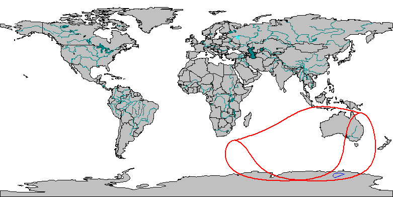

|||
|-|-|
| Начало частного затмения | `3:52:37 UTC` |
| Начало полного затмения | `5:58:36 UTC` |
| Максимальная фаза | `6:3:12 UTC` |
| Конец полного затмения | `6:8:10 UTC` |
| Конец частного затмения | `8:14:12 UTC` |

**Наибольшее затмение:**

| Долгота: | Широта: |
|-|-|
| `131° 21.1' Вос.` | `70° 45.9' Южн.` |

## Частное солнечное затмение `23 октября 2014г`.

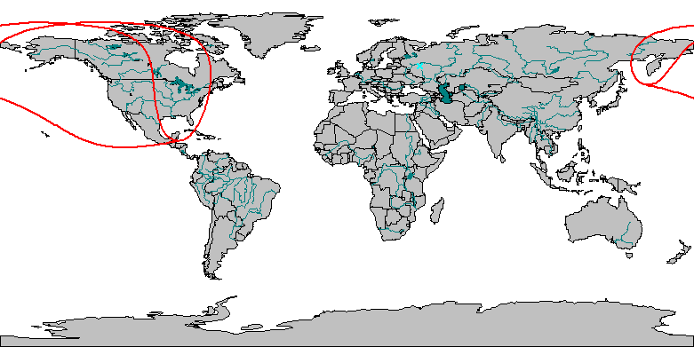

|||
|-|-|
| Начало частного затмения | `19:37:29 UTC` |
| Максимальная фаза | `21:44:17 UTC` |
| Конец частного затмения | `23:51:23 UTC` |

**Наибольшее затмение:**

| Долгота: | Широта: |
|-|-|
| `97° 3.8' Зап.` | `71° 17.2' Сев.` |

## Полное солнечное затмение `20 марта 2015г`.

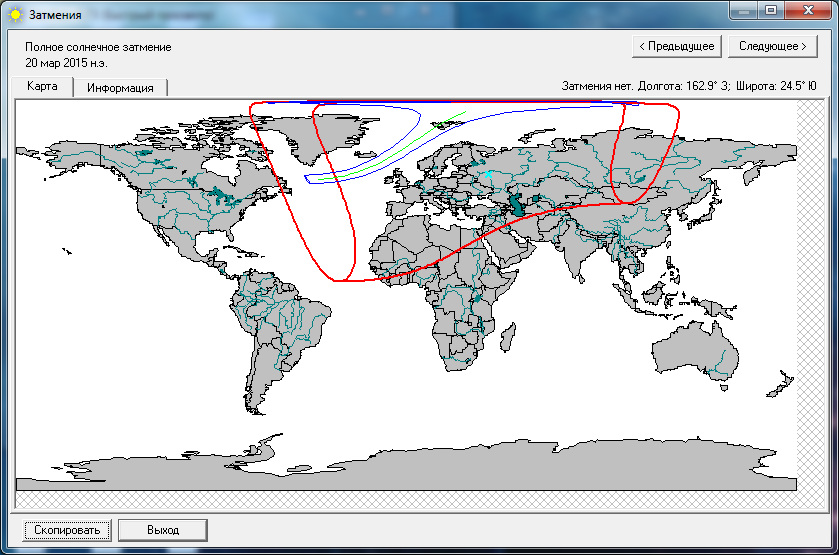

|||
|-|-|
| Начало частного затмения | `7:40:40 UTC` |
| Начало полного затмения | `9:9:13 UTC` |
| Максимальная фаза | `9:45:26 UTC` |
| Конец полного затмения | `10:21:16 UTC` |
| Конец частного затмения | `11:49:51 UTC` |

**Наибольшее затмение:**

| Долгота: | Широта: |
|-|-|
| `6° 32.1' Зап.` | `64° 24.6' Сев.` |

## Частное солнечное затмение `13 сентября 2015г`.

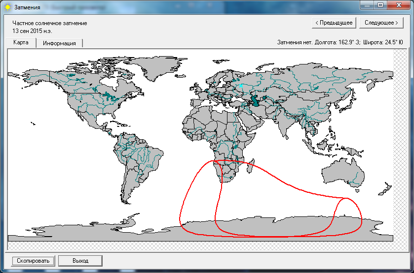

|||
|-|-|
| Начало частного затмения | `4:41:33 UTC` |
| Максимальная фаза | `6:53:58 UTC` |
| Конец частного затмения | `9:5:55 UTC` |

**Наибольшее затмение:**

| Долгота: | Широта: |
|-|-|
| `2° 18.3' Зап.` | `72° 13.2' Южн.` |

## Полное солнечное затмение `8 - 9 марта 2016г`.

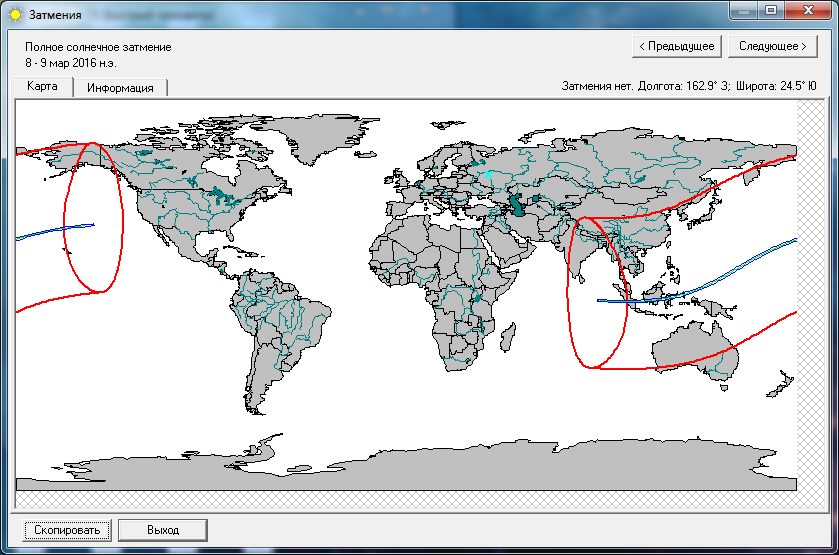

|||
|-|-|
| Начало частного затмения | `23:19:6 UTC` |
| Начало полного затмения | `0:15:41 UTC` |
| Максимальная фаза | `1:56:57 UTC` |
| Конец полного затмения | `3:38:8 UTC` |
| Конец частного затмения | `4:34:39 UTC` |

**Наибольшее затмение:**

| Долгота: | Широта: |
|-|-|
| `148° 51.6' Вос.` | `10° 6.6' Сев.` |

## Кольцеобразное солнечное затмение `1 сентября 2016г`.

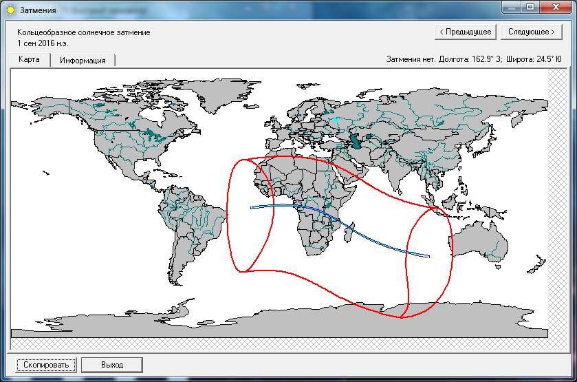

|||
|-|-|
| Начало частного затмения | `6:12:55 UTC` |
| Начало полного затмения | `7:17:38 UTC` |
| Максимальная фаза | `9:6:41 UTC` |
| Конец полного затмения | `10:55:39 UTC` |
| Конец частного затмения | `12:0:25 UTC` |

**Наибольшее затмение:**

| Долгота: | Широта: |
|-|-|
| `37° 49.2' Вос.` | `10° 40.6' Южн.` |

## Кольцеобразное солнечное затмение `26 февраля 2017г`.

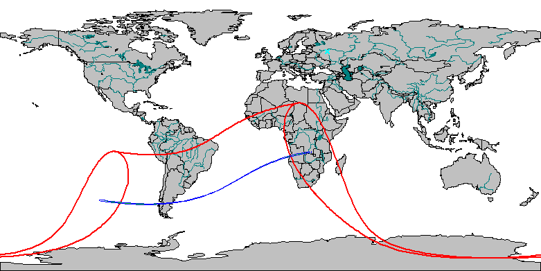

|||
|-|-|
| Начало частного затмения | `12:10:37 UTC` |
| Начало полного затмения | `13:15:5 UTC` |
| Максимальная фаза | `14:53:10 UTC` |
| Конец полного затмения | `16:31:22 UTC` |
| Конец частного затмения | `17:35:48 UTC` |

**Наибольшее затмение:**

| Долгота: | Широта: |
|-|-|
| `31° 7.8' Зап.` | `34° 40.5' Южн.` |

## Полное солнечное затмение `21 августа 2017г`.

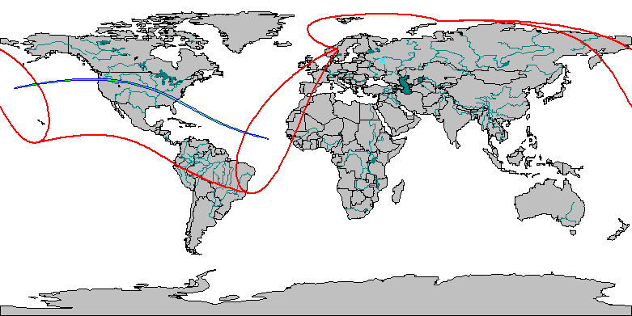

|||
|-|-|
| Начало частного затмения | `15:46:41 UTC` |
| Начало полного затмения | `16:48:21 UTC` |
| Максимальная фаза | `18:25:17 UTC` |
| Конец полного затмения | `20:2:21 UTC` |
| Конец частного затмения | `21:4:9 UTC` |

**Наибольшее затмение:**

| Долгота: | Широта: |
|-|-|
| `87° 36.2' Зап.` | `36° 59.0' Сев.` |

## Частное солнечное затмение `15 февраля 2018г`.

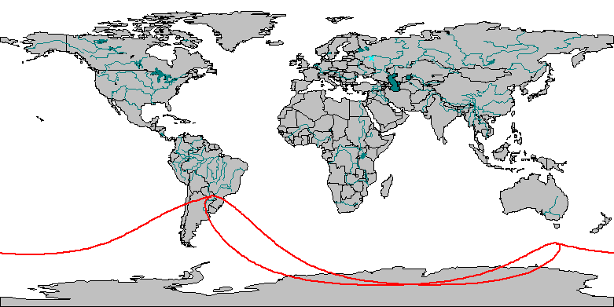

|||
|-|-|
| Начало частного затмения | `18:55:53 UTC` |
| Максимальная фаза | `20:51:9 UTC` |
| Конец частного затмения | `22:46:48 UTC` |

**Наибольшее затмение:**

| Долгота: | Широта: |
|-|-|
| `0° 44.6' Вос.` | `71° 8.7' Южн.` |

## Частное солнечное затмение `13 июля 2018г`.

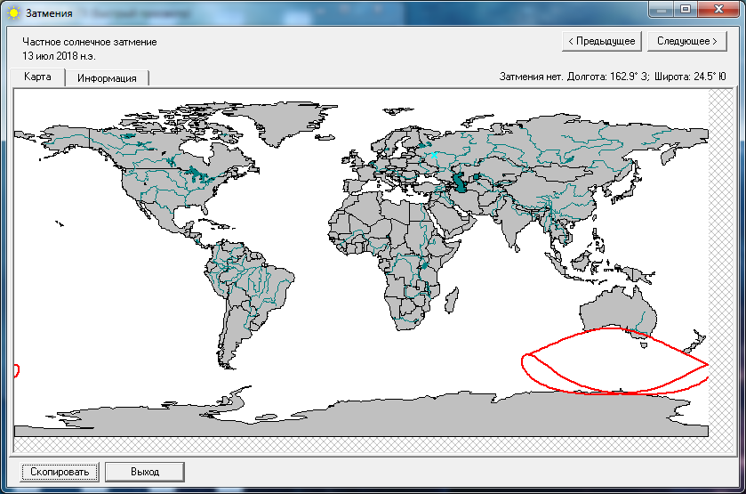

|||
|-|-|
| Начало частного затмения | `1:48:23 UTC` |
| Максимальная фаза | `3:0:51 UTC` |
| Конец частного затмения | `4:13:14 UTC` |

**Наибольшее затмение:**

| Долгота: | Широта: |
|-|-|
| `127° 29.1' Вос.` | `68° 3.5' Южн.` |

## Частное солнечное затмение `11 августа 2018г`.

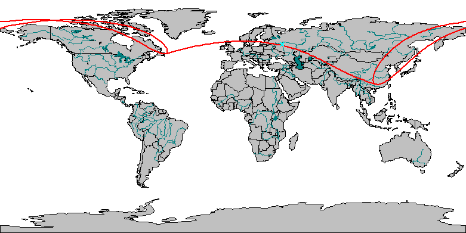

|||
|-|-|
| Начало частного затмения | `8:2:6 UTC` |
| Максимальная фаза | `9:46:4 UTC` |
| Конец частного затмения | `11:30:23 UTC` |

**Наибольшее затмение:**

| Долгота: | Широта: |
|-|-|
| `174° 33.5' Вос.` | `70° 30.6' Сев.` |

## Частное солнечное затмение `5 - 6 января 2019г`.

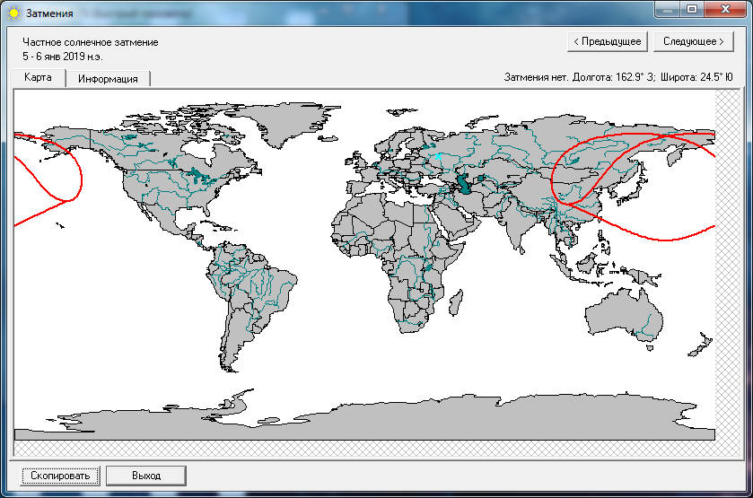

|||
|-|-|
| Начало частного затмения | `23:34:1 UTC` |
| Максимальная фаза | `1:41:11 UTC` |
| Конец частного затмения | `3:48:22 UTC` |

**Наибольшее затмение:**

| Долгота: | Широта: |
|-|-|
| `153° 37.8' Вос.` | `67° 34.3' Сев.` |

## Полное солнечное затмение `2 июля 2019г`.

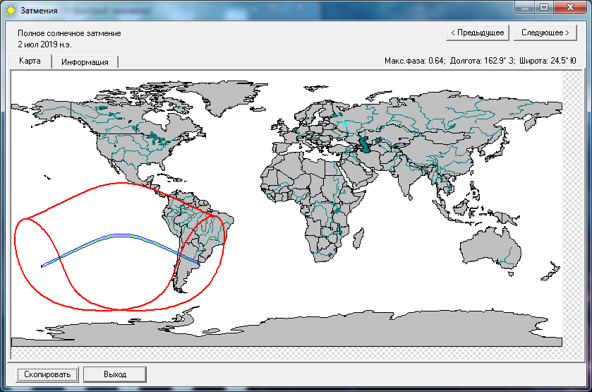

|||
|-|-|
| Начало частного затмения | `16:55:0 UTC` |
| Начало полного затмения | `18:0:53 UTC` |
| Максимальная фаза | `19:22:43 UTC` |
| Конец полного затмения | `20:44:35 UTC` |
| Конец частного затмения | `21:50:21 UTC` |

**Наибольшее затмение:**

| Долгота: | Широта: |
|-|-|
| `108° 56.0' Зап.` | `17° 23.5' Южн.` |

## Кольцеобразное солнечное затмение `26 декабря 2019г`.

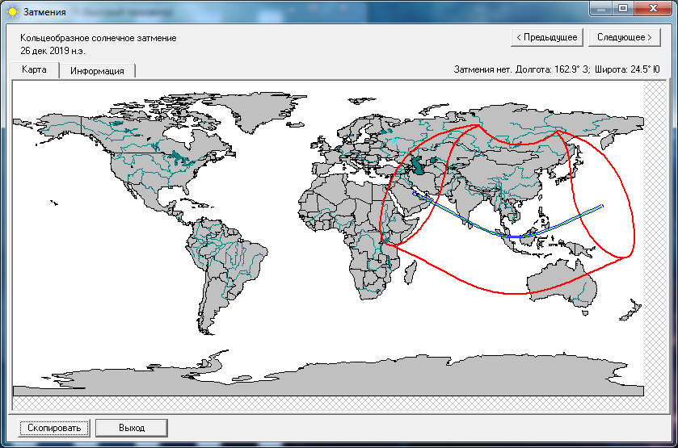

|||
|-|-|
| Начало частного затмения | `2:29:33 UTC` |
| Начало полного затмения | `3:34:15 UTC` |
| Максимальная фаза | `5:17:24 UTC` |
| Конец полного затмения | `7:0:39 UTC` |
| Конец частного затмения | `8:5:24 UTC` |

**Наибольшее затмение:**

| Долгота: | Широта: |
|-|-|
| `102° 19.8' Вос.` | `1° 1.0' Сев.` |

## Кольцеобразное солнечное затмение `21 июня 2020г`.

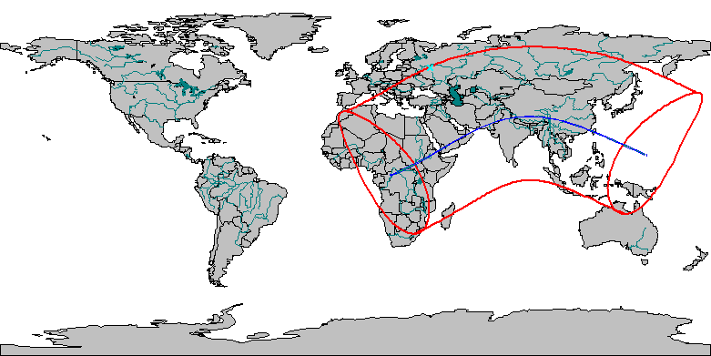

|||
|-|-|
| Начало частного затмения | `3:45:43 UTC` |
| Начало полного затмения | `4:47:29 UTC` |
| Максимальная фаза | `6:39:49 UTC` |
| Конец полного затмения | `8:32:4 UTC` |
| Конец частного затмения | `9:33:47 UTC` |

**Наибольшее затмение:**

| Долгота: | Широта: |
|-|-|
| `79° 44.5' Вос.` | `30° 30.8' Сев.` |

## Полное солнечное затмение `14 декабря 2020г`.

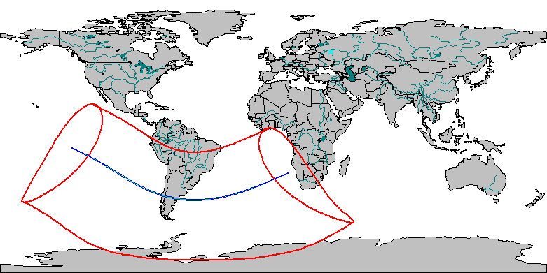

|||
|-|-|
| Начало частного затмения | `13:33:37 UTC` |
| Начало полного затмения | `14:32:15 UTC` |
| Максимальная фаза | `16:13:12 UTC` |
| Конец полного затмения | `17:54:5 UTC` |
| Конец частного затмения | `18:52:49 UTC` |

**Наибольшее затмение:**

| Долгота: | Широта: |
|-|-|
| `67° 52.8' Зап.` | `40° 19.1' Южн.` |

## Кольцеобразное солнечное затмение `10 июня 2021г`.

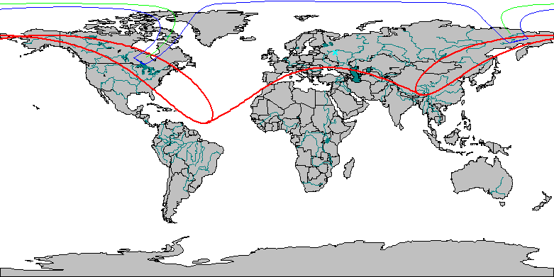

|||
|-|-|
| Начало частного затмения | `8:12:6 UTC` |
| Начало полного затмения | `9:49:38 UTC` |
| Максимальная фаза | `10:41:38 UTC` |
| Конец полного затмения | `11:33:24 UTC` |
| Конец частного затмения | `13:10:55 UTC` |

**Наибольшее затмение:**

| Долгота: | Широта: |
|-|-|
| `66° 56.8' Зап.` | `80° 49.0' Сев.` |

## Полное солнечное затмение `4 декабря 2021г`.

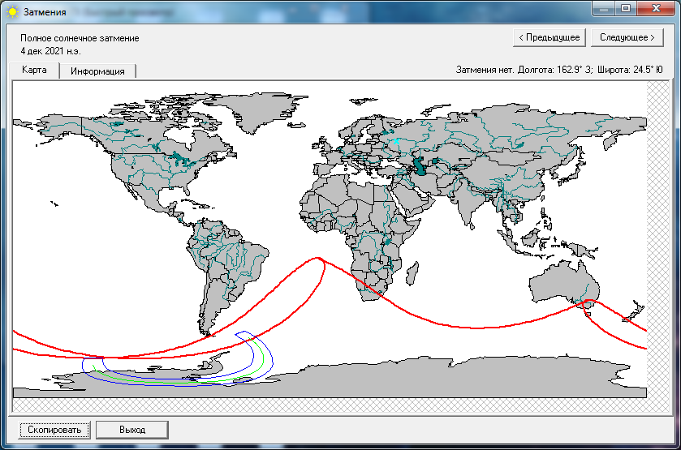

|||
|-|-|
| Начало частного затмения | `5:29:2 UTC` |
| Начало полного затмения | `6:59:42 UTC` |
| Максимальная фаза | `7:33:14 UTC` |
| Конец полного затмения | `8:6:31 UTC` |
| Конец частного затмения | `9:37:10 UTC` |

**Наибольшее затмение:**

| Долгота: | Широта: |
|-|-|
| `45° 52.4' Зап.` | `76° 48.7' Южн.` |

## Частное солнечное затмение `30 апреля 2022г`.

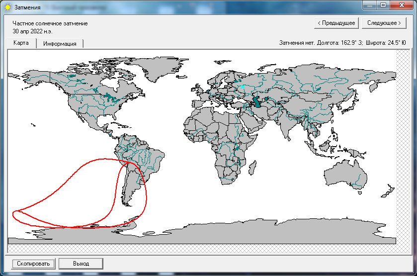

|||
|-|-|
| Начало частного затмения | `18:45:17 UTC` |
| Максимальная фаза | `20:41:8 UTC` |
| Конец частного затмения | `22:37:41 UTC` |

**Наибольшее затмение:**

| Долгота: | Широта: |
|-|-|
| `71° 20.3' Зап.` | `62° 16.6' Южн.` |

## Частное солнечное затмение `25 октября 2022г`.

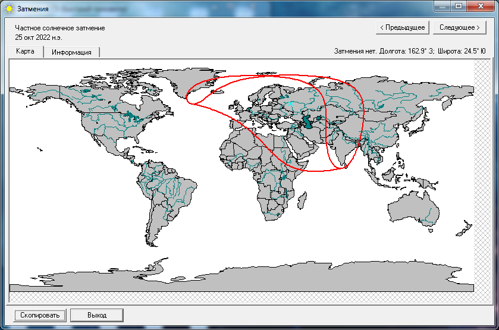

|||
|-|-|
| Начало частного затмения | `8:58:16 UTC` |
| Максимальная фаза | `10:59:49 UTC` |
| Конец частного затмения | `13:1:52 UTC` |

**Наибольшее затмение:**

| Долгота: | Широта: |
|-|-|
| `77° 29.9' Вос.` | `61° 48.6' Сев.` |

## Полное солнечное затмение `20 апреля 2023г`.

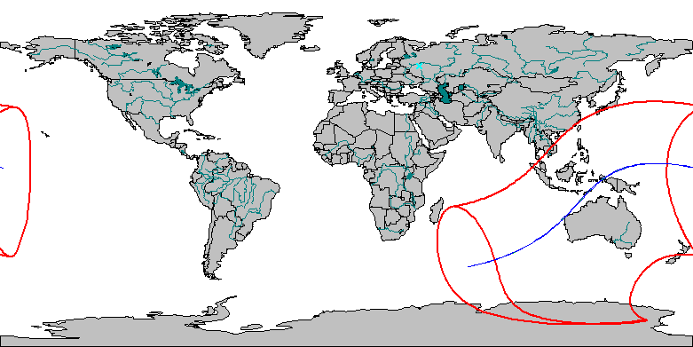

|||
|-|-|
| Начало частного затмения | `1:34:9 UTC` |
| Начало полного затмения | `2:36:46 UTC` |
| Максимальная фаза | `4:16:26 UTC` |
| Конец полного затмения | `5:56:22 UTC` |
| Конец частного затмения | `6:59:1 UTC` |

**Наибольшее затмение:**

| Долгота: | Широта: |
|-|-|
| `125° 51.6' Вос.` | `9° 35.2' Южн.` |

## Кольцеобразное солнечное затмение `14 октября 2023г`.

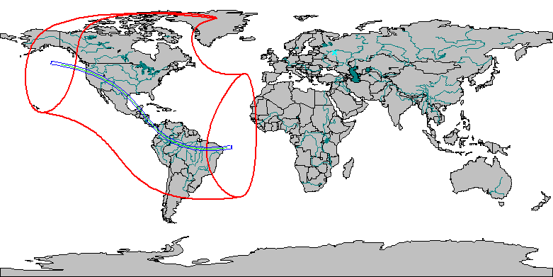

|||
|-|-|
| Начало частного затмения | `15:3:33 UTC` |
| Начало полного затмения | `16:9:51 UTC` |
| Максимальная фаза | `17:59:9 UTC` |
| Конец полного затмения | `19:48:39 UTC` |
| Конец частного затмения | `20:54:54 UTC` |

**Наибольшее затмение:**

| Долгота: | Широта: |
|-|-|
| `83° 0.5' Зап.` | `11° 22.8' Сев.` |

## Полное солнечное затмение `8 апреля 2024г`.

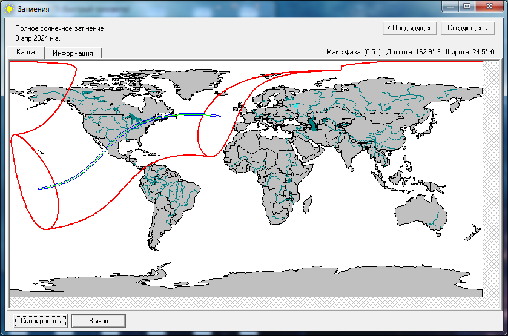

|||
|-|-|
| Начало частного затмения | `15:41:56 UTC` |
| Начало полного затмения | `16:38:32 UTC` |
| Максимальная фаза | `18:17:2 UTC` |
| Конец полного затмения | `19:55:19 UTC` |
| Конец частного затмения | `20:51:58 UTC` |

**Наибольшее затмение:**

| Долгота: | Широта: |
|-|-|
| `104° 4.1' Зап.` | `25° 17.7' Сев.` |

## Кольцеобразное солнечное затмение `2 октября 2024г`.

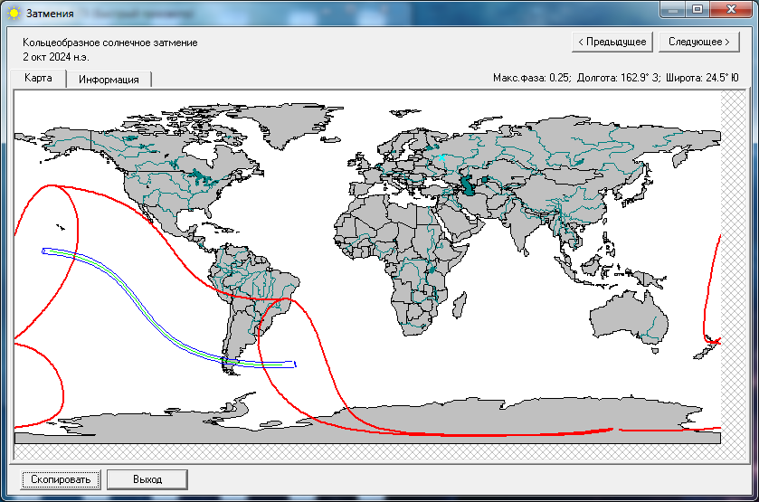

|||
|-|-|
| Начало частного затмения | `15:42:37 UTC` |
| Начало полного затмения | `16:50:15 UTC` |
| Максимальная фаза | `18:44:41 UTC` |
| Конец полного затмения | `20:38:53 UTC` |
| Конец частного затмения | `21:46:31 UTC` |

**Наибольшее затмение:**

| Долгота: | Широта: |
|-|-|
| `114° 25.0' Зап.` | `21° 57.0' Южн.` |

## Частное солнечное затмение `29 марта 2025г`.

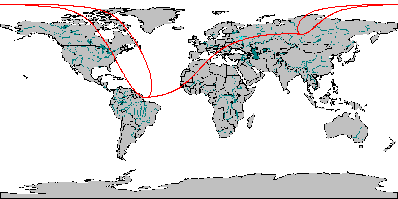

|||
|-|-|
| Начало частного затмения | `8:50:23 UTC` |
| Максимальная фаза | `10:47:5 UTC` |
| Конец частного затмения | `12:43:9 UTC` |

**Наибольшее затмение:**

| Долгота: | Широта: |
|-|-|
| `77° 4.6' Зап.` | `61° 15.8' Сев.` |

## Частное солнечное затмение `21 сентября 2025г`.

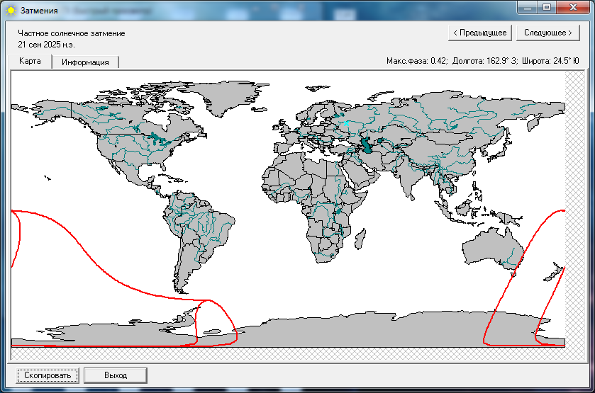

|||
|-|-|
| Начало частного затмения | `17:29:21 UTC` |
| Максимальная фаза | `19:41:33 UTC` |
| Конец частного затмения | `21:53:7 UTC` |

**Наибольшее затмение:**

| Долгота: | Широта: |
|-|-|
| `153° 29.9' Вос.` | `61° 3.9' Южн.` |

## Кольцеобразное солнечное затмение `17 февраля 2026г`.

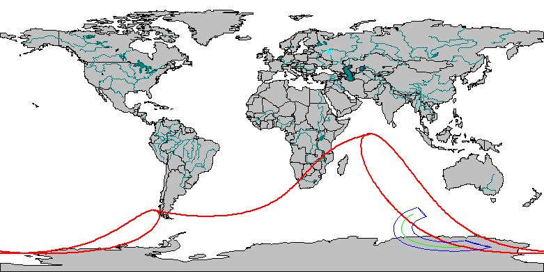

|||
|-|-|
| Начало частного затмения | `9:56:16 UTC` |
| Начало полного затмения | `11:42:34 UTC` |
| Максимальная фаза | `12:11:33 UTC` |
| Конец полного затмения | `12:41:2 UTC` |
| Конец частного затмения | `14:27:17 UTC` |

**Наибольшее затмение:**

| Долгота: | Широта: |
|-|-|
| `86° 50.6' Вос.` | `64° 43.1' Южн.` |

## Полное солнечное затмение `12 августа 2026г`.

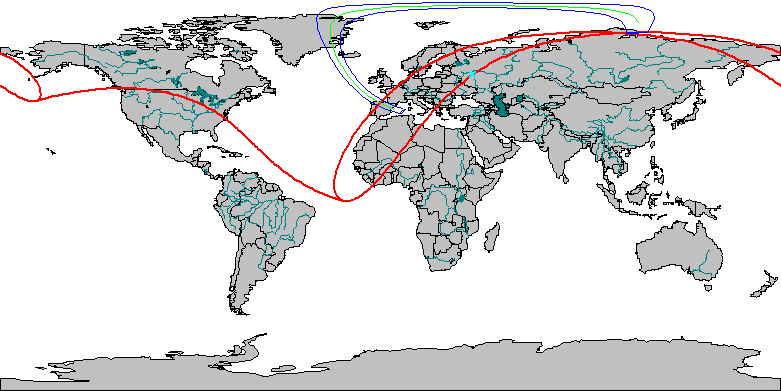

|||
|-|-|
| Начало частного затмения | `15:33:58 UTC` |
| Начало полного затмения | `16:57:39 UTC` |
| Максимальная фаза | `17:45:31 UTC` |
| Конец полного затмения | `18:33:47 UTC` |
| Конец частного затмения | `19:57:34 UTC` |

**Наибольшее затмение:**

| Долгота: | Широта: |
|-|-|
| `25° 9.7' Зап.` | `65° 12.9' Сев.` |

## Кольцеобразное солнечное затмение `6 февраля 2027г`.

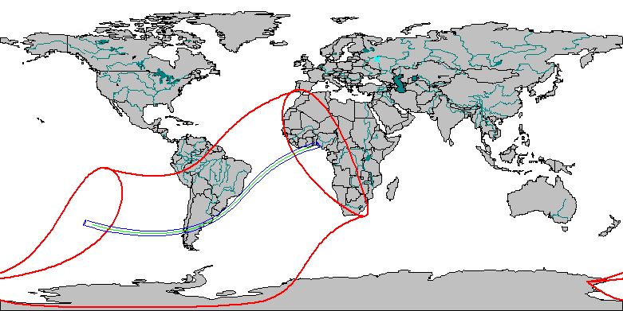

|||
|-|-|
| Начало частного затмения | `12:57:17 UTC` |
| Начало полного затмения | `14:3:33 UTC` |
| Максимальная фаза | `15:59:14 UTC` |
| Конец полного затмения | `17:55:2 UTC` |
| Конец частного затмения | `19:1:16 UTC` |

**Наибольшее затмение:**

| Долгота: | Широта: |
|-|-|
| `48° 22.5' Зап.` | `31° 17.5' Южн.` |

## Полное солнечное затмение `2 августа 2027г`.

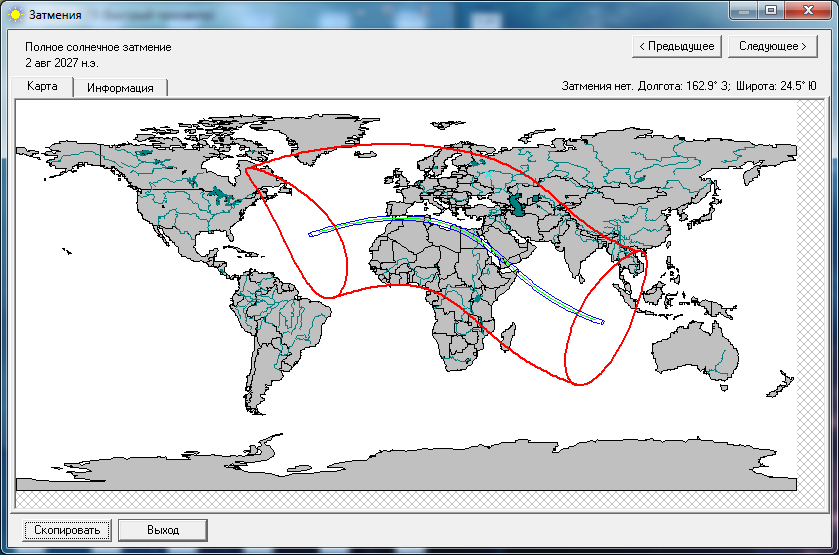

|||
|-|-|
| Начало частного затмения | `7:29:48 UTC` |
| Начало полного затмения | `8:23:1 UTC` |
| Максимальная фаза | `10:6:14 UTC` |
| Конец полного затмения | `11:49:31 UTC` |
| Конец частного затмения | `12:42:45 UTC` |

**Наибольшее затмение:**

| Долгота: | Широта: |
|-|-|
| `33° 17.2' Вос.` | `25° 29.8' Сев.` |

## Кольцеобразное солнечное затмение `26 января 2028г`.

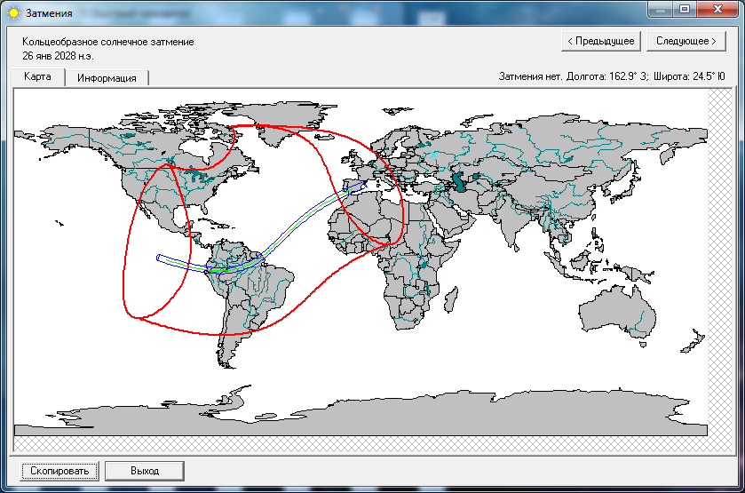

|||
|-|-|
| Начало частного затмения | `12:6:17 UTC` |
| Начало полного затмения | `13:14:29 UTC` |
| Максимальная фаза | `15:7:23 UTC` |
| Конец полного затмения | `17:0:7 UTC` |
| Конец частного затмения | `18:8:21 UTC` |

**Наибольшее затмение:**

| Долгота: | Широта: |
|-|-|
| `51° 27.2' Зап.` | `2° 57.3' Сев.` |

## Полное солнечное затмение `22 июля 2028г`.

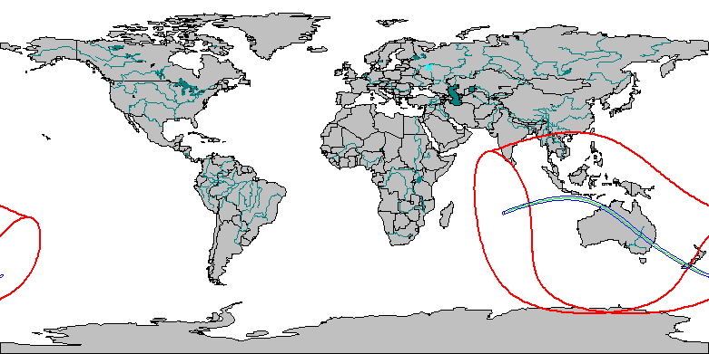

|||
|-|-|
| Начало частного затмения | `0:27:10 UTC` |
| Начало полного затмения | `1:30:15 UTC` |
| Максимальная фаза | `2:55:4 UTC` |
| Конец полного затмения | `4:19:42 UTC` |
| Конец частного затмения | `5:22:42 UTC` |

**Наибольшее затмение:**

| Долгота: | Широта: |
|-|-|
| `126° 48.3' Вос.` | `15° 34.9' Южн.` |

## Частное солнечное затмение `14 января 2029г`.

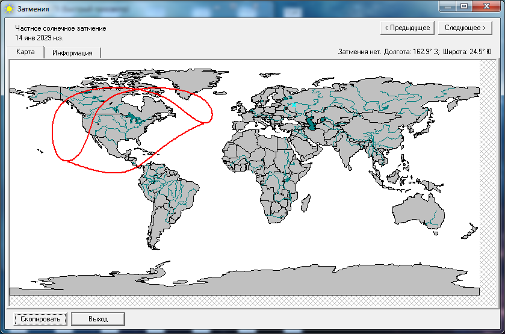

|||
|-|-|
| Начало частного затмения | `15:1:33 UTC` |
| Максимальная фаза | `17:12:9 UTC` |
| Конец частного затмения | `19:22:28 UTC` |

**Наибольшее затмение:**

| Долгота: | Широта: |
|-|-|
| `114° 9.4' Зап.` | `63° 51.3' Сев.` |

## Частное солнечное затмение `12 июня 2029г`.

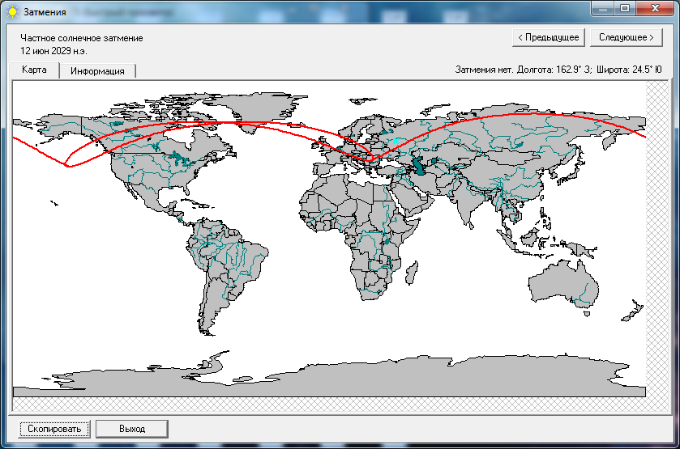

|||
|-|-|
| Начало частного затмения | `2:26:19 UTC` |
| Максимальная фаза | `4:4:36 UTC` |
| Конец частного затмения | `5:42:51 UTC` |

**Наибольшее затмение:**

| Долгота: | Широта: |
|-|-|
| `66° 4.5' Зап.` | `66° 54.2' Сев.` |

## Частное солнечное затмение `11 июля 2029г`.

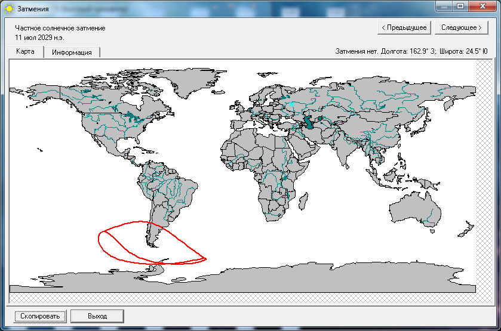

|||
|-|-|
| Начало частного затмения | `14:27:37 UTC` |
| Максимальная фаза | `15:35:44 UTC` |
| Конец частного затмения | `16:43:20 UTC` |

**Наибольшее затмение:**

| Долгота: | Широта: |
|-|-|
| `85° 33.9' Зап.` | `64° 24.8' Южн.` |

## Частное солнечное затмение `5 декабря 2029г`.

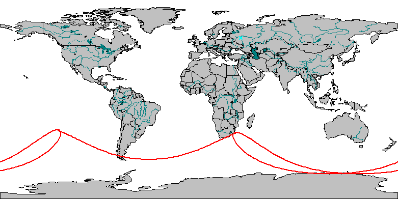

|||
|-|-|
| Начало частного затмения | `13:6:24 UTC` |
| Максимальная фаза | `15:2:21 UTC` |
| Конец частного затмения | `16:58:19 UTC` |

**Наибольшее затмение:**

| Долгота: | Широта: |
|-|-|
| `135° 44.6' Вос.` | `67° 38.9' Южн.` |

## Кольцеобразное солнечное затмение `1 июня 2030г`.

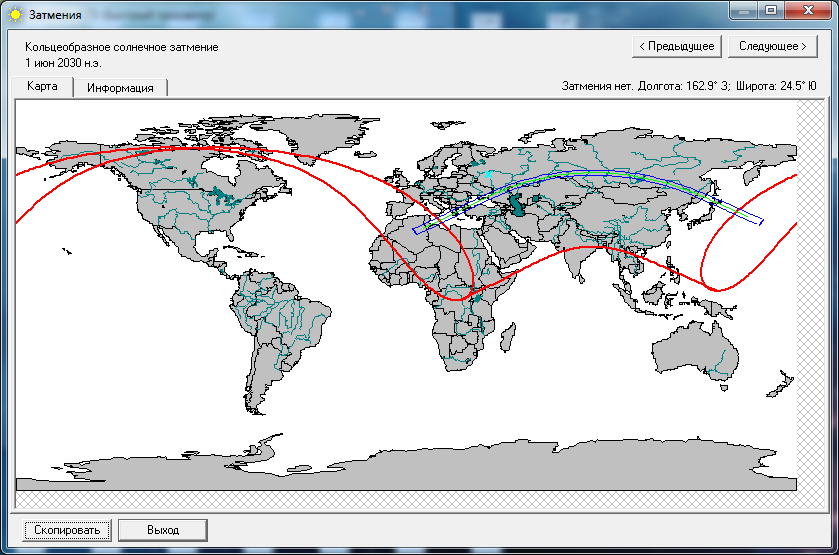

|||
|-|-|
| Начало частного затмения | `3:34:15 UTC` |
| Начало полного затмения | `4:46:48 UTC` |
| Максимальная фаза | `6:27:34 UTC` |
| Конец полного затмения | `8:8:17 UTC` |
| Конец частного затмения | `9:20:49 UTC` |

**Наибольшее затмение:**

| Долгота: | Широта: |
|-|-|
| `80° 10.8' Вос.` | `56° 30.9' Сев.` |

## Полное солнечное затмение `25 ноября 2030г`.

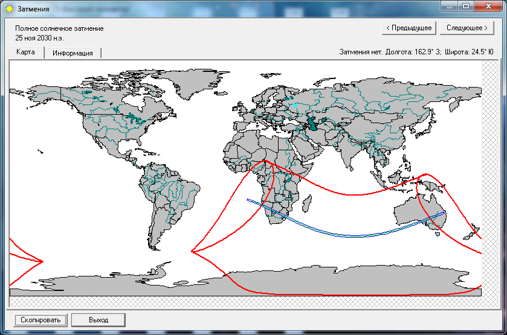

|||
|-|-|
| Начало частного затмения | `4:16:19 UTC` |
| Начало полного затмения | `5:13:56 UTC` |
| Максимальная фаза | `6:49:59 UTC` |
| Конец полного затмения | `8:26:0 UTC` |
| Конец частного затмения | `9:23:35 UTC` |

**Наибольшее затмение:**

| Долгота: | Широта: |
|-|-|
| `71° 19.9' Вос.` | `43° 38.6' Южн.` |

## Кольцеобразное солнечное затмение `21 мая 2031г`.

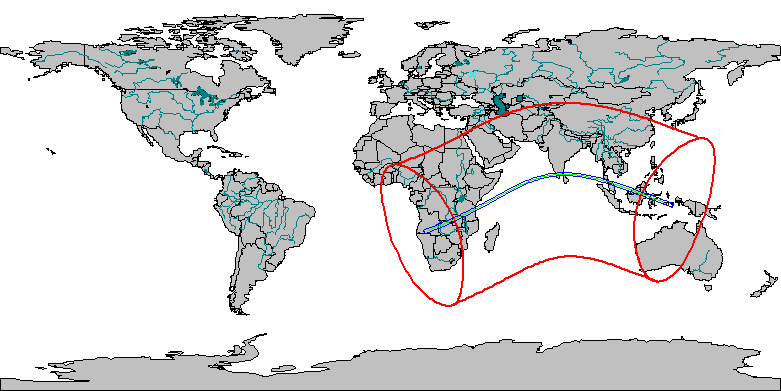

|||
|-|-|
| Начало частного затмения | `4:13:45 UTC` |
| Начало полного затмения | `5:18:16 UTC` |
| Максимальная фаза | `7:14:26 UTC` |
| Конец полного затмения | `9:10:40 UTC` |
| Конец частного затмения | `10:15:13 UTC` |

**Наибольшее затмение:**

| Долгота: | Широта: |
|-|-|
| `71° 50.2' Вос.` | `8° 55.1' Сев.` |

## Полное солнечное затмение `14 ноября 2031г`.

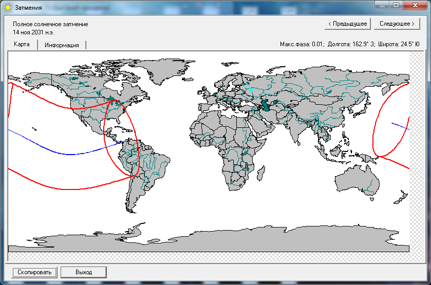

|||
|-|-|
| Начало частного затмения | `18:22:49 UTC` |
| Начало полного затмения | `19:23:28 UTC` |
| Максимальная фаза | `21:5:52 UTC` |
| Конец полного затмения | `22:48:17 UTC` |
| Конец частного затмения | `23:48:53 UTC` |

**Наибольшее затмение:**

| Долгота: | Широта: |
|-|-|
| `137° 32.3' Зап.` | `0° 39.1' Южн.` |

## Кольцеобразное солнечное затмение `9 мая 2032г`.

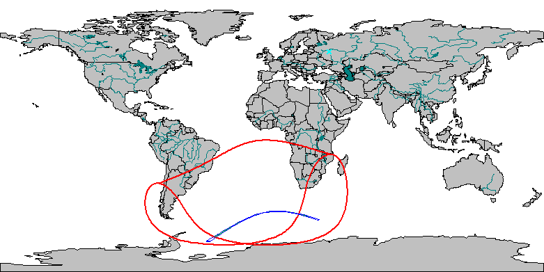

|||
|-|-|
| Начало частного затмения | `11:9:35 UTC` |
| Начало полного затмения | `12:46:55 UTC` |
| Максимальная фаза | `13:25:2 UTC` |
| Конец полного затмения | `14:3:25 UTC` |
| Конец частного затмения | `15:40:48 UTC` |

**Наибольшее затмение:**

| Долгота: | Широта: |
|-|-|
| `6° 56.8' Зап.` | `51° 17.7' Южн.` |

## Частное солнечное затмение `3 ноября 2032г`.

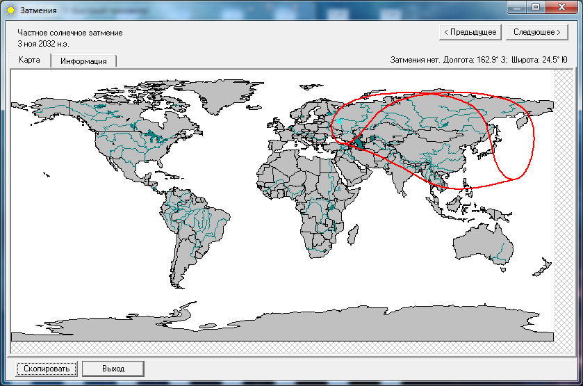

|||
|-|-|
| Начало частного затмения | `3:22:2 UTC` |
| Максимальная фаза | `5:32:30 UTC` |
| Конец частного затмения | `7:43:13 UTC` |

**Наибольшее затмение:**

| Долгота: | Широта: |
|-|-|
| `132° 45.5' Вос.` | `70° 33.0' Сев.` |

## Полное солнечное затмение `30 марта 2033г`.

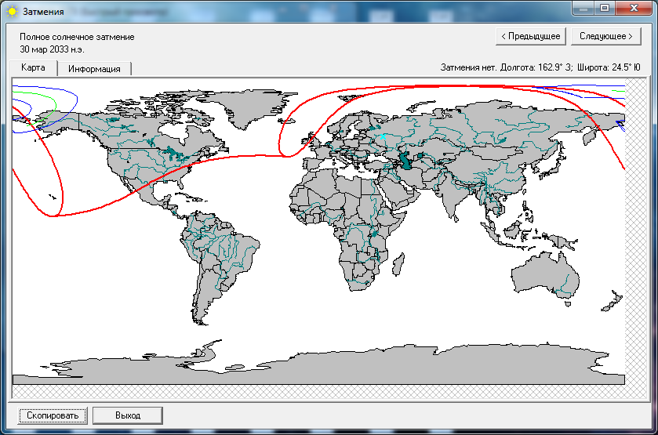

|||
|-|-|
| Начало частного затмения | `15:59:6 UTC` |
| Начало полного затмения | `17:35:14 UTC` |
| Максимальная фаза | `18:0:55 UTC` |
| Конец полного затмения | `18:26:11 UTC` |
| Конец частного затмения | `20:2:21 UTC` |

**Наибольшее затмение:**

| Долгота: | Широта: |
|-|-|
| `155° 38.2' Зап.` | `71° 18.4' Сев.` |

## Частное солнечное затмение `23 сентября 2033г`.

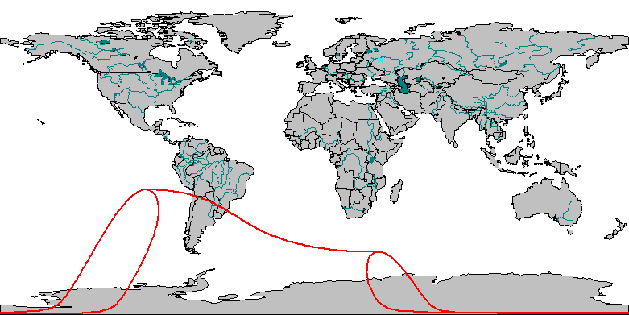

|||
|-|-|
| Начало частного затмения | `11:47:32 UTC` |
| Максимальная фаза | `13:52:50 UTC` |
| Конец частного затмения | `15:57:36 UTC` |

**Наибольшее затмение:**

| Долгота: | Широта: |
|-|-|
| `121° 12.2' Зап.` | `72° 18.9' Южн.` |

## Полное солнечное затмение `20 марта 2034г`.

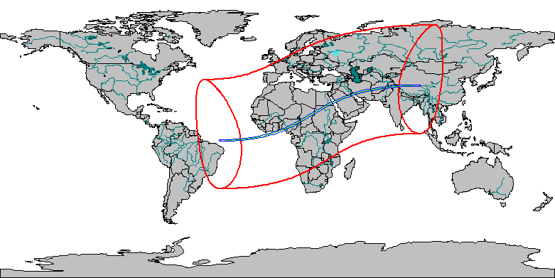

|||
|-|-|
| Начало частного затмения | `7:39:30 UTC` |
| Начало полного затмения | `8:36:26 UTC` |
| Максимальная фаза | `10:17:3 UTC` |
| Конец полного затмения | `11:57:35 UTC` |
| Конец частного затмения | `12:54:26 UTC` |

**Наибольшее затмение:**

| Долгота: | Широта: |
|-|-|
| `22° 19.9' Вос.` | `16° 3.4' Сев.` |

## Кольцеобразное солнечное затмение `12 сентября 2034г`.

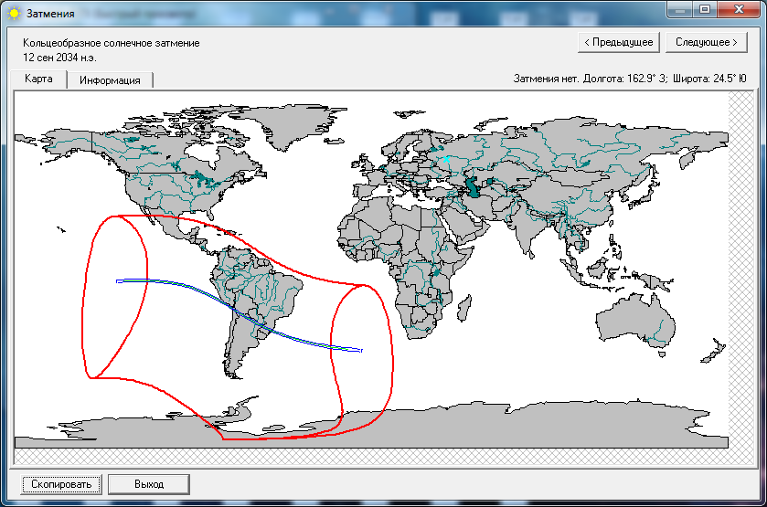

|||
|-|-|
| Начало частного затмения | `13:26:12 UTC` |
| Начало полного затмения | `14:31:43 UTC` |
| Максимальная фаза | `16:17:46 UTC` |
| Конец полного затмения | `18:3:42 UTC` |
| Конец частного затмения | `19:9:16 UTC` |

**Наибольшее затмение:**

| Долгота: | Широта: |
|-|-|
| `72° 30.6' Зап.` | `18° 14.1' Южн.` |

## Кольцеобразное солнечное затмение `9 - 10 марта 2035г`.

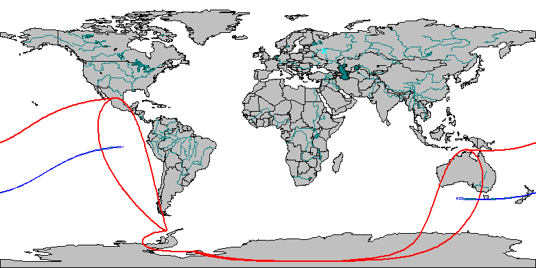

|||
|-|-|
| Начало частного затмения | `20:20:24 UTC` |
| Начало полного затмения | `21:24:36 UTC` |
| Максимальная фаза | `23:4:10 UTC` |
| Конец полного затмения | `0:43:50 UTC` |
| Конец частного затмения | `1:48:0 UTC` |

**Наибольшее затмение:**

| Долгота: | Широта: |
|-|-|
| `154° 51.1' Зап.` | `29° 1.8' Южн.` |

## Полное солнечное затмение `1 - 2 сентября 2035г`.

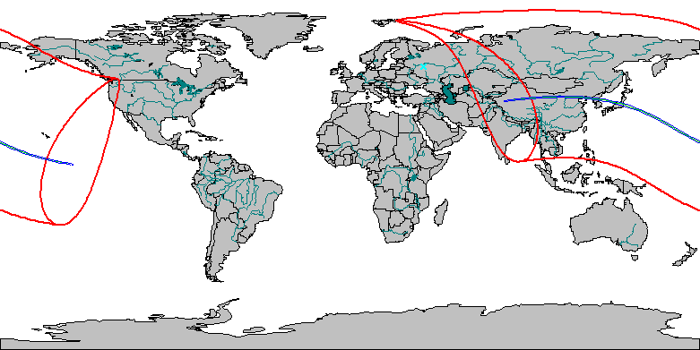

|||
|-|-|
| Начало частного затмения | `23:15:6 UTC` |
| Начало полного затмения | `0:15:21 UTC` |
| Максимальная фаза | `1:55:3 UTC` |
| Конец полного затмения | `3:34:51 UTC` |
| Конец частного затмения | `4:35:14 UTC` |

**Наибольшее затмение:**

| Долгота: | Широта: |
|-|-|
| `158° 8.3' Вос.` | `29° 6.5' Сев.` |

## Частное солнечное затмение `27 февраля 2036г`.

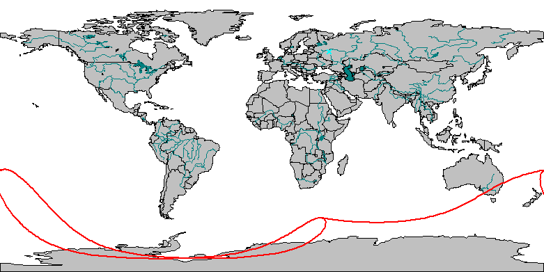

|||
|-|-|
| Начало частного затмения | `2:47:9 UTC` |
| Максимальная фаза | `4:45:5 UTC` |
| Конец частного затмения | `6:43:27 UTC` |

**Наибольшее затмение:**

| Долгота: | Широта: |
|-|-|
| `131° 17.6' Зап.` | `71° 45.8' Южн.` |

## Частное солнечное затмение `23 июля 2036г`.

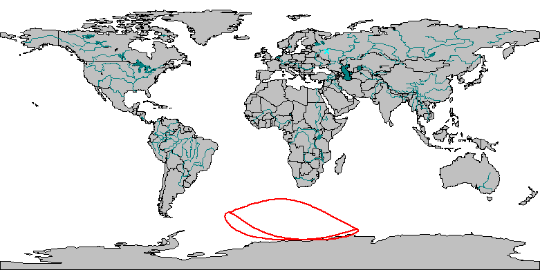

|||
|-|-|
| Начало частного затмения | `9:33:57 UTC` |
| Максимальная фаза | `10:30:21 UTC` |
| Конец частного затмения | `11:26:32 UTC` |

**Наибольшее затмение:**

| Долгота: | Широта: |
|-|-|
| `3° 38.0' Вос.` | `69° 0.7' Южн.` |

## Частное солнечное затмение `21 августа 2036г`.

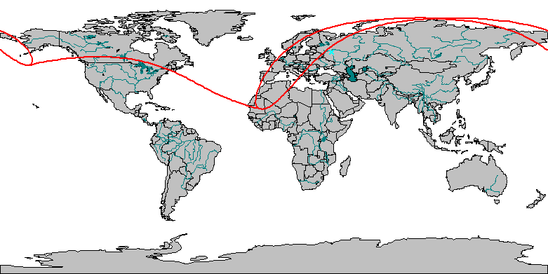

|||
|-|-|
| Начало частного затмения | `15:32:57 UTC` |
| Максимальная фаза | `17:24:2 UTC` |
| Конец частного затмения | `19:15:29 UTC` |

**Наибольшее затмение:**

| Долгота: | Широта: |
|-|-|
| `47° 7.9' Вос.` | `71° 14.3' Сев.` |

## Частное солнечное затмение `16 января 2037г`.

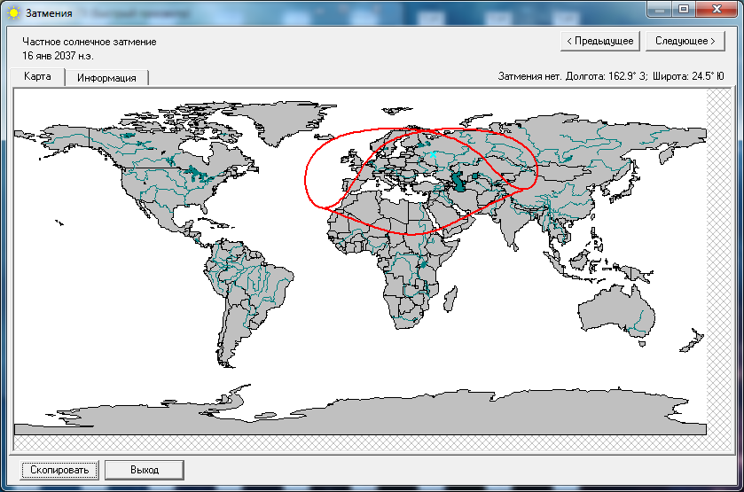

|||
|-|-|
| Начало частного затмения | `7:41:1 UTC` |
| Максимальная фаза | `9:47:8 UTC` |
| Конец частного затмения | `11:53:9 UTC` |

**Наибольшее затмение:**

| Долгота: | Широта: |
|-|-|
| `20° 54.0' Вос.` | `68° 39.1' Сев.` |

## Полное солнечное затмение `13 июля 2037г`.

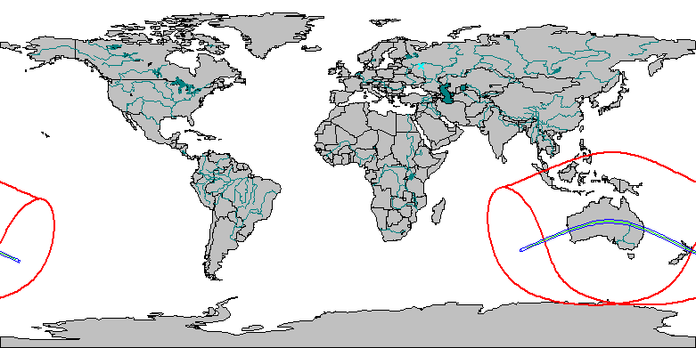

|||
|-|-|
| Начало частного затмения | `0:14:44 UTC` |
| Начало полного затмения | `1:24:40 UTC` |
| Максимальная фаза | `2:38:53 UTC` |
| Конец полного затмения | `3:53:6 UTC` |
| Конец частного затмения | `5:2:55 UTC` |

**Наибольшее затмение:**

| Долгота: | Широта: |
|-|-|
| `139° 9.6' Вос.` | `24° 46.1' Южн.` |

## Кольцеобразное солнечное затмение `5 января 2038г`.

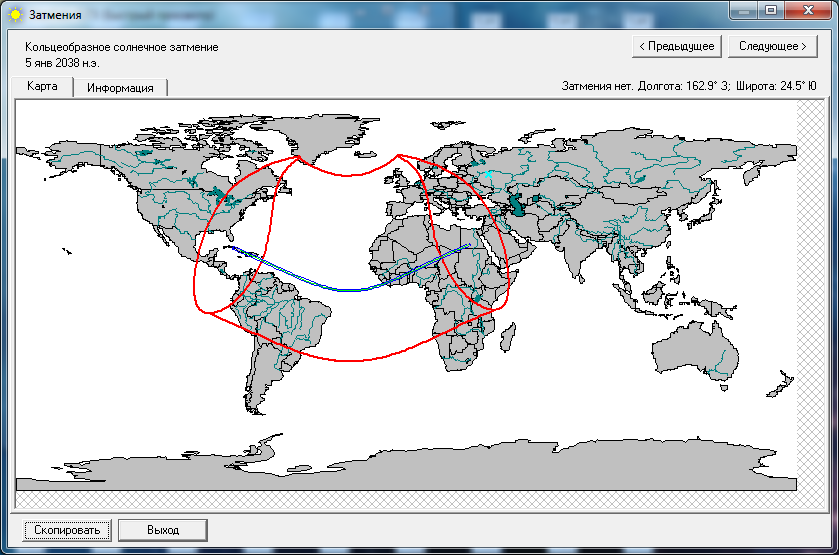

|||
|-|-|
| Начало частного затмения | `10:58:15 UTC` |
| Начало полного затмения | `12:2:48 UTC` |
| Максимальная фаза | `13:45:23 UTC` |
| Конец полного затмения | `15:28:0 UTC` |
| Конец частного затмения | `16:32:36 UTC` |

**Наибольшее затмение:**

| Долгота: | Широта: |
|-|-|
| `25° 20.2' Зап.` | `2° 6.1' Сев.` |

## Кольцеобразное солнечное затмение `2 июля 2038г`.

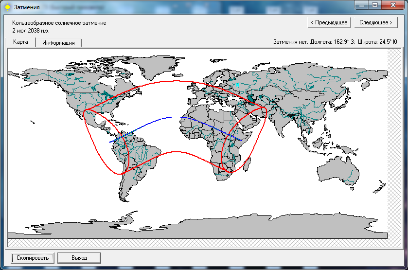

|||
|-|-|
| Начало частного затмения | `10:35:51 UTC` |
| Начало полного затмения | `11:37:35 UTC` |
| Максимальная фаза | `13:31:10 UTC` |
| Конец полного затмения | `15:24:41 UTC` |
| Конец частного затмения | `16:26:22 UTC` |

**Наибольшее затмение:**

| Долгота: | Широта: |
|-|-|
| `21° 47.8' Зап.` | `25° 25.3' Сев.` |

## Полное солнечное затмение `25 - 26 декабря 2038г`.

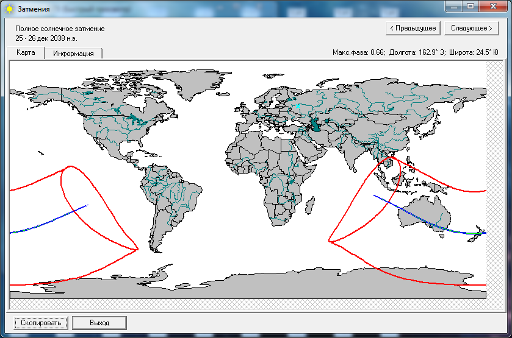

|||
|-|-|
| Начало частного затмения | `22:19:5 UTC` |
| Начало полного затмения | `23:17:27 UTC` |
| Максимальная фаза | `0:58:24 UTC` |
| Конец полного затмения | `2:39:17 UTC` |
| Конец частного затмения | `3:37:45 UTC` |

**Наибольшее затмение:**

| Долгота: | Широта: |
|-|-|
| `164° 2.9' Вос.` | `40° 15.9' Южн.` |

## Кольцеобразное солнечное затмение `21 июня 2039г`.

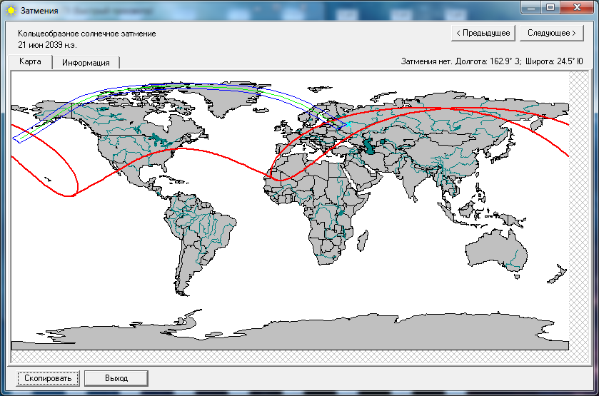

|||
|-|-|
| Начало частного затмения | `14:34:40 UTC` |
| Начало полного затмения | `16:2:2 UTC` |
| Максимальная фаза | `17:11:5 UTC` |
| Конец полного затмения | `18:20:1 UTC` |
| Конец частного затмения | `19:47:23 UTC` |

**Наибольшее затмение:**

| Долгота: | Широта: |
|-|-|
| `102° 4.9' Зап.` | `78° 54.4' Сев.` |

## Полное солнечное затмение `15 декабря 2039г`.

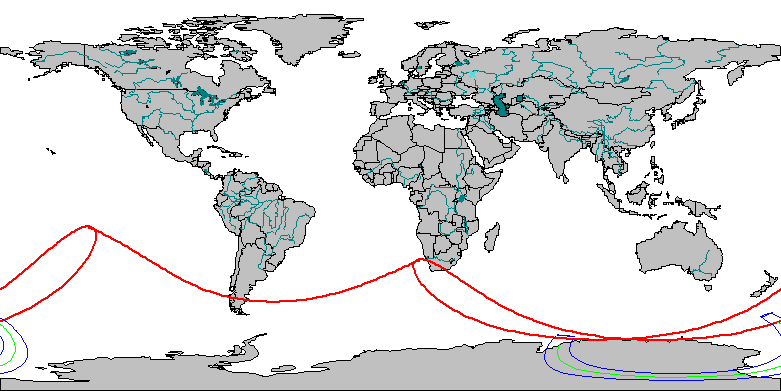

|||
|-|-|
| Начало частного затмения | `14:17:13 UTC` |
| Начало полного затмения | `15:46:41 UTC` |
| Максимальная фаза | `16:22:0 UTC` |
| Конец полного затмения | `16:57:10 UTC` |
| Конец частного затмения | `18:26:37 UTC` |

**Наибольшее затмение:**

| Долгота: | Широта: |
|-|-|
| `173° 2.8' Вос.` | `80° 52.7' Южн.` |

## Частное солнечное затмение `11 мая 2040г`.

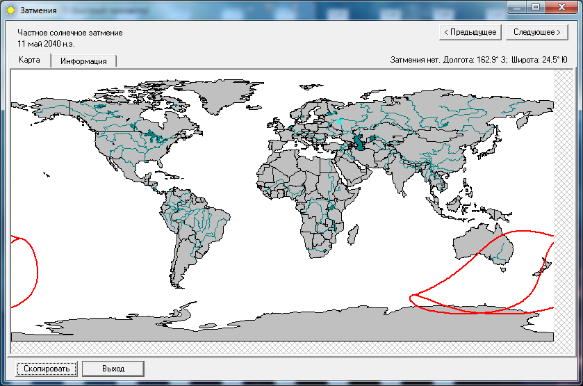

|||
|-|-|
| Начало частного затмения | `1:55:12 UTC` |
| Максимальная фаза | `3:41:12 UTC` |
| Конец частного затмения | `5:27:52 UTC` |

**Наибольшее затмение:**

| Долгота: | Широта: |
|-|-|
| `174° 34.4' Вос.` | `62° 55.5' Южн.` |

## Частное солнечное затмение `4 ноября 2040г`.

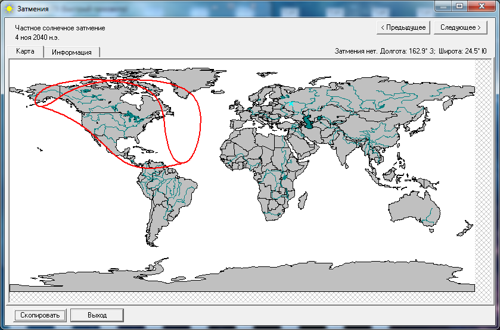

|||
|-|-|
| Начало частного затмения | `17:8:3 UTC` |
| Максимальная фаза | `19:7:12 UTC` |
| Конец частного затмения | `21:6:48 UTC` |

**Наибольшее затмение:**

| Долгота: | Широта: |
|-|-|
| `53° 12.8' Зап.` | `62° 21.6' Сев.` |

## Полное солнечное затмение `30 апреля 2041г`.

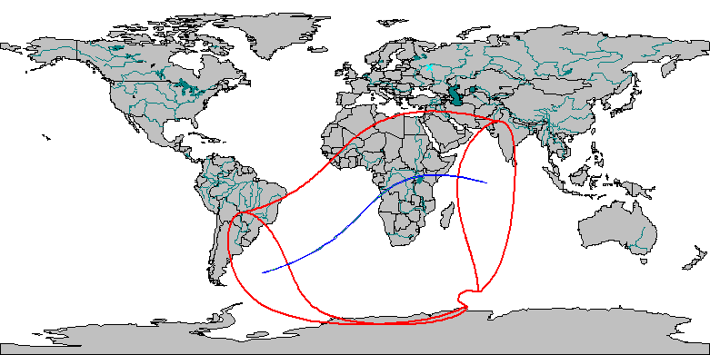

|||
|-|-|
| Начало частного затмения | `9:10:41 UTC` |
| Начало полного затмения | `10:13:49 UTC` |
| Максимальная фаза | `11:50:30 UTC` |
| Конец полного затмения | `13:27:22 UTC` |
| Конец частного затмения | `14:30:38 UTC` |

**Наибольшее затмение:**

| Долгота: | Широта: |
|-|-|
| `12° 17.8' Вос.` | `9° 37.0' Южн.` |

## Кольцеобразное солнечное затмение `24 - 25 октября 2041г`.

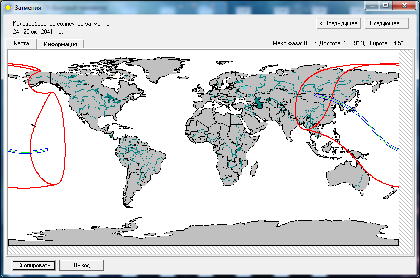

|||
|-|-|
| Начало частного затмения | `22:39:16 UTC` |
| Начало полного затмения | `23:46:28 UTC` |
| Максимальная фаза | `1:34:29 UTC` |
| Конец полного затмения | `3:22:42 UTC` |
| Конец частного затмения | `4:29:52 UTC` |

**Наибольшее затмение:**

| Долгота: | Широта: |
|-|-|
| `162° 58.4' Вос.` | `9° 56.3' Сев.` |

## Полное солнечное затмение `19 - 20 апреля 2042г`.

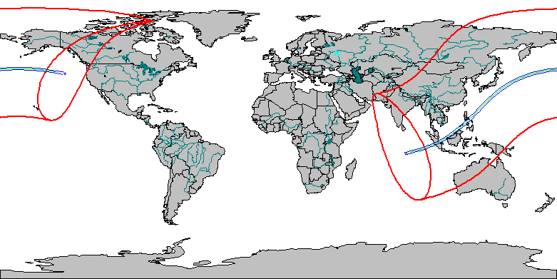

|||
|-|-|
| Начало частного затмения | `23:39:58 UTC` |
| Начало полного затмения | `0:35:37 UTC` |
| Максимальная фаза | `2:15:42 UTC` |
| Конец полного затмения | `3:55:37 UTC` |
| Конец частного затмения | `4:51:19 UTC` |

**Наибольшее затмение:**

| Долгота: | Широта: |
|-|-|
| `137° 24.4' Вос.` | `26° 57.3' Сев.` |

## Кольцеобразное солнечное затмение `13 - 14 октября 2042г`.

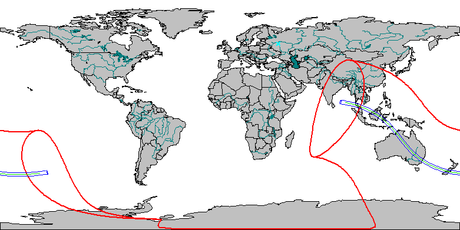

|||
|-|-|
| Начало частного затмения | `22:55:21 UTC` |
| Начало полного затмения | `0:2:18 UTC` |
| Максимальная фаза | `1:58:48 UTC` |
| Конец полного затмения | `3:55:7 UTC` |
| Конец частного затмения | `5:2:4 UTC` |

**Наибольшее затмение:**

| Долгота: | Широта: |
|-|-|
| `137° 56.0' Вос.` | `23° 44.9' Южн.` |

## Нецентральное полное солнечное затмение `9 апреля 2043г`.

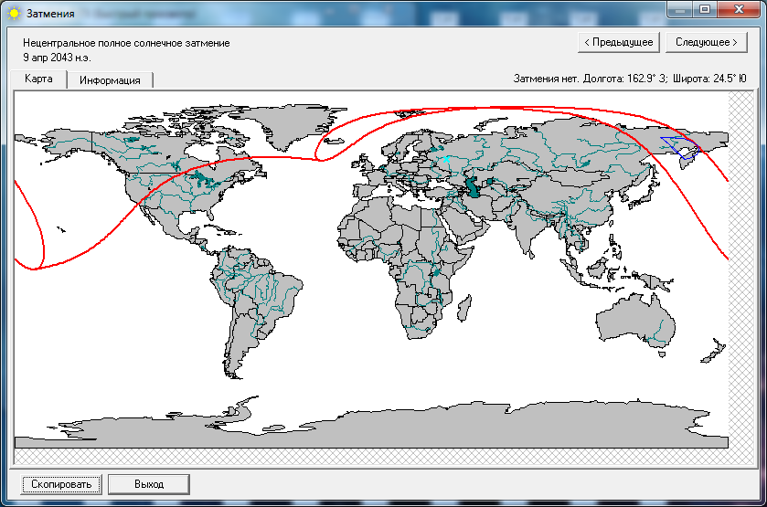

|||
|-|-|
| Начало частного затмения | `16:55:43 UTC` |
| Начало полного затмения | `18:45:12 UTC` |
| Максимальная фаза | `18:55:56 UTC` |
| Конец полного затмения | `19:6:8 UTC` |
| Конец частного затмения | `20:55:34 UTC` |

**Наибольшее затмение:**

| Долгота: | Широта: |
|-|-|
| `152° 0.2' Вос.` | `61° 28.4' Сев.` |

## Нецентральное кольцеобразное солнечное затмение `3 октября 2043г`.

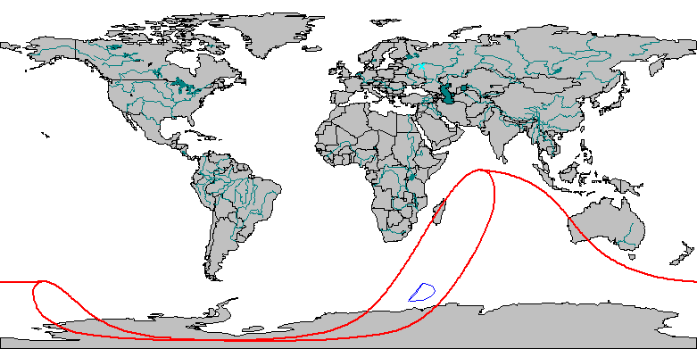

|||
|-|-|
| Начало частного затмения | `0:42:25 UTC` |
| Начало полного затмения | `2:50:13 UTC` |
| Максимальная фаза | `2:59:55 UTC` |
| Конец полного затмения | `3:9:1 UTC` |
| Конец частного затмения | `5:16:52 UTC` |

**Наибольшее затмение:**

| Долгота: | Широта: |
|-|-|
| `35° 17.4' Вос.` | `61° 7.5' Южн.` |
## Кольцеобразное солнечное затмение `28 февраля 2044г`.

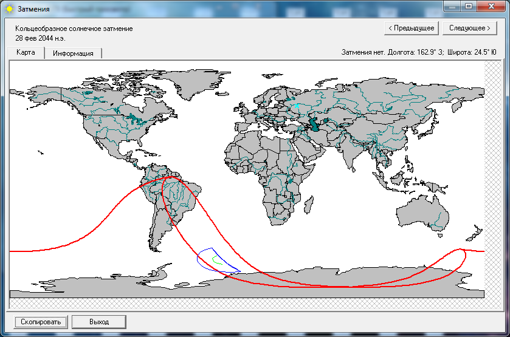

|||
|-|-|
| Начало частного затмения | `18:9:0 UTC` |
| Начало полного затмения | `20:4:35 UTC` |
| Максимальная фаза | `20:22:45 UTC` |
| Конец полного затмения | `20:41:28 UTC` |
| Конец частного затмения | `22:37:0 UTC` |

## Полное солнечное затмение `22 - 23 августа 2044г`.

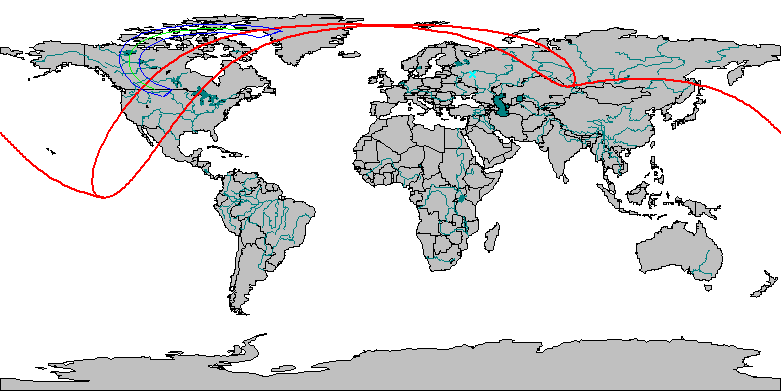

|||
|-|-|
| Начало частного затмения | `23:9:7 UTC` |
| Начало полного затмения | `0:43:59 UTC` |
| Максимальная фаза | `1:15:6 UTC` |
| Конец полного затмения | `1:46:42 UTC` |
| Конец частного затмения | `3:21:40 UTC` |

**Наибольшее затмение:**

| Долгота: | Широта: |
|-|-|
| `120° 23.7' Зап.` | `64° 19.8' Сев.` |

## Кольцеобразное солнечное затмение `16 - 17 февраля 2045г`.

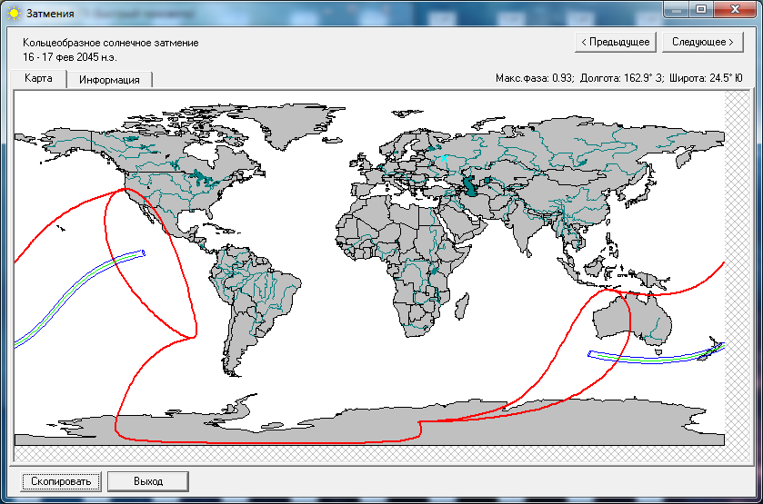

|||
|-|-|
| Начало частного затмения | `20:52:27 UTC` |
| Начало полного затмения | `21:59:2 UTC` |
| Максимальная фаза | `23:54:11 UTC` |
| Конец полного затмения | `1:49:30 UTC` |
| Конец частного затмения | `2:56:3 UTC` |

**Наибольшее затмение:**

| Долгота: | Широта: |
|-|-|
| `166° 5.1' Зап.` | `28° 14.9' Южн.` |

## Полное солнечное затмение `12 августа 2045г`.

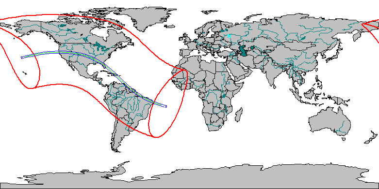

|||
|-|-|
| Начало частного затмения | `15:5:8 UTC` |
| Начало полного затмения | `15:58:50 UTC` |
| Максимальная фаза | `17:40:43 UTC` |
| Конец полного затмения | `19:22:42 UTC` |
| Конец частного затмения | `20:16:25 UTC` |

**Наибольшее затмение:**

| Долгота: | Широта: |
|-|-|
| `78° 25.3' Зап.` | `25° 54.0' Сев.` |

## Кольцеобразное солнечное затмение `5 - 6 февраля 2046г`.

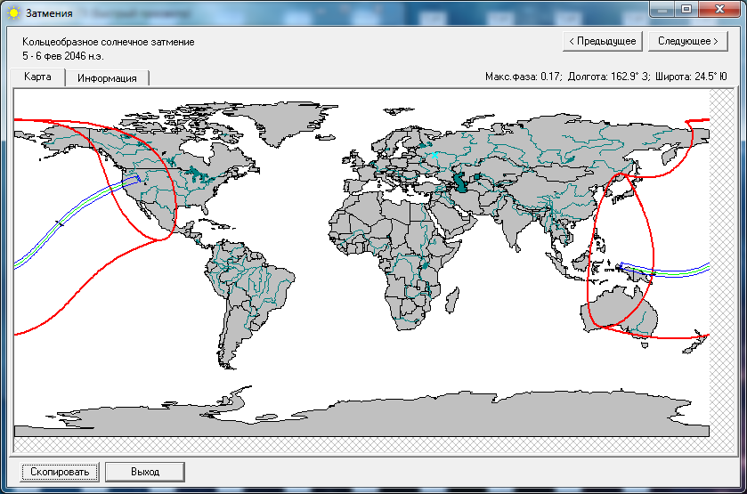

|||
|-|-|
| Начало частного затмения | `20:3:21 UTC` |
| Начало полного затмения | `21:11:12 UTC` |
| Максимальная фаза | `23:4:29 UTC` |
| Конец полного затмения | `0:57:35 UTC` |
| Конец частного затмения | `2:5:27 UTC` |

**Наибольшее затмение:**

| Долгота: | Широта: |
|-|-|
| `171° 16.0' Зап.` | `4° 46.7' Сев.` |

## Полное солнечное затмение `2 августа 2046г`.

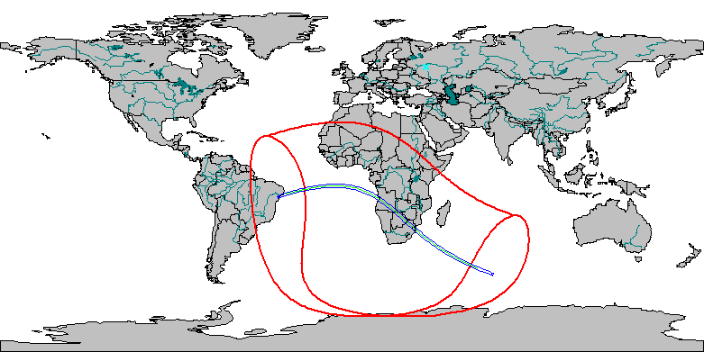

|||
|-|-|
| Начало частного затмения | `7:47:53 UTC` |
| Начало полного затмения | `8:49:15 UTC` |
| Максимальная фаза | `10:19:17 UTC` |
| Конец полного затмения | `11:49:7 UTC` |
| Конец частного затмения | `12:50:23 UTC` |

**Наибольшее затмение:**

| Долгота: | Широта: |
|-|-|
| `15° 17.5' Вос.` | `12° 44.7' Южн.` |

## Частное солнечное затмение `25 - 26 января 2047г`.

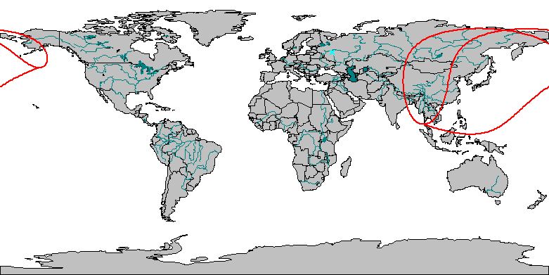

|||
|-|-|
| Начало частного затмения | `23:20:12 UTC` |
| Максимальная фаза | `1:31:18 UTC` |
| Конец частного затмения | `3:42:3 UTC` |

**Наибольшее затмение:**

| Долгота: | Широта: |
|-|-|
| `111° 48.6' Вос.` | `63° 1.3' Сев.` |

## Частное солнечное затмение `23 июня 2047г`.

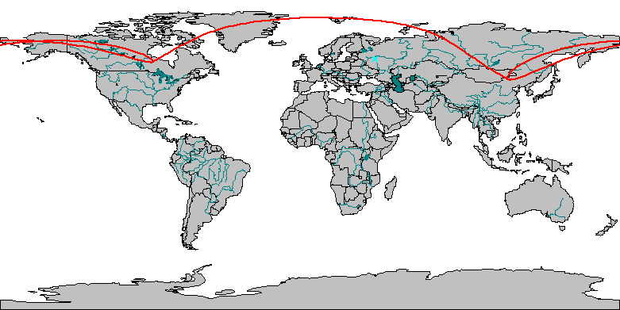

|||
|-|-|
| Начало частного затмения | `9:27:55 UTC` |
| Максимальная фаза | `10:50:33 UTC` |
| Конец частного затмения | `12:13:19 UTC` |

**Наибольшее затмение:**

| Долгота: | Широта: |
|-|-|
| `177° 52.3' Зап.` | `65° 54.6' Сев.` |

## Частное солнечное затмение `22 июля 2047г`.

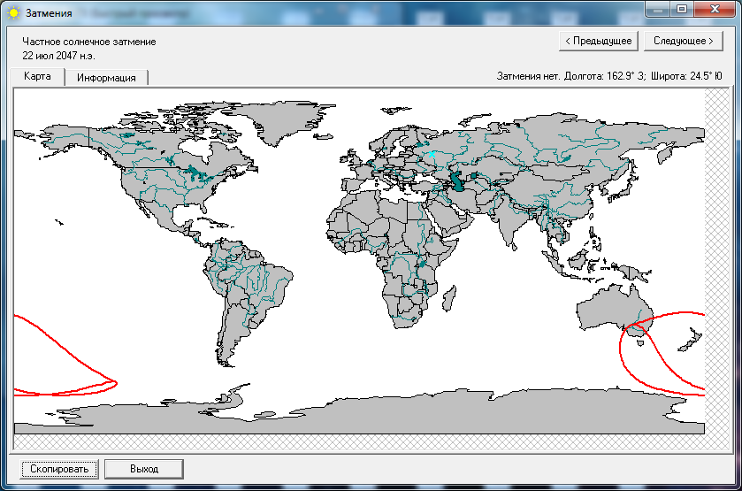

|||
|-|-|
| Начало частного затмения | `21:9:32 UTC` |
| Максимальная фаза | `22:34:21 UTC` |
| Конец частного затмения | `23:58:34 UTC` |

**Наибольшее затмение:**

| Долгота: | Широта: |
|-|-|
| `160° 14.1' Вос.` | `63° 35.6' Южн.` |

## Частное солнечное затмение `16 - 17 декабря 2047г`.

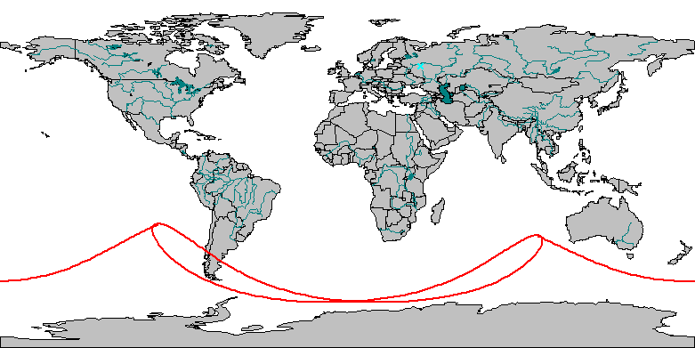

|||
|-|-|
| Начало частного затмения | `21:53:1 UTC` |
| Максимальная фаза | `23:48:13 UTC` |
| Конец частного затмения | `1:43:32 UTC` |

**Наибольшее затмение:**

| Долгота: | Широта: |
|-|-|
| `6° 28.3' Зап.` | `66° 35.0' Южн.` |

## Кольцеобразное солнечное затмение `11 июня 2048г`.

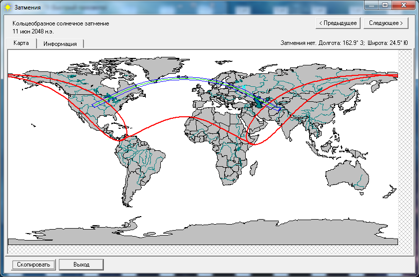

|||
|-|-|
| Начало частного затмения | `10:7:47 UTC` |
| Начало полного затмения | `11:23:35 UTC` |
| Максимальная фаза | `12:56:53 UTC` |
| Конец полного затмения | `14:30:12 UTC` |
| Конец частного затмения | `15:45:59 UTC` |

**Наибольшее затмение:**

| Долгота: | Широта: |
|-|-|
| `11° 22.4' Зап.` | `63° 40.9' Сев.` |

## Полное солнечное затмение `5 декабря 2048г`.

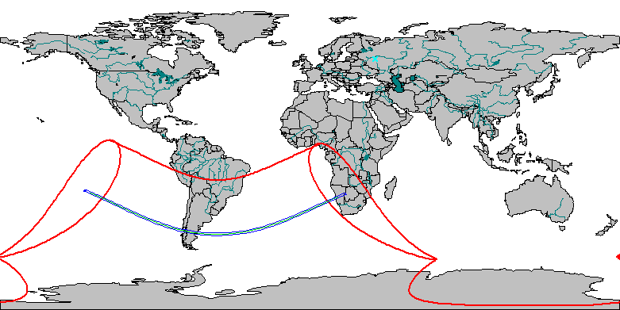

|||
|-|-|
| Начало частного затмения | `12:59:52 UTC` |
| Начало полного затмения | `13:57:53 UTC` |
| Максимальная фаза | `15:33:29 UTC` |
| Конец полного затмения | `17:9:6 UTC` |
| Конец частного затмения | `18:7:5 UTC` |

**Наибольшее затмение:**

| Долгота: | Широта: |
|-|-|
| `56° 15.3' Зап.` | `46° 9.3' Южн.` |

## Кольцеобразное солнечное затмение `31 мая 2049г`.

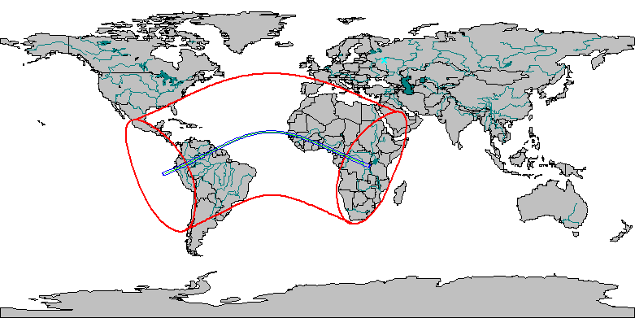

|||
|-|-|
| Начало частного затмения | `10:57:0 UTC` |
| Начало полного затмения | `12:0:48 UTC` |
| Максимальная фаза | `13:57:57 UTC` |
| Конец полного затмения | `15:55:8 UTC` |
| Конец частного затмения | `16:58:59 UTC` |

**Наибольшее затмение:**

| Долгота: | Широта: |
|-|-|
| `29° 43.0' Зап.` | `15° 18.2' Сев.` |

## Полное солнечное затмение `25 ноября 2049г`.

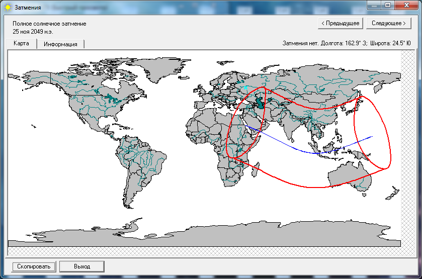

|||
|-|-|
| Начало частного затмения | `2:47:45 UTC` |
| Начало полного затмения | `3:48:26 UTC` |
| Максимальная фаза | `5:31:48 UTC` |
| Конец полного затмения | `7:15:9 UTC` |
| Конец частного затмения | `8:15:47 UTC` |

**Наибольшее затмение:**

| Долгота: | Широта: |
|-|-|
| `95° 22.3' Вос.` | `3° 48.7' Южн.` |

## Полное солнечное затмение `20 мая 2050г`.

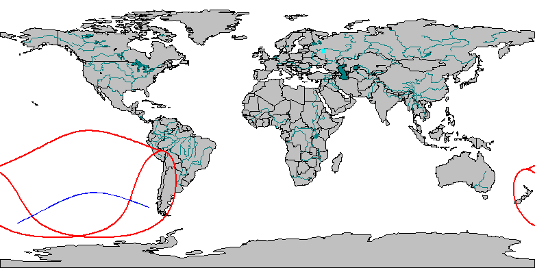

|||
|-|-|
| Начало частного затмения | `18:20:34 UTC` |
| Начало полного затмения | `19:46:49 UTC` |
| Максимальная фаза | `20:40:47 UTC` |
| Конец полного затмения | `21:34:56 UTC` |
| Конец частного затмения | `23:1:14 UTC` |

**Наибольшее затмение:**

| Долгота: | Широта: |
|-|-|
| `123° 34.9' Зап.` | `40° 6.3' Южн.` |

## Частное солнечное затмение `14 ноября 2050г`.

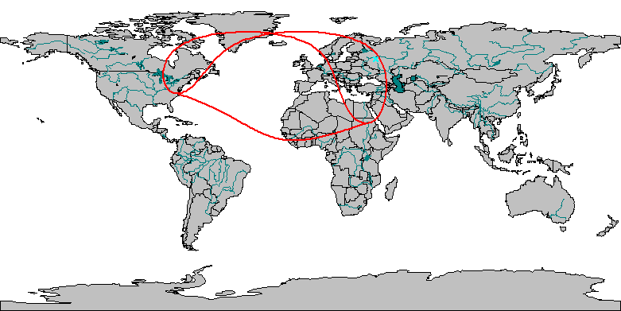

|||
|-|-|
| Начало частного затмения | `11:15:33 UTC` |
| Максимальная фаза | `13:28:49 UTC` |
| Конец частного затмения | `15:42:14 UTC` |

**Наибольшее затмение:**

| Долгота: | Широта: |
|-|-|
| `1° 10.6' Вос.` | `69° 39.2' Сев.` |

## Частное солнечное затмение `11 апреля 2051г`.

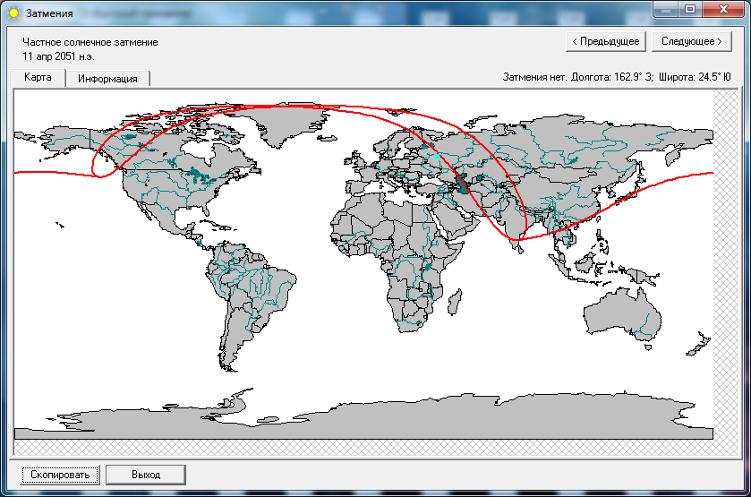

|||
|-|-|
| Начало частного затмения | `0:10:30 UTC` |
| Максимальная фаза | `2:8:35 UTC` |
| Конец частного затмения | `4:6:18 UTC` |

**Наибольшее затмение:**

| Долгота: | Широта: |
|-|-|
| `32° 15.7' Вос.` | `71° 44.5' Сев.` |

## Частное солнечное затмение `4 октября 2051г`.

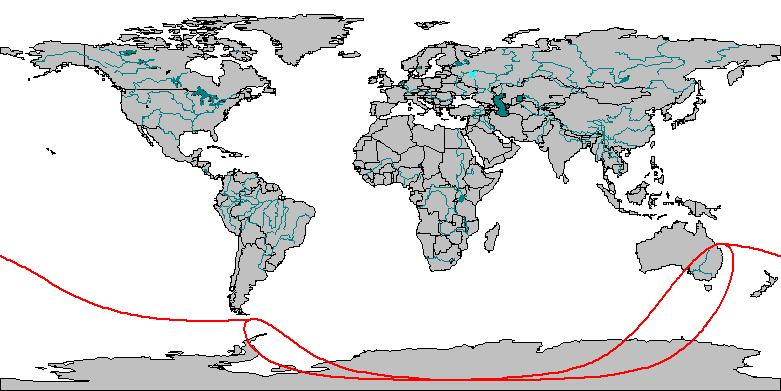

|||
|-|-|
| Начало частного затмения | `19:1:52 UTC` |
| Максимальная фаза | `21:0:11 UTC` |
| Конец частного затмения | `22:57:59 UTC` |

**Наибольшее затмение:**

| Долгота: | Широта: |
|-|-|
| `117° 47.4' Вос.` | `72° 9.5' Южн.` |

## Полное солнечное затмение `30 марта 2052г`.

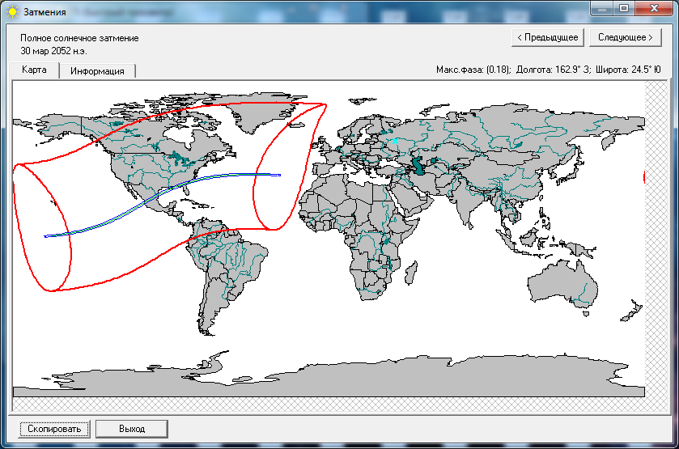

|||
|-|-|
| Начало частного затмения | `15:52:43 UTC` |
| Начало полного затмения | `16:50:7 UTC` |
| Максимальная фаза | `18:29:48 UTC` |
| Конец полного затмения | `20:9:23 UTC` |
| Конец частного затмения | `21:6:42 UTC` |

**Наибольшее затмение:**

| Долгота: | Широта: |
|-|-|
| `102° 24.6' Зап.` | `22° 22.8' Сев.` |

## Кольцеобразное солнечное затмение `22 - 23 сентября 2052г`.

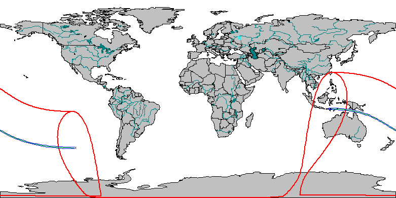

|||
|-|-|
| Начало частного затмения | `20:47:47 UTC` |
| Начало полного затмения | `21:54:12 UTC` |
| Максимальная фаза | `23:37:6 UTC` |
| Конец полного затмения | `1:19:51 UTC` |
| Конец частного затмения | `2:26:19 UTC` |

**Наибольшее затмение:**

| Долгота: | Широта: |
|-|-|
| `175° 6.2' Вос.` | `25° 40.7' Южн.` |

## Кольцеобразное солнечное затмение `20 марта 2053г`.

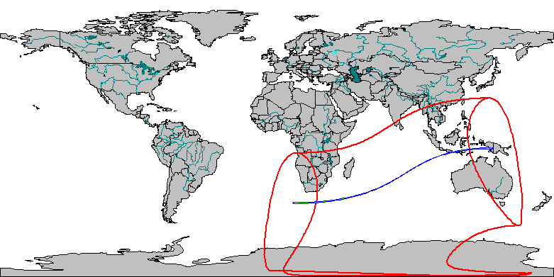

|||
|-|-|
| Начало частного затмения | `4:21:4 UTC` |
| Начало полного затмения | `5:24:56 UTC` |
| Максимальная фаза | `7:6:14 UTC` |
| Конец полного затмения | `8:47:40 UTC` |
| Конец частного затмения | `9:51:28 UTC` |

**Наибольшее затмение:**

| Долгота: | Широта: |
|-|-|
| `83° 4.0' Вос.` | `23° 0.2' Южн.` |

## Полное солнечное затмение `12 сентября 2053г`.

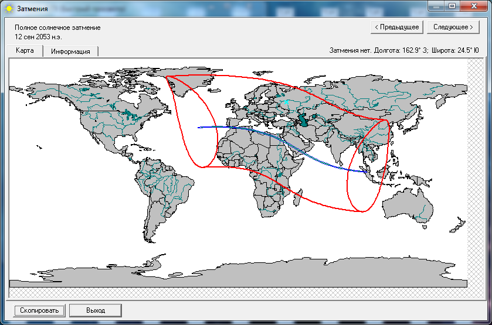

|||
|-|-|
| Начало частного затмения | `6:51:10 UTC` |
| Начало полного затмения | `7:50:22 UTC` |
| Максимальная фаза | `9:32:4 UTC` |
| Конец полного затмения | `11:13:52 UTC` |
| Конец частного затмения | `12:13:11 UTC` |

**Наибольшее затмение:**

| Долгота: | Широта: |
|-|-|
| `41° 50.1' Вос.` | `21° 29.0' Сев.` |

## Частное солнечное затмение `9 марта 2054г`.

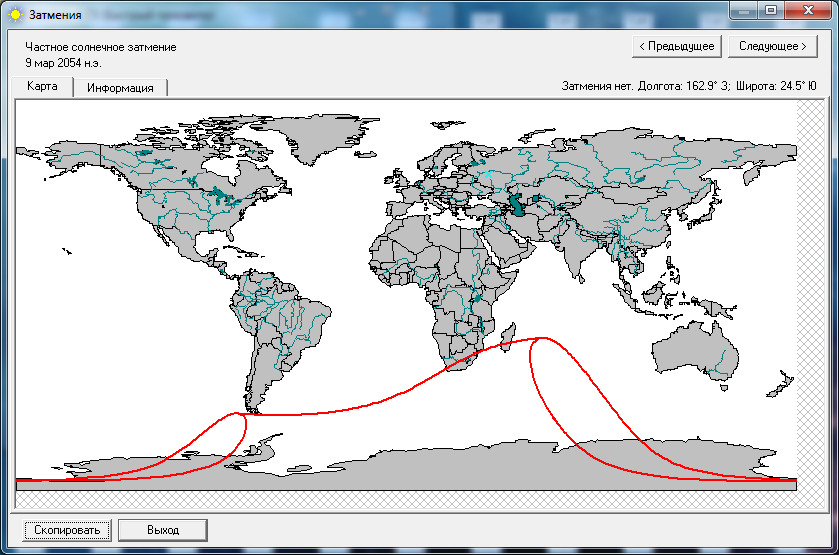

|||
|-|-|
| Начало частного затмения | `10:30:20 UTC` |
| Максимальная фаза | `12:31:34 UTC` |
| Конец частного затмения | `14:33:16 UTC` |

**Наибольшее затмение:**

| Долгота: | Широта: |
|-|-|
| `98° 5.0' Вос.` | `72° 9.3' Южн.` |

## Частное солнечное затмение `3 августа 2054г`.

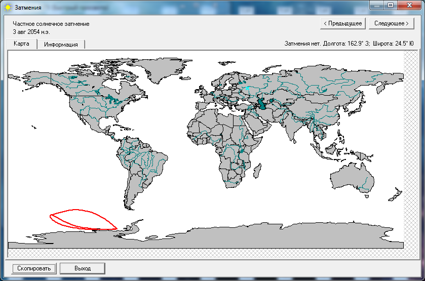

|||
|-|-|
| Начало частного затмения | `17:29:25 UTC` |
| Максимальная фаза | `18:1:52 UTC` |
| Конец частного затмения | `18:33:58 UTC` |

**Наибольшее затмение:**

| Долгота: | Широта: |
|-|-|
| `121° 15.9' Зап.` | `69° 53.9' Южн.` |

## Частное солнечное затмение `1 - 2 сентября 2054г`.

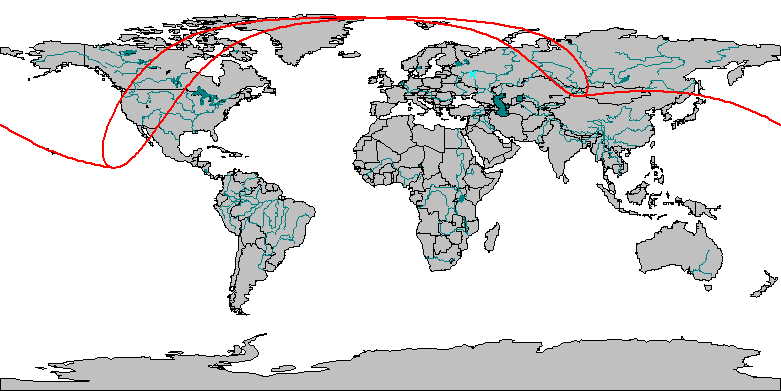

|||
|-|-|
| Начало частного затмения | `23:10:25 UTC` |
| Максимальная фаза | `1:7:26 UTC` |
| Конец частного затмения | `3:4:50 UTC` |

**Наибольшее затмение:**

| Долгота: | Широта: |
|-|-|
| `82° 12.0' Зап.` | `71° 47.7' Сев.` |

## Частное солнечное затмение `27 января 2055г`.

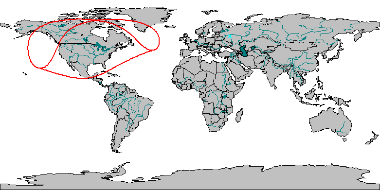

|||
|-|-|
| Начало частного затмения | `15:47:8 UTC` |
| Максимальная фаза | `17:51:57 UTC` |
| Конец частного затмения | `19:56:35 UTC` |

**Наибольшее затмение:**

| Долгота: | Широта: |
|-|-|
| `112° 10.7' Зап.` | `69° 40.5' Сев.` |

## Полное солнечное затмение `24 июля 2055г`.

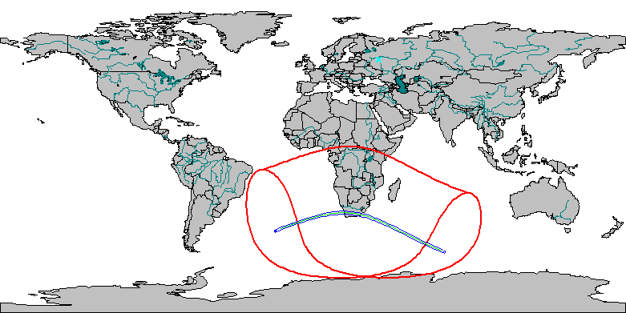

|||
|-|-|
| Начало частного затмения | `7:35:37 UTC` |
| Начало полного затмения | `8:50:57 UTC` |
| Максимальная фаза | `9:55:43 UTC` |
| Конец полного затмения | `11:0:24 UTC` |
| Конец частного затмения | `12:15:37 UTC` |

**Наибольшее затмение:**

| Долгота: | Широта: |
|-|-|
| `25° 53.4' Вос.` | `33° 16.5' Южн.` |

## Кольцеобразное солнечное затмение `16 - 17 января 2056г`.

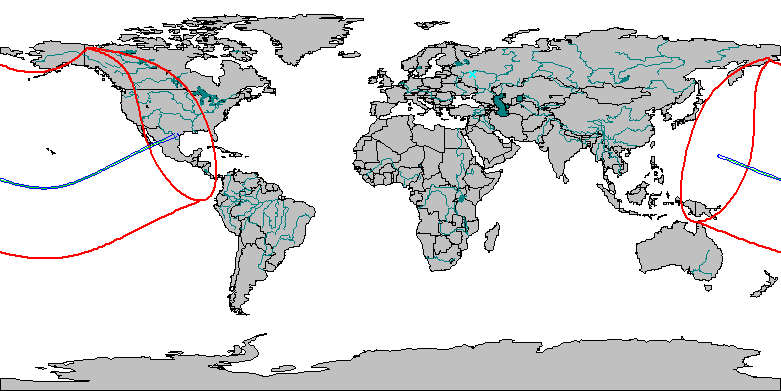

|||
|-|-|
| Начало частного затмения | `19:28:10 UTC` |
| Начало полного затмения | `20:32:34 UTC` |
| Максимальная фаза | `22:14:34 UTC` |
| Конец полного затмения | `23:56:35 UTC` |
| Конец частного затмения | `1:1:2 UTC` |

**Наибольшее затмение:**

| Долгота: | Широта: |
|-|-|
| `153° 25.3' Зап.` | `3° 54.8' Сев.` |

## Кольцеобразное солнечное затмение `12 июля 2056г`.

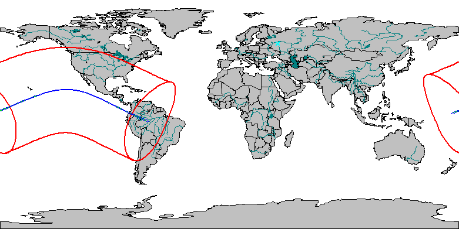

|||
|-|-|
| Начало частного затмения | `17:23:48 UTC` |
| Начало полного затмения | `18:25:46 UTC` |
| Максимальная фаза | `20:19:51 UTC` |
| Конец полного затмения | `22:13:53 UTC` |
| Конец частного затмения | `23:15:49 UTC` |

**Наибольшее затмение:**

| Долгота: | Широта: |
|-|-|
| `123° 38.4' Зап.` | `19° 26.3' Сев.` |

## Полное солнечное затмение `5 января 2057г`.

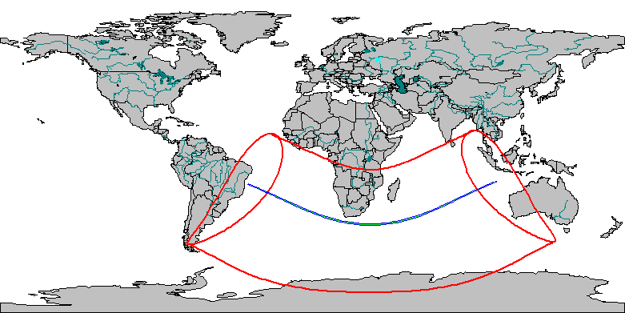

|||
|-|-|
| Начало частного затмения | `7:6:43 UTC` |
| Начало полного затмения | `8:4:49 UTC` |
| Максимальная фаза | `9:45:42 UTC` |
| Конец полного затмения | `11:26:35 UTC` |
| Конец частного затмения | `12:24:46 UTC` |

**Наибольшее затмение:**

| Долгота: | Широта: |
|-|-|
| `35° 17.4' Вос.` | `39° 12.9' Южн.` |

## Кольцеобразное солнечное затмение `1 - 2 июля 2057г`.

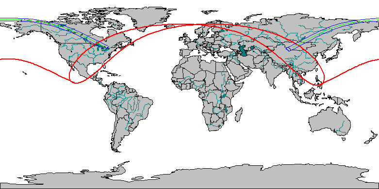

|||
|-|-|
| Начало частного затмения | `20:55:28 UTC` |
| Начало полного затмения | `22:16:18 UTC` |
| Максимальная фаза | `23:38:3 UTC` |
| Конец полного затмения | `0:59:46 UTC` |
| Конец частного затмения | `2:20:34 UTC` |

**Наибольшее затмение:**

| Долгота: | Широта: |
|-|-|
| `176° 5.9' Зап.` | `71° 30.7' Сев.` |

## Полное солнечное затмение `25 - 26 декабря 2057г`.

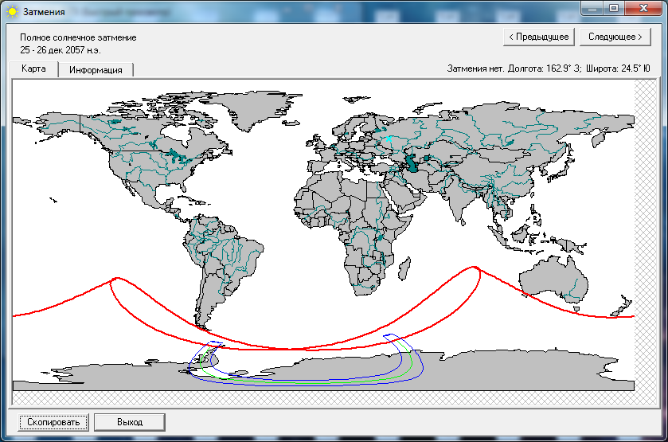

|||
|-|-|
| Начало частного затмения | `23:7:11 UTC` |
| Начало полного затмения | `0:35:47 UTC` |
| Максимальная фаза | `1:12:25 UTC` |
| Конец полного затмения | `1:49:0 UTC` |
| Конец частного затмения | `3:17:35 UTC` |

**Наибольшее затмение:**

| Долгота: | Широта: |
|-|-|
| `21° 56.1' Вос.` | `84° 51.8' Южн.` |

## Частное солнечное затмение `22 мая 2058г`.

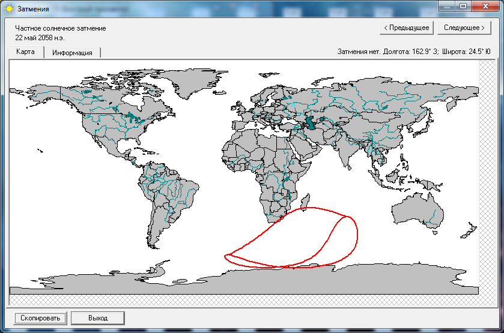

|||
|-|-|
| Начало частного затмения | `9:3:6 UTC` |
| Максимальная фаза | `10:37:13 UTC` |
| Конец частного затмения | `12:11:54 UTC` |

**Наибольшее затмение:**

| Долгота: | Широта: |
|-|-|
| `61° 16.8' Вос.` | `63° 41.0' Южн.` |

## Частное солнечное затмение `20 - 21 июня 2058г`.

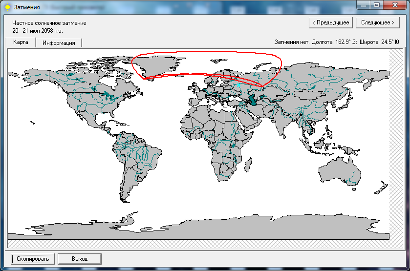

|||
|-|-|
| Начало частного затмения | `23:22:27 UTC` |
| Максимальная фаза | `0:17:22 UTC` |
| Конец частного затмения | `1:12:8 UTC` |

**Наибольшее затмение:**

| Долгота: | Широта: |
|-|-|
| `9° 57.4' Вос.` | `66° 5.6' Сев.` |

## Частное солнечное затмение `16 ноября 2058г`.

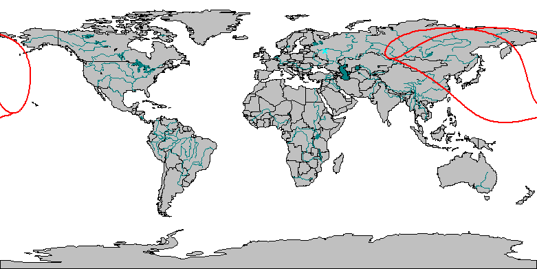

|||
|-|-|
| Начало частного затмения | `1:23:37 UTC` |
| Максимальная фаза | `3:20:53 UTC` |
| Конец частного затмения | `5:18:31 UTC` |

**Наибольшее затмение:**

| Долгота: | Широта: |
|-|-|
| `174° 19.8' Вос.` | `63° 3.4' Сев.` |

## Полное солнечное затмение `11 мая 2059г`.

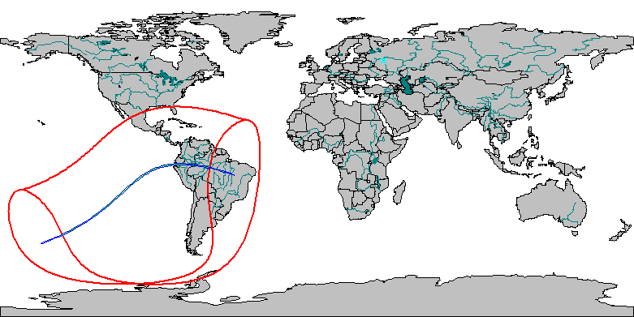

|||
|-|-|
| Начало частного затмения | `16:43:3 UTC` |
| Начало полного затмения | `17:46:58 UTC` |
| Максимальная фаза | `19:20:1 UTC` |
| Конец полного затмения | `20:53:15 UTC` |
| Конец частного затмения | `21:57:19 UTC` |

**Наибольшее затмение:**

| Долгота: | Широта: |
|-|-|
| `100° 18.2' Зап.` | `10° 42.7' Южн.` |

## Кольцеобразное солнечное затмение `5 ноября 2059г`.

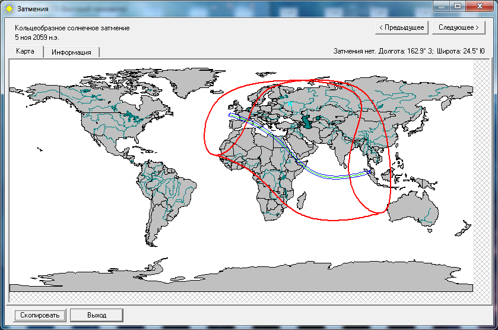

|||
|-|-|
| Начало частного затмения | `6:21:6 UTC` |
| Начало полного затмения | `7:29:10 UTC` |
| Максимальная фаза | `9:15:59 UTC` |
| Конец полного затмения | `11:2:58 UTC` |
| Конец частного затмения | `12:11:0 UTC` |

**Наибольшее затмение:**

| Долгота: | Широта: |
|-|-|
| `47° 11.0' Вос.` | `8° 44.8' Сев.` |

## Полное солнечное затмение `30 апреля 2060г`.

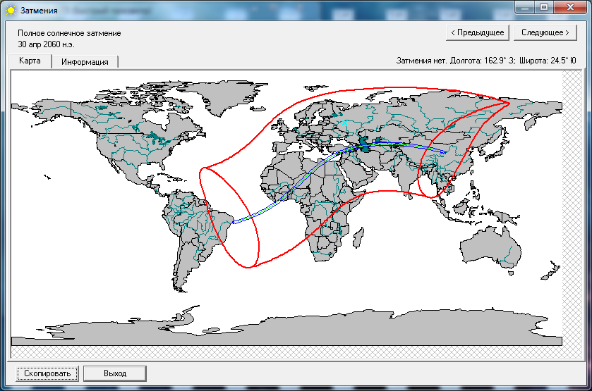

|||
|-|-|
| Начало частного затмения | `7:31:27 UTC` |
| Начало полного затмения | `8:26:16 UTC` |
| Максимальная фаза | `10:7:49 UTC` |
| Конец полного затмения | `11:49:14 UTC` |
| Конец частного затмения | `12:44:6 UTC` |

**Наибольшее затмение:**

| Долгота: | Широта: |
|-|-|
| `20° 59.4' Вос.` | `27° 57.4' Сев.` |

## Кольцеобразное солнечное затмение `24 октября 2060г`.

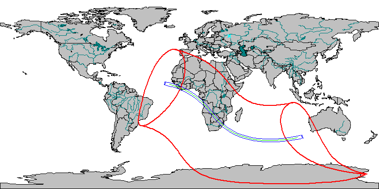

|||
|-|-|
| Начало частного затмения | `6:17:23 UTC` |
| Начало полного затмения | `7:23:51 UTC` |
| Максимальная фаза | `9:21:52 UTC` |
| Конец полного затмения | `11:19:43 UTC` |
| Конец частного затмения | `12:26:12 UTC` |

**Наибольшее затмение:**

| Долгота: | Широта: |
|-|-|
| `28° 13.3' Вос.` | `25° 47.3' Южн.` |

## Полное солнечное затмение `20 апреля 2061г`.

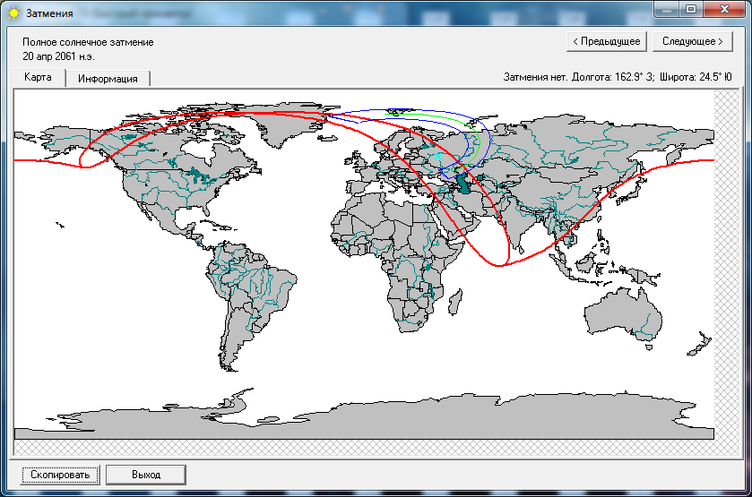

|||
|-|-|
| Начало частного затмения | `0:50:19 UTC` |
| Начало полного затмения | `2:21:28 UTC` |
| Максимальная фаза | `2:54:35 UTC` |
| Конец полного затмения | `3:27:13 UTC` |
| Конец частного затмения | `4:58:18 UTC` |

**Наибольшее затмение:**

| Долгота: | Широта: |
|-|-|
| `59° 16.7' Вос.` | `64° 32.1' Сев.` |

## Кольцеобразное солнечное затмение `13 октября 2061г`.

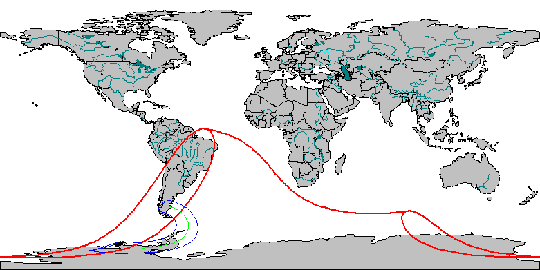

|||
|-|-|
| Начало частного затмения | `8:8:21 UTC` |
| Начало полного затмения | `9:53:28 UTC` |
| Максимальная фаза | `10:29:53 UTC` |
| Конец полного затмения | `11:5:44 UTC` |
| Конец частного затмения | `12:50:53 UTC` |

**Наибольшее затмение:**

| Долгота: | Широта: |
|-|-|
| `54° 21.6' Зап.` | `62° 8.7' Южн.` |

## Частное солнечное затмение `11 марта 2062г`.

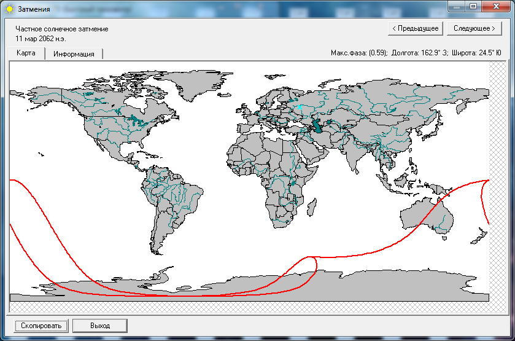

|||
|-|-|
| Начало частного затмения | `2:12:34 UTC` |
| Максимальная фаза | `4:23:58 UTC` |
| Конец частного затмения | `6:35:54 UTC` |

**Наибольшее затмение:**

| Долгота: | Широта: |
|-|-|
| `146° 58.0' Зап.` | `61° 8.0' Южн.` |

## Частное солнечное затмение `3 сентября 2062г`.

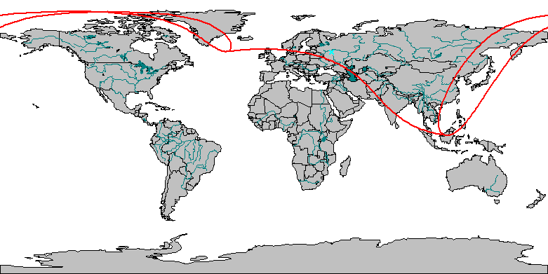

|||
|-|-|
| Начало частного затмения | `6:51:41 UTC` |
| Максимальная фаза | `8:52:8 UTC` |
| Конец частного затмения | `10:53:15 UTC` |

**Наибольшее затмение:**

| Долгота: | Широта: |
|-|-|
| `150° 28.8' Вос.` | `61° 28.0' Сев.` |

## Кольцеобразное солнечное затмение `28 февраля 2063г`.

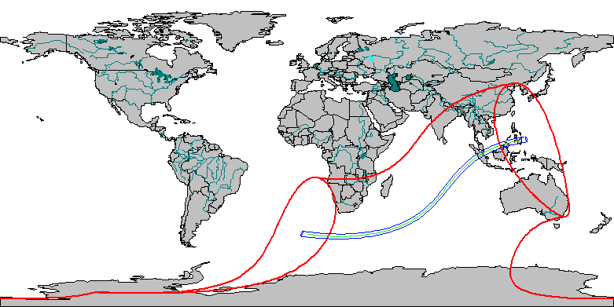

|||
|-|-|
| Начало частного затмения | `4:39:53 UTC` |
| Начало полного затмения | `5:46:54 UTC` |
| Максимальная фаза | `7:41:12 UTC` |
| Конец полного затмения | `9:35:41 UTC` |
| Конец частного затмения | `10:42:40 UTC` |

**Наибольшее затмение:**

| Долгота: | Широта: |
|-|-|
| `77° 49.4' Вос.` | `25° 13.6' Южн.` |

## Полное солнечное затмение `23 - 24 августа 2063г`.

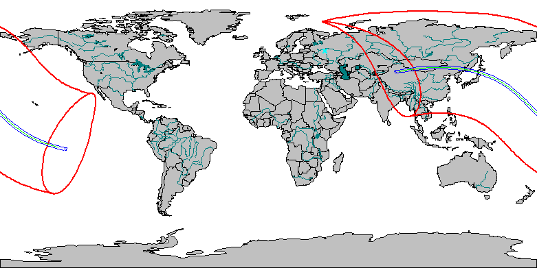

|||
|-|-|
| Начало частного затмения | `22:45:17 UTC` |
| Начало полного затмения | `23:39:42 UTC` |
| Максимальная фаза | `1:19:49 UTC` |
| Конец полного затмения | `3:0:6 UTC` |
| Конец частного затмения | `3:54:30 UTC` |

**Наибольшее затмение:**

| Долгота: | Широта: |
|-|-|
| `168° 31.5' Вос.` | `25° 33.1' Сев.` |

## Кольцеобразное солнечное затмение `17 февраля 2064г`.

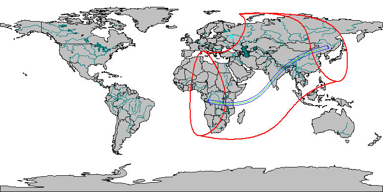

|||
|-|-|
| Начало частного затмения | `3:56:53 UTC` |
| Начало полного затмения | `5:4:19 UTC` |
| Максимальная фаза | `6:58:3 UTC` |
| Конец полного затмения | `8:51:35 UTC` |
| Конец частного затмения | `9:59:3 UTC` |

**Наибольшее затмение:**

| Долгота: | Широта: |
|-|-|
| `69° 49.7' Вос.` | `7° 1.8' Сев.` |

## Полное солнечное затмение `12 августа 2064г`.

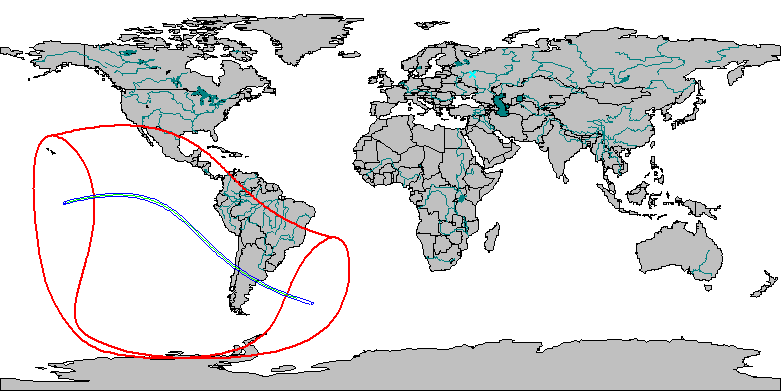

|||
|-|-|
| Начало частного затмения | `15:9:15 UTC` |
| Начало полного затмения | `16:9:23 UTC` |
| Максимальная фаза | `17:43:46 UTC` |
| Конец полного затмения | `19:17:57 UTC` |
| Конец частного затмения | `20:17:59 UTC` |

**Наибольшее затмение:**

| Долгота: | Широта: |
|-|-|
| `95° 53.9' Зап.` | `10° 56.2' Южн.` |

## Частное солнечное затмение `5 февраля 2065г`.

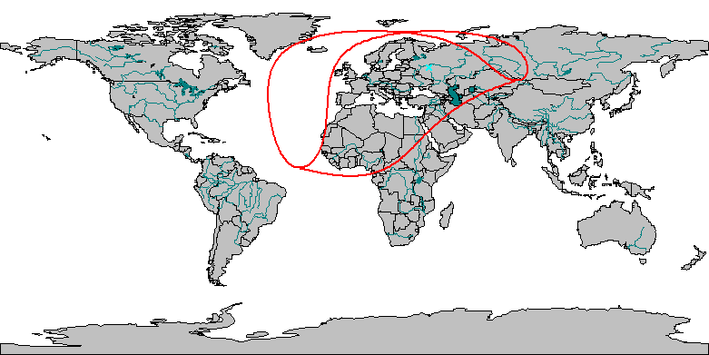

|||
|-|-|
| Начало частного затмения | `7:38:25 UTC` |
| Максимальная фаза | `9:50:3 UTC` |
| Конец частного затмения | `12:1:15 UTC` |

**Наибольшее затмение:**

| Долгота: | Широта: |
|-|-|
| `21° 52.8' Зап.` | `62° 19.2' Сев.` |

## Частное солнечное затмение `3 июля 2065г`.

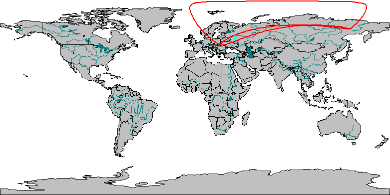

|||
|-|-|
| Начало частного затмения | `16:30:54 UTC` |
| Максимальная фаза | `17:31:31 UTC` |
| Конец частного затмения | `18:32:24 UTC` |

**Наибольшее затмение:**

| Долгота: | Широта: |
|-|-|
| `71° 58.0' Вос.` | `64° 58.2' Сев.` |

## Частное солнечное затмение `2 августа 2065г`.

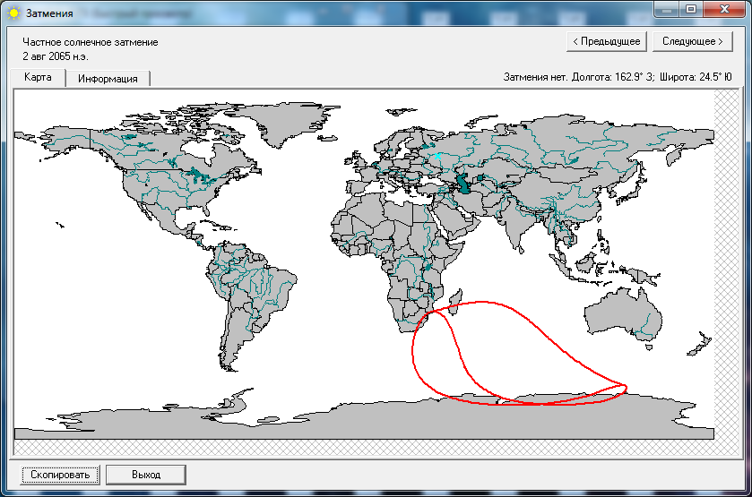

|||
|-|-|
| Начало частного затмения | `3:53:31 UTC` |
| Максимальная фаза | `5:31:55 UTC` |
| Конец частного затмения | `7:9:39 UTC` |

**Наибольшее затмение:**

| Долгота: | Широта: |
|-|-|
| `46° 33.1' Вос.` | `62° 52.1' Южн.` |

## Частное солнечное затмение `27 декабря 2065г`.

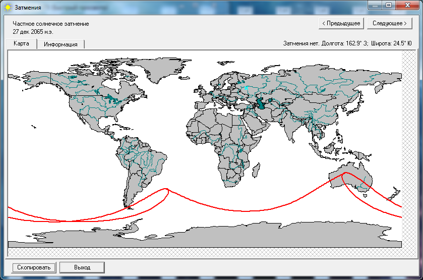

|||
|-|-|
| Начало частного затмения | `6:42:50 UTC` |
| Максимальная фаза | `8:37:31 UTC` |
| Конец частного затмения | `10:32:26 UTC` |

**Наибольшее затмение:**

| Долгота: | Широта: |
|-|-|
| `149° 3.4' Зап.` | `65° 32.5' Южн.` |

## Кольцеобразное солнечное затмение `22 июня 2066г`.

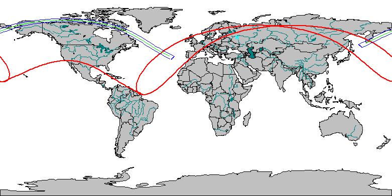

|||
|-|-|
| Начало частного затмения | `16:39:25 UTC` |
| Начало полного затмения | `17:59:41 UTC` |
| Максимальная фаза | `19:23:25 UTC` |
| Конец полного затмения | `20:47:16 UTC` |
| Конец частного затмения | `22:7:32 UTC` |

**Наибольшее затмение:**

| Долгота: | Широта: |
|-|-|
| `96° 16.8' Зап.` | `70° 7.9' Сев.` |

## Полное солнечное затмение `16 - 17 декабря 2066г`.

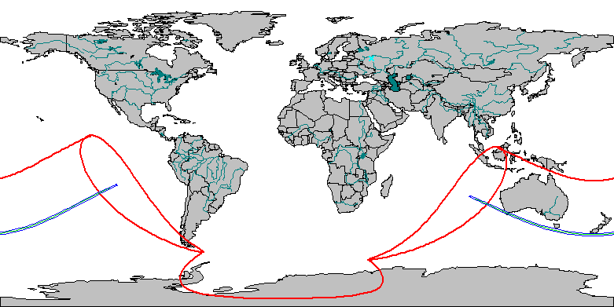

|||
|-|-|
| Начало частного затмения | `21:47:34 UTC` |
| Начало полного затмения | `22:45:54 UTC` |
| Максимальная фаза | `0:21:14 UTC` |
| Конец полного затмения | `1:56:36 UTC` |
| Конец частного затмения | `2:54:54 UTC` |

**Наибольшее затмение:**

| Долгота: | Широта: |
|-|-|
| `175° 51.9' Вос.` | `47° 22.8' Южн.` |

## Кольцеобразное солнечное затмение `11 июня 2067г`.

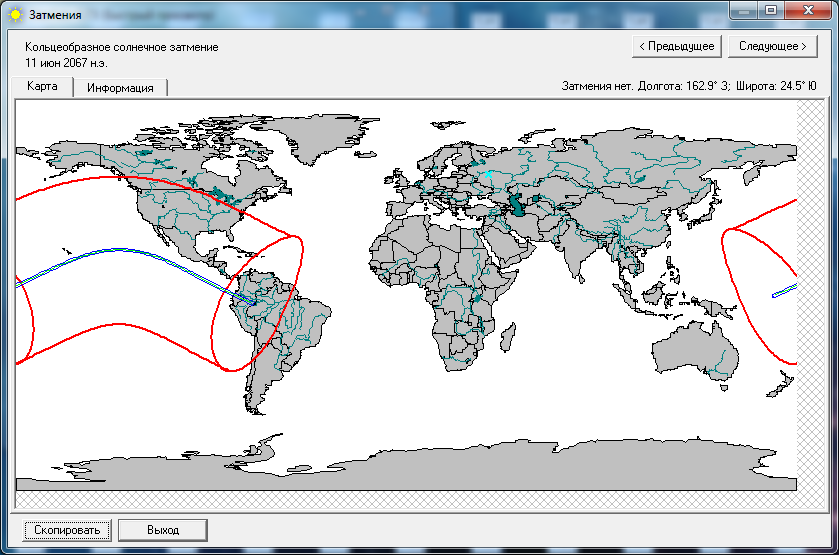

|||
|-|-|
| Начало частного затмения | `17:39:17 UTC` |
| Начало полного затмения | `18:42:38 UTC` |
| Максимальная фаза | `20:40:1 UTC` |
| Конец полного затмения | `22:37:27 UTC` |
| Конец частного затмения | `23:40:50 UTC` |

**Наибольшее затмение:**

| Долгота: | Широта: |
|-|-|
| `130° 6.0' Зап.` | `21° 2.3' Сев.` |

## Полное солнечное затмение `6 декабря 2067г`.

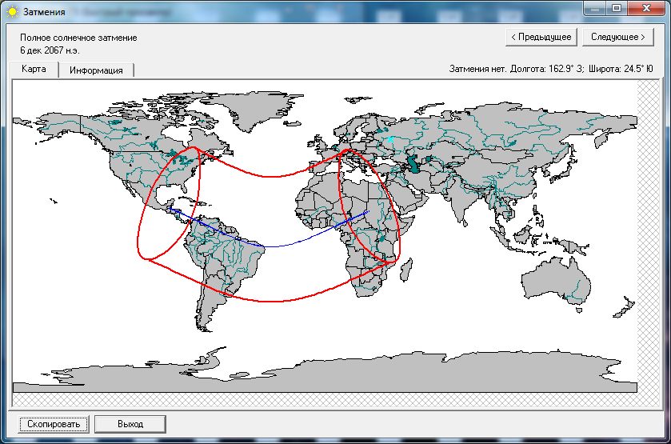

|||
|-|-|
| Начало частного затмения | `11:16:20 UTC` |
| Начало полного затмения | `12:17:6 UTC` |
| Максимальная фаза | `14:1:17 UTC` |
| Конец полного затмения | `15:45:25 UTC` |
| Конец частного затмения | `16:46:9 UTC` |

**Наибольшее затмение:**

| Долгота: | Широта: |
|-|-|
| `32° 18.1' Зап.` | `6° 3.2' Южн.` |

## Полное солнечное затмение `31 мая 2068г`.

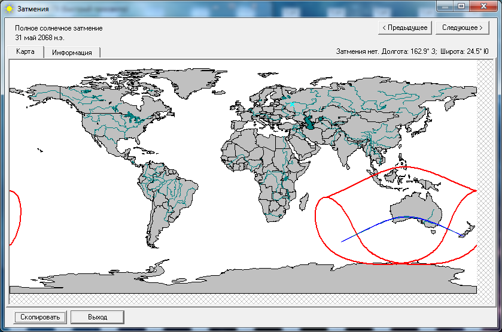

|||
|-|-|
| Начало частного затмения | `1:29:37 UTC` |
| Начало полного затмения | `2:48:26 UTC` |
| Максимальная фаза | `3:54:11 UTC` |
| Конец полного затмения | `4:59:56 UTC` |
| Конец частного затмения | `6:18:54 UTC` |

**Наибольшее затмение:**

| Долгота: | Широта: |
|-|-|
| `123° 18.5' Вос.` | `31° 1.3' Южн.` |

## Частное солнечное затмение `24 ноября 2068г`.

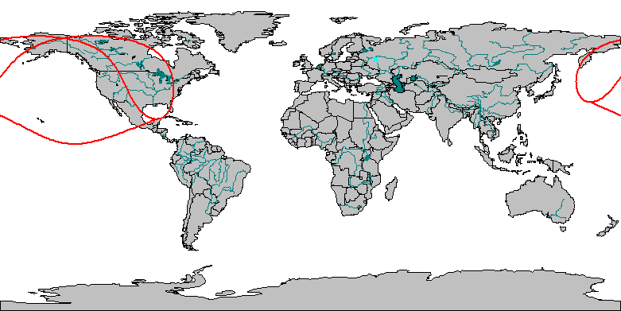

|||
|-|-|
| Начало частного затмения | `19:14:31 UTC` |
| Максимальная фаза | `21:30:1 UTC` |
| Конец частного затмения | `23:45:33 UTC` |

**Наибольшее затмение:**

| Долгота: | Широта: |
|-|-|
| `130° 59.2' Зап.` | `68° 38.9' Сев.` |

## Частное солнечное затмение `21 апреля 2069г`.

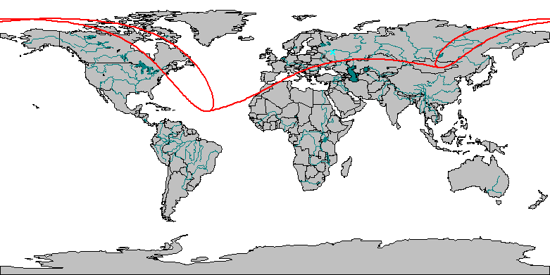

|||
|-|-|
| Начало частного затмения | `8:15:11 UTC` |
| Максимальная фаза | `10:8:41 UTC` |
| Конец частного затмения | `12:1:51 UTC` |

**Наибольшее затмение:**

| Долгота: | Широта: |
|-|-|
| `101° 14.7' Зап.` | `71° 9.8' Сев.` |

## Частное солнечное затмение `20 мая 2069г`.

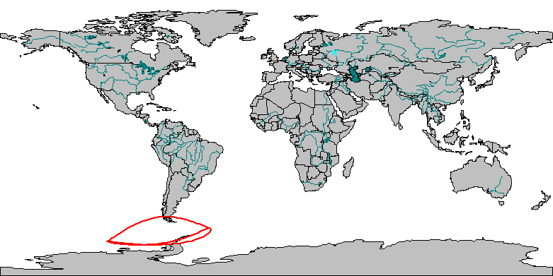

|||
|-|-|
| Начало частного затмения | `17:12:51 UTC` |
| Максимальная фаза | `17:50:52 UTC` |
| Конец частного затмения | `18:29:7 UTC` |

**Наибольшее затмение:**

| Долгота: | Широта: |
|-|-|
| `69° 50.3' Зап.` | `68° 53.4' Южн.` |

## Частное солнечное затмение `15 октября 2069г`.

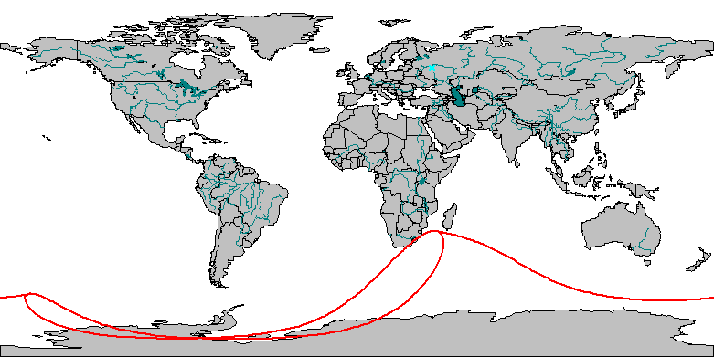

|||
|-|-|
| Начало частного затмения | `2:25:38 UTC` |
| Максимальная фаза | `4:17:28 UTC` |
| Конец частного затмения | `6:8:48 UTC` |

**Наибольшее затмение:**

| Долгота: | Широта: |
|-|-|
| `5° 27.1' Зап.` | `71° 45.5' Южн.` |

## Полное солнечное затмение `10 - 11 апреля 2070г`.

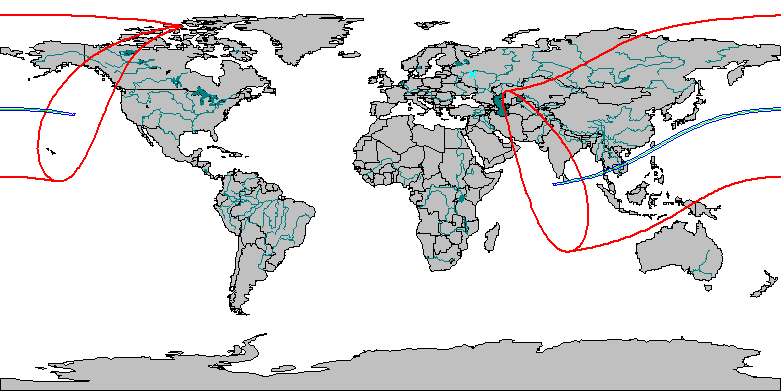

|||
|-|-|
| Начало частного затмения | `23:57:17 UTC` |
| Начало полного затмения | `0:55:21 UTC` |
| Максимальная фаза | `2:33:40 UTC` |
| Конец полного затмения | `4:11:52 UTC` |
| Конец частного затмения | `5:9:51 UTC` |

**Наибольшее затмение:**

| Долгота: | Широта: |
|-|-|
| `135° 8.0' Вос.` | `29° 3.8' Сев.` |

## Кольцеобразное солнечное затмение `4 октября 2070г`.

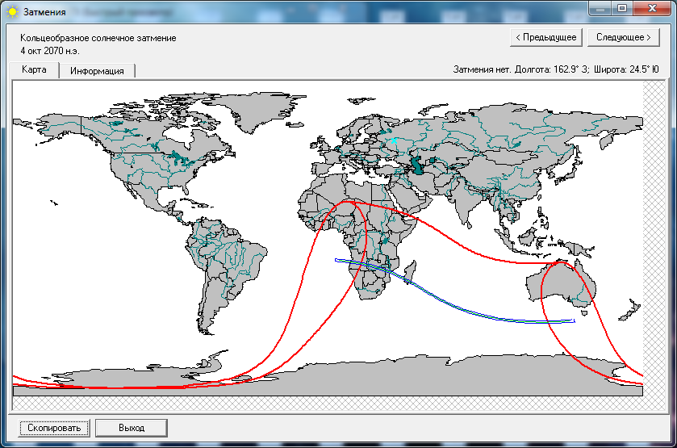

|||
|-|-|
| Начало частного затмения | `4:19:21 UTC` |
| Начало полного затмения | `5:26:42 UTC` |
| Максимальная фаза | `7:6:27 UTC` |
| Конец полного затмения | `8:46:4 UTC` |
| Конец частного затмения | `9:53:27 UTC` |

**Наибольшее затмение:**

| Долгота: | Широта: |
|-|-|
| `60° 28.0' Вос.` | `32° 50.4' Южн.` |

## Кольцеобразное солнечное затмение `31 марта 2071г`.

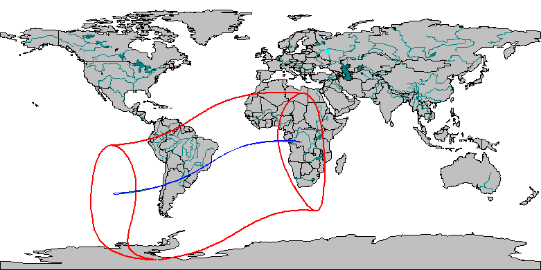

|||
|-|-|
| Начало частного затмения | `12:11:52 UTC` |
| Начало полного затмения | `13:15:18 UTC` |
| Максимальная фаза | `14:58:36 UTC` |
| Конец полного затмения | `16:42:0 UTC` |
| Конец частного затмения | `17:45:23 UTC` |

**Наибольшее затмение:**

| Долгота: | Широта: |
|-|-|
| `36° 56.6' Зап.` | `16° 40.7' Южн.` |

## Полное солнечное затмение `23 сентября 2071г`.

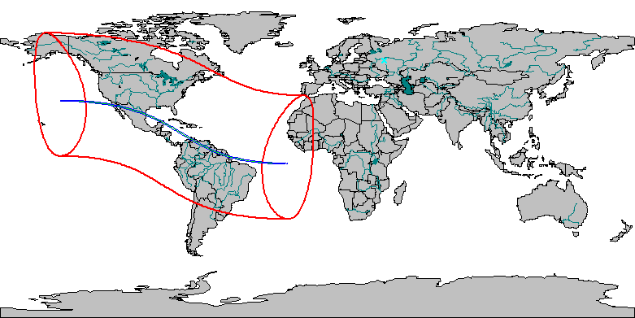

|||
|-|-|
| Начало частного затмения | `14:36:27 UTC` |
| Начало полного затмения | `15:34:52 UTC` |
| Максимальная фаза | `17:17:57 UTC` |
| Конец полного затмения | `19:1:7 UTC` |
| Конец частного затмения | `19:59:39 UTC` |

**Наибольшее затмение:**

| Долгота: | Широта: |
|-|-|
| `76° 41.2' Зап.` | `14° 14.3' Сев.` |

## Частное солнечное затмение `19 марта 2072г`.

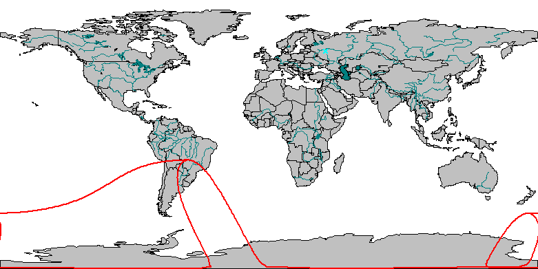

|||
|-|-|
| Начало частного затмения | `18:2:37 UTC` |
| Максимальная фаза | `20:7:59 UTC` |
| Конец частного затмения | `22:13:49 UTC` |

**Наибольшее затмение:**

| Долгота: | Широта: |
|-|-|
| `30° 15.6' Зап.` | `72° 17.7' Южн.` |

## Полное солнечное затмение `12 сентября 2072г`.

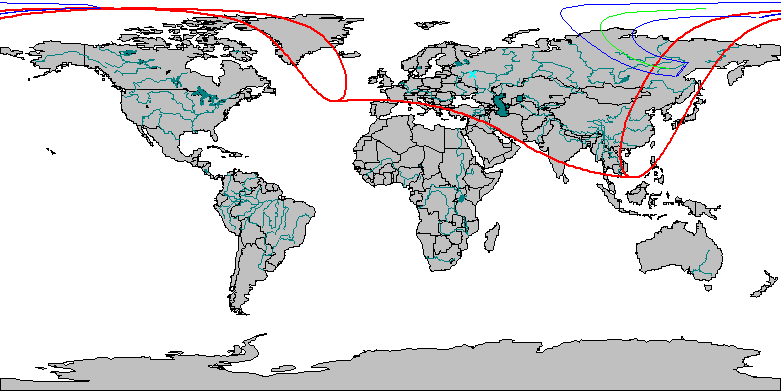

|||
|-|-|
| Начало частного затмения | `6:54:51 UTC` |
| Начало полного затмения | `8:26:20 UTC` |
| Максимальная фаза | `8:56:49 UTC` |
| Конец полного затмения | `9:27:41 UTC` |
| Конец частного затмения | `10:59:11 UTC` |

**Наибольшее затмение:**

| Долгота: | Широта: |
|-|-|
| `102° 6.9' Вос.` | `69° 47.0' Сев.` |

## Частное солнечное затмение `6 - 7 февраля 2073г`.

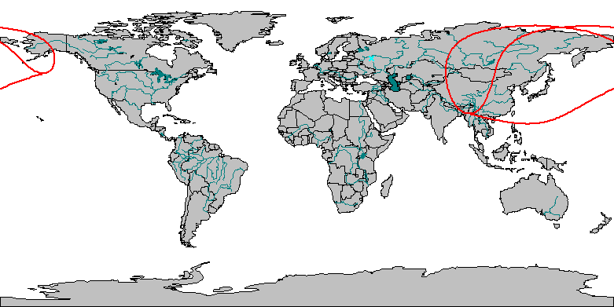

|||
|-|-|
| Начало частного затмения | `23:50:20 UTC` |
| Максимальная фаза | `1:53:25 UTC` |
| Конец частного затмения | `3:56:12 UTC` |

**Наибольшее затмение:**

| Долгота: | Широта: |
|-|-|
| `114° 55.5' Вос.` | `70° 35.3' Сев.` |

## Полное солнечное затмение `3 августа 2073г`.

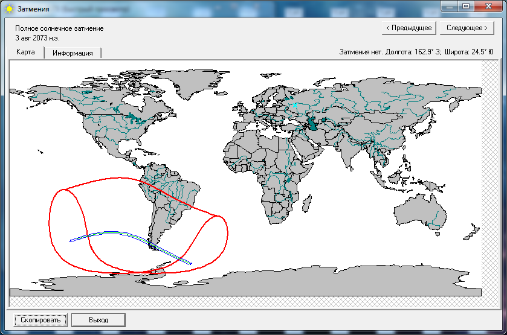

|||
|-|-|
| Начало частного затмения | `14:57:21 UTC` |
| Начало полного затмения | `16:20:26 UTC` |
| Максимальная фаза | `17:12:52 UTC` |
| Конец полного затмения | `18:5:7 UTC` |
| Конец частного затмения | `19:28:5 UTC` |

**Наибольшее затмение:**

| Долгота: | Широта: |
|-|-|
| `89° 21.3' Зап.` | `43° 14.3' Южн.` |

## Кольцеобразное солнечное затмение `27 января 2074г`.

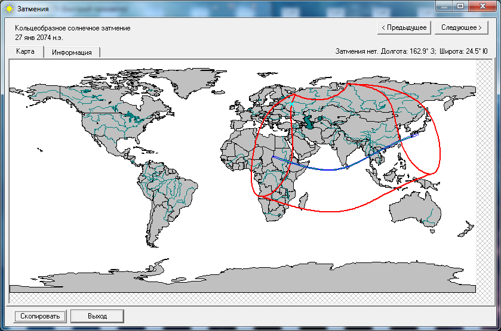

|||
|-|-|
| Начало частного затмения | `3:56:6 UTC` |
| Начало полного затмения | `5:0:24 UTC` |
| Максимальная фаза | `6:41:39 UTC` |
| Конец полного затмения | `8:22:53 UTC` |
| Конец частного затмения | `9:27:13 UTC` |

**Наибольшее затмение:**

| Долгота: | Широта: |
|-|-|
| `78° 50.5' Вос.` | `6° 33.7' Сев.` |

## Кольцеобразное солнечное затмение `24 июля 2074г`.

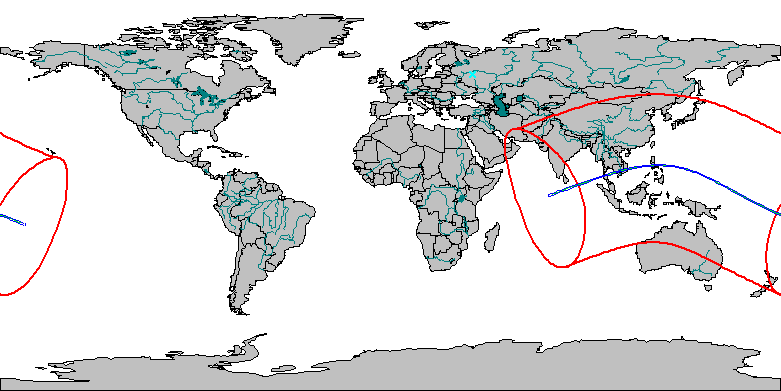

|||
|-|-|
| Начало частного затмения | `0:11:39 UTC` |
| Начало полного затмения | `1:14:8 UTC` |
| Максимальная фаза | `3:8:0 UTC` |
| Конец полного затмения | `5:1:47 UTC` |
| Конец частного затмения | `6:4:13 UTC` |

**Наибольшее затмение:**

| Долгота: | Широта: |
|-|-|
| `133° 45.8' Вос.` | `12° 46.5' Сев.` |

## Полное солнечное затмение `16 января 2075г`.

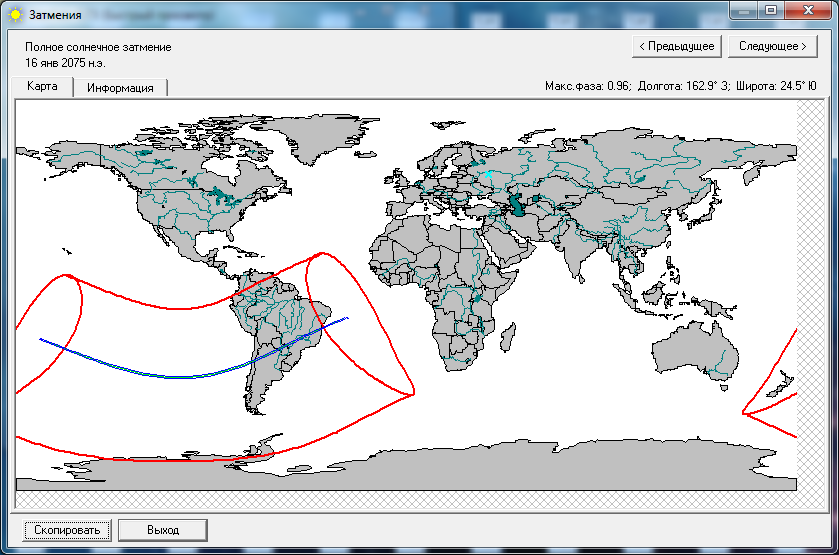

|||
|-|-|
| Начало частного затмения | `15:54:49 UTC` |
| Начало полного затмения | `16:52:37 UTC` |
| Максимальная фаза | `18:33:28 UTC` |
| Конец полного затмения | `20:14:19 UTC` |
| Конец частного затмения | `21:12:12 UTC` |

**Наибольшее затмение:**

| Долгота: | Широта: |
|-|-|
| `94° 2.9' Зап.` | `37° 10.5' Южн.` |

## Кольцеобразное солнечное затмение `13 июля 2075г`.

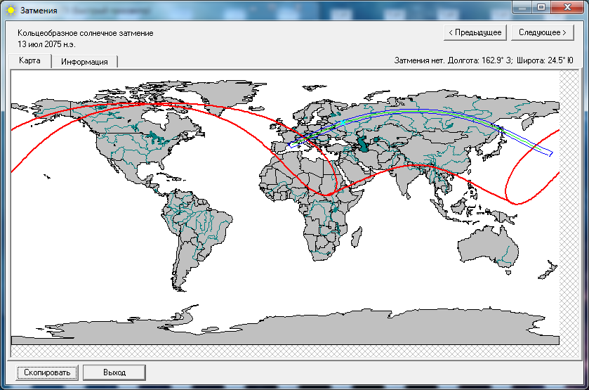

|||
|-|-|
| Начало частного затмения | `3:15:8 UTC` |
| Начало полного затмения | `4:31:19 UTC` |
| Максимальная фаза | `6:3:7 UTC` |
| Конец полного затмения | `7:34:58 UTC` |
| Конец частного затмения | `8:51:8 UTC` |

**Наибольшее затмение:**

| Долгота: | Широта: |
|-|-|
| `95° 15.0' Вос.` | `63° 8.0' Сев.` |

## Полное солнечное затмение `6 января 2076г`.

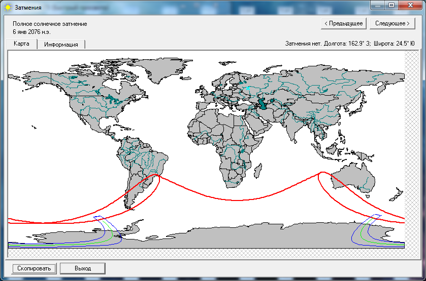

|||
|-|-|
| Начало частного затмения | `7:59:19 UTC` |
| Начало полного затмения | `9:27:29 UTC` |
| Максимальная фаза | `10:4:51 UTC` |
| Конец полного затмения | `10:42:14 UTC` |
| Конец частного затмения | `12:10:23 UTC` |

**Наибольшее затмение:**

| Долгота: | Широта: |
|-|-|
| `173° 40.5' Зап.` | `87° 9.4' Южн.` |

## Частное солнечное затмение `1 июня 2076г`.

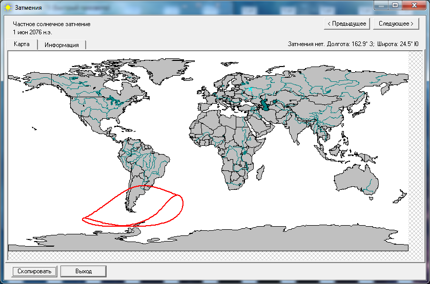

|||
|-|-|
| Начало частного затмения | `16:9:39 UTC` |
| Максимальная фаза | `17:28:43 UTC` |
| Конец частного затмения | `18:48:16 UTC` |

**Наибольшее затмение:**

| Долгота: | Широта: |
|-|-|
| `51° 9.4' Зап.` | `64° 32.0' Южн.` |

## Частное солнечное затмение `1 июля 2076г`.

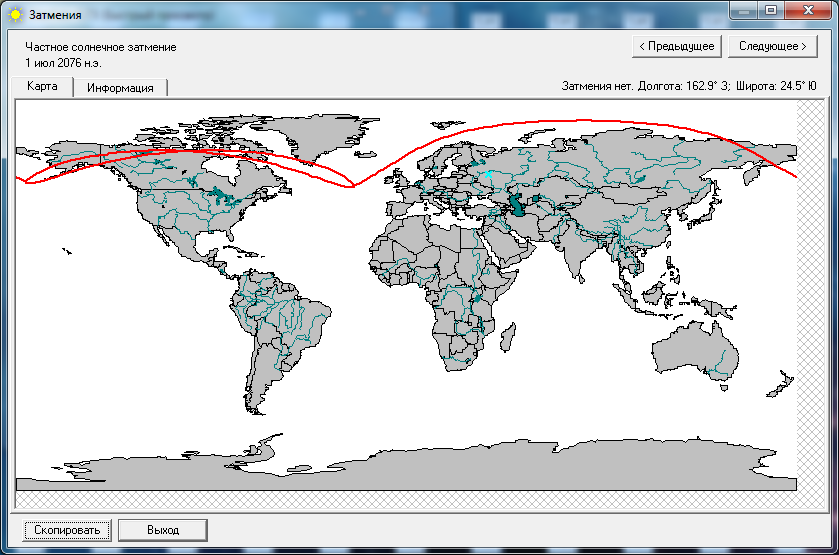

|||
|-|-|
| Начало частного затмения | `5:28:4 UTC` |
| Максимальная фаза | `6:48:4 UTC` |
| Конец частного затмения | `8:8:6 UTC` |

**Наибольшее затмение:**

| Долгота: | Широта: |
|-|-|
| `98° 4.9' Зап.` | `67° 5.4' Сев.` |

## Частное солнечное затмение `26 ноября 2076г`.

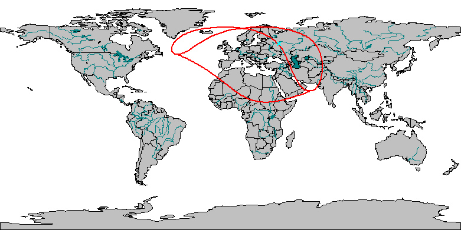

|||
|-|-|
| Начало частного затмения | `9:44:30 UTC` |
| Максимальная фаза | `11:40:23 UTC` |
| Конец частного затмения | `13:36:34 UTC` |

**Наибольшее затмение:**

| Долгота: | Широта: |
|-|-|
| `40° 11.3' Вос.` | `63° 53.0' Сев.` |

## Полное солнечное затмение `22 мая 2077г`.

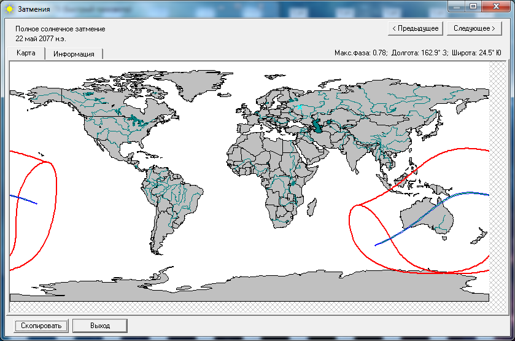

|||
|-|-|
| Начало частного затмения | `0:9:48 UTC` |
| Начало полного затмения | `1:15:0 UTC` |
| Максимальная фаза | `2:43:26 UTC` |
| Конец полного затмения | `4:12:2 UTC` |
| Конец частного затмения | `5:17:22 UTC` |

**Наибольшее затмение:**

| Долгота: | Широта: |
|-|-|
| `148° 21.4' Вос.` | `13° 6.5' Южн.` |

## Кольцеобразное солнечное затмение `15 ноября 2077г`.

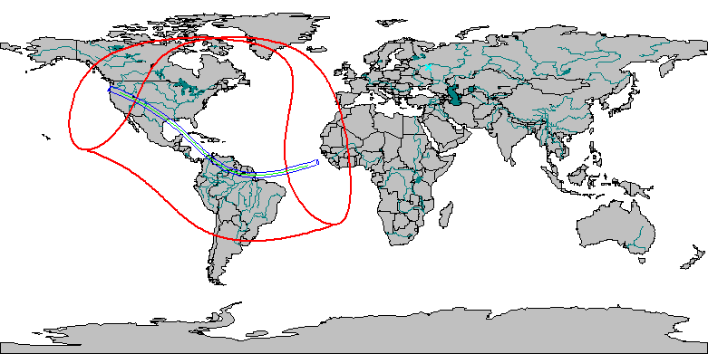

|||
|-|-|
| Начало частного затмения | `14:10:35 UTC` |
| Начало полного затмения | `15:19:26 UTC` |
| Максимальная фаза | `17:5:16 UTC` |
| Конец полного затмения | `18:51:16 UTC` |
| Конец частного затмения | `20:0:5 UTC` |

**Наибольшее затмение:**

| Долгота: | Широта: |
|-|-|
| `70° 46.6' Зап.` | `7° 47.5' Сев.` |

## Полное солнечное затмение `11 мая 2078г`.

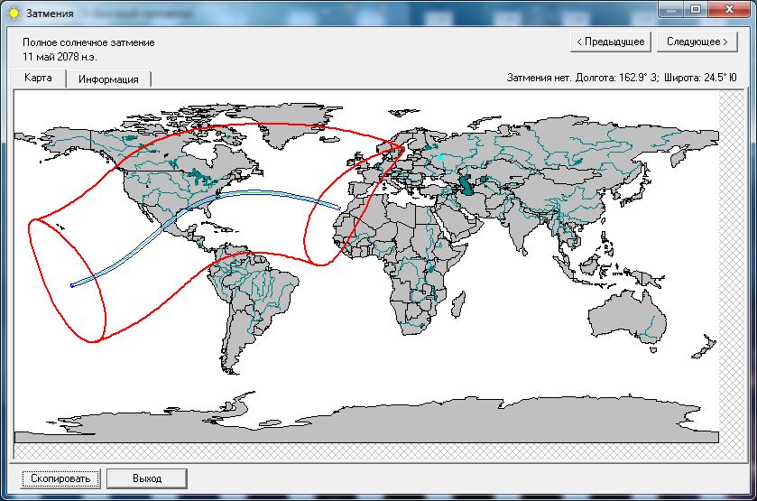

|||
|-|-|
| Начало частного затмения | `15:17:23 UTC` |
| Начало полного затмения | `16:11:29 UTC` |
| Максимальная фаза | `17:54:17 UTC` |
| Конец полного затмения | `19:36:59 UTC` |
| Конец частного затмения | `20:31:7 UTC` |

**Наибольшее затмение:**

| Долгота: | Широта: |
|-|-|
| `93° 41.3' Зап.` | `28° 8.3' Сев.` |

## Кольцеобразное солнечное затмение `4 ноября 2078г`.

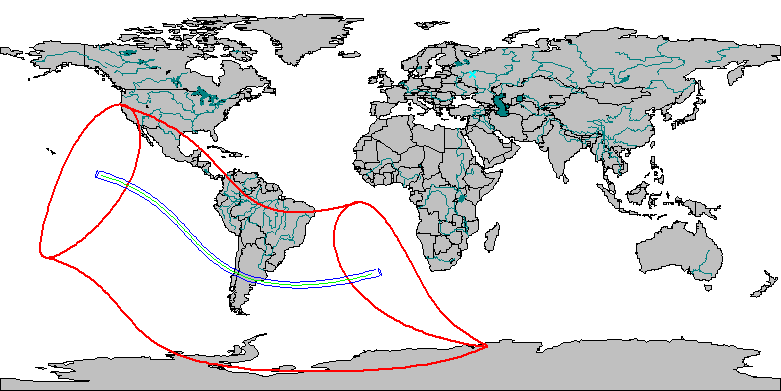

|||
|-|-|
| Начало частного затмения | `13:47:48 UTC` |
| Начало полного затмения | `14:53:55 UTC` |
| Максимальная фаза | `16:53:1 UTC` |
| Конец полного затмения | `18:52:0 UTC` |
| Конец частного затмения | `19:58:8 UTC` |

**Наибольшее затмение:**

| Долгота: | Широта: |
|-|-|
| `83° 16.2' Зап.` | `27° 49.9' Южн.` |

## Полное солнечное затмение `1 мая 2079г`.

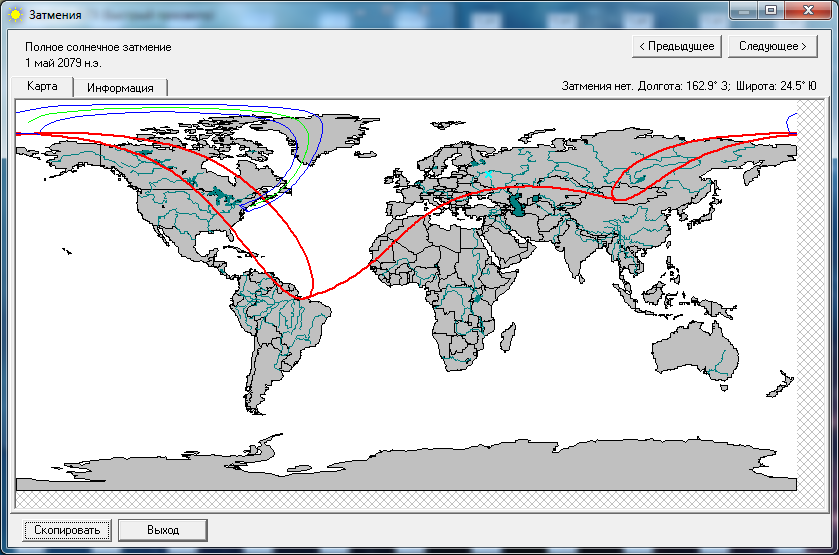

|||
|-|-|
| Начало частного затмения | `8:39:10 UTC` |
| Начало полного затмения | `10:1:35 UTC` |
| Максимальная фаза | `10:47:32 UTC` |
| Конец полного затмения | `11:33:3 UTC` |
| Конец частного затмения | `12:55:25 UTC` |

**Наибольшее затмение:**

| Долгота: | Широта: |
|-|-|
| `46° 17.3' Зап.` | `66° 10.0' Сев.` |

## Кольцеобразное солнечное затмение `24 октября 2079г`.

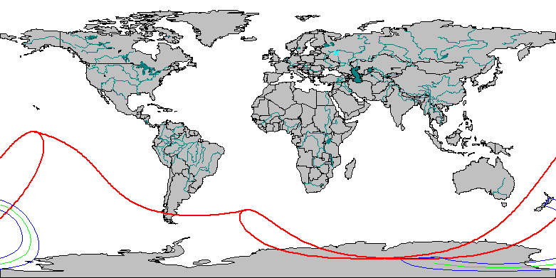

|||
|-|-|
| Начало частного затмения | `15:44:0 UTC` |
| Начало полного затмения | `17:20:29 UTC` |
| Максимальная фаза | `18:8:38 UTC` |
| Конец полного затмения | `18:56:17 UTC` |
| Конец частного затмения | `20:32:49 UTC` |

**Наибольшее затмение:**

| Долгота: | Широта: |
|-|-|
| `160° 32.6' Зап.` | `63° 25.1' Южн.` |

## Частное солнечное затмение `21 марта 2080г`.

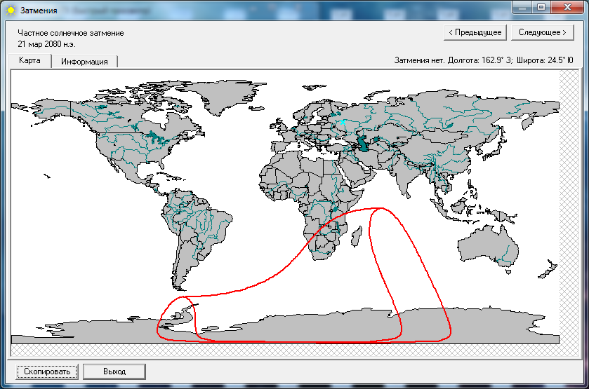

|||
|-|-|
| Начало частного затмения | `10:9:12 UTC` |
| Максимальная фаза | `12:17:31 UTC` |
| Конец частного затмения | `14:26:25 UTC` |

**Наибольшее затмение:**

| Долгота: | Широта: |
|-|-|
| `86° 2.4' Вос.` | `61° 5.2' Южн.` |

## Частное солнечное затмение `13 сентября 2080г`.

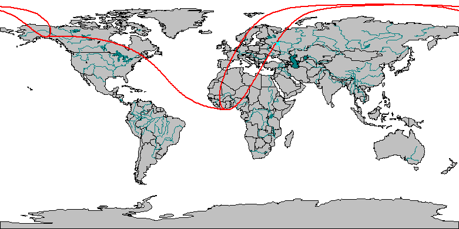

|||
|-|-|
| Начало частного затмения | `14:40:29 UTC` |
| Максимальная фаза | `16:35:25 UTC` |
| Конец частного затмения | `18:31:2 UTC` |

**Наибольшее затмение:**

| Долгота: | Широта: |
|-|-|
| `25° 56.1' Вос.` | `61° 17.0' Сев.` |

## Кольцеобразное солнечное затмение `10 марта 2081г`.

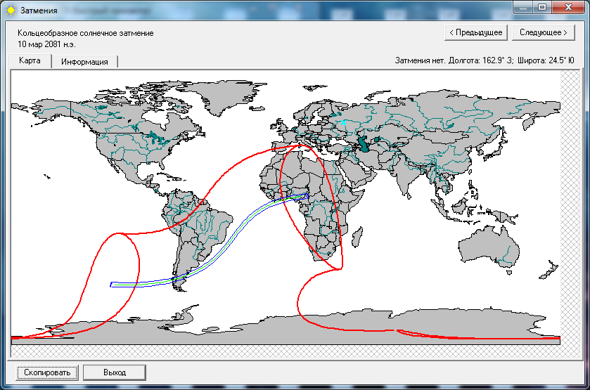

|||
|-|-|
| Начало частного затмения | `12:20:8 UTC` |
| Начало полного затмения | `13:27:41 UTC` |
| Максимальная фаза | `15:20:46 UTC` |
| Конец полного затмения | `17:14:4 UTC` |
| Конец частного затмения | `18:21:36 UTC` |

**Наибольшее затмение:**

| Долгота: | Широта: |
|-|-|
| `36° 41.1' Зап.` | `22° 23.3' Южн.` |

## Полное солнечное затмение `3 сентября 2081г`.

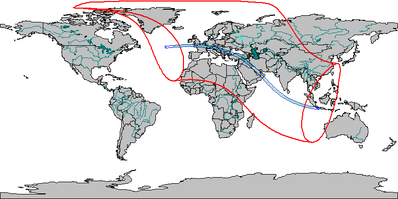

|||
|-|-|
| Начало частного затмения | `6:31:21 UTC` |
| Начало полного затмения | `7:26:37 UTC` |
| Максимальная фаза | `9:4:41 UTC` |
| Конец полного затмения | `10:42:58 UTC` |
| Конец частного затмения | `11:38:13 UTC` |

**Наибольшее затмение:**

| Долгота: | Широта: |
|-|-|
| `53° 40.8' Вос.` | `24° 37.0' Сев.` |

## Кольцеобразное солнечное затмение `27 февраля 2082г`.

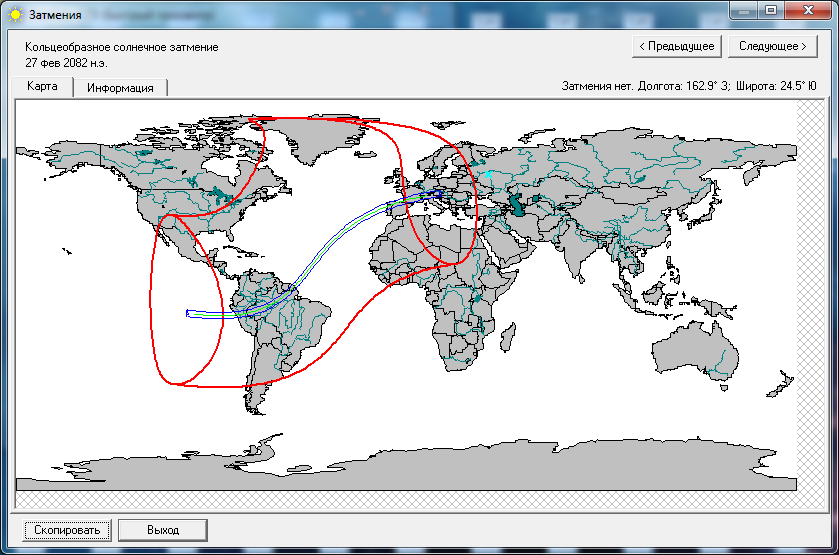

|||
|-|-|
| Начало частного затмения | `11:42:56 UTC` |
| Начало полного затмения | `12:49:52 UTC` |
| Максимальная фаза | `14:44:13 UTC` |
| Конец полного затмения | `16:38:24 UTC` |
| Конец частного затмения | `17:45:22 UTC` |

**Наибольшее затмение:**

| Долгота: | Широта: |
|-|-|
| `47° 5.4' Зап.` | `9° 25.7' Сев.` |

## Полное солнечное затмение `23 - 24 августа 2082г`.

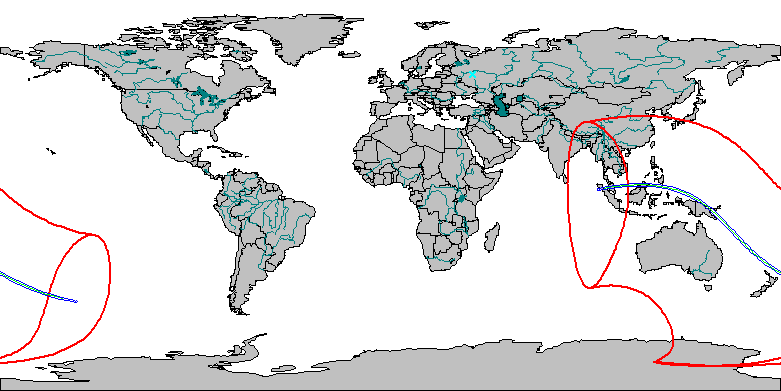

|||
|-|-|
| Начало частного затмения | `22:36:25 UTC` |
| Начало полного затмения | `23:35:45 UTC` |
| Максимальная фаза | `1:13:33 UTC` |
| Конец полного затмения | `2:51:9 UTC` |
| Конец частного затмения | `3:50:23 UTC` |

**Наибольшее затмение:**

| Долгота: | Широта: |
|-|-|
| `151° 47.5' Вос.` | `10° 17.6' Южн.` |

## Частное солнечное затмение `16 февраля 2083г`.

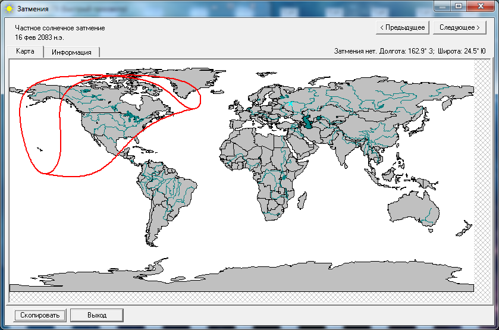

|||
|-|-|
| Начало частного затмения | `15:51:12 UTC` |
| Максимальная фаза | `18:3:47 UTC` |
| Конец частного затмения | `20:15:54 UTC` |

**Наибольшее затмение:**

| Долгота: | Широта: |
|-|-|
| `154° 8.6' Зап.` | `61° 46.0' Сев.` |

## Частное солнечное затмение `14 - 15 июля 2083г`.

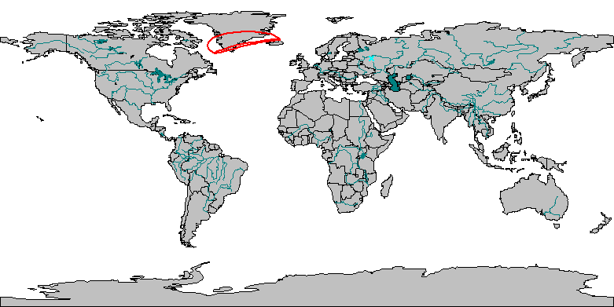

|||
|-|-|
| Начало частного затмения | `23:53:26 UTC` |
| Максимальная фаза | `0:11:36 UTC` |
| Конец частного затмения | `0:30:13 UTC` |

**Наибольшее затмение:**

| Долгота: | Широта: |
|-|-|
| `37° 39.5' Зап.` | `64° 6.1' Сев.` |

## Частное солнечное затмение `13 августа 2083г`.

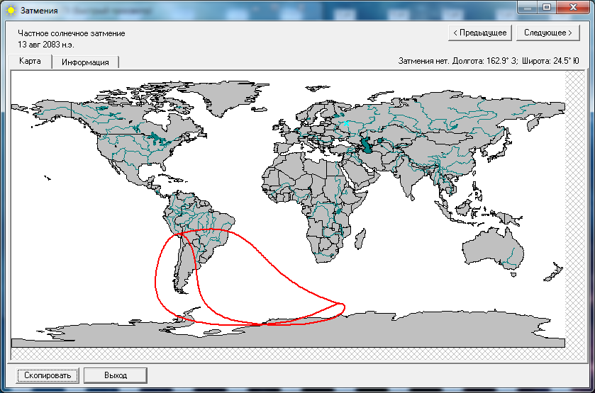

|||
|-|-|
| Начало частного затмения | `10:42:19 UTC` |
| Максимальная фаза | `12:31:54 UTC` |
| Конец частного затмения | `14:20:45 UTC` |

**Наибольшее затмение:**

| Долгота: | Широта: |
|-|-|
| `67° 31.4' Зап.` | `62° 15.1' Южн.` |

## Частное солнечное затмение `7 января 2084г`.

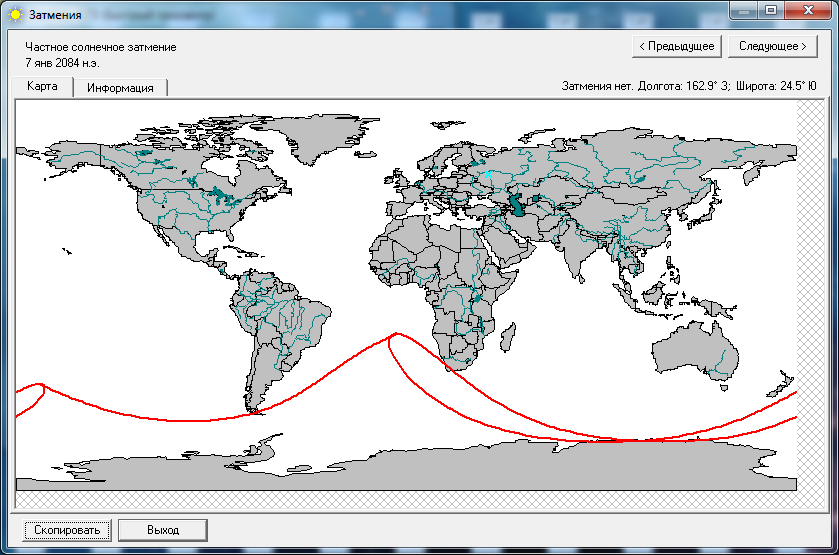

|||
|-|-|
| Начало частного затмения | `15:33:21 UTC` |
| Максимальная фаза | `17:27:31 UTC` |
| Конец частного затмения | `19:22:1 UTC` |

**Наибольшее затмение:**

| Долгота: | Широта: |
|-|-|
| `68° 35.8' Вос.` | `64° 33.6' Южн.` |

## Кольцеобразное солнечное затмение `2 - 3 июля 2084г`.

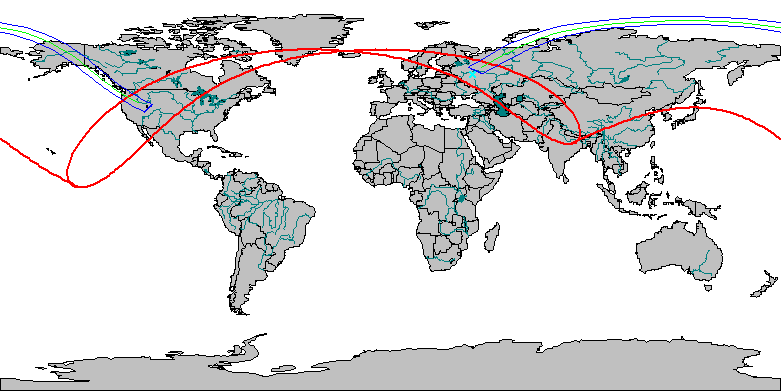

|||
|-|-|
| Начало частного затмения | `23:9:40 UTC` |
| Начало полного затмения | `0:36:24 UTC` |
| Максимальная фаза | `1:47:36 UTC` |
| Конец полного затмения | `2:59:1 UTC` |
| Конец частного затмения | `4:25:45 UTC` |

**Наибольшее затмение:**

| Долгота: | Широта: |
|-|-|
| `168° 59.8' Зап.` | `75° 0.9' Сев.` |

## Полное солнечное затмение `27 декабря 2084г`.

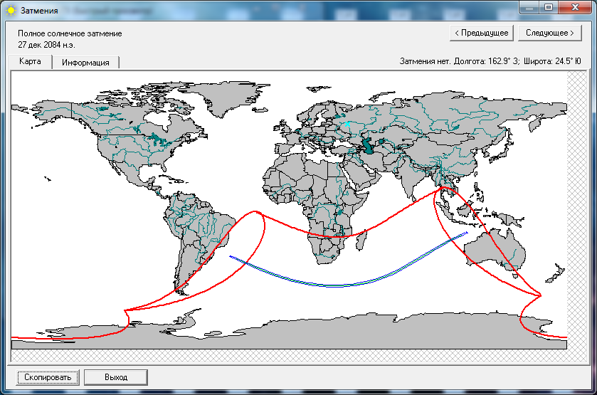

|||
|-|-|
| Начало частного затмения | `6:37:11 UTC` |
| Начало полного затмения | `7:35:48 UTC` |
| Максимальная фаза | `9:10:56 UTC` |
| Конец полного затмения | `10:46:10 UTC` |
| Конец частного затмения | `11:44:44 UTC` |

**Наибольшее затмение:**

| Долгота: | Широта: |
|-|-|
| `47° 43.1' Вос.` | `47° 19.2' Южн.` |

## Кольцеобразное солнечное затмение `22 июня 2085г`.

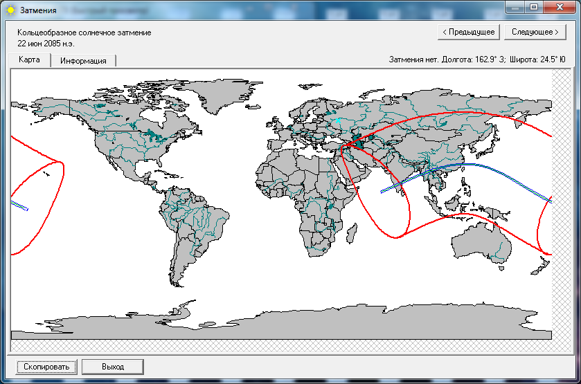

|||
|-|-|
| Начало частного затмения | `0:18:23 UTC` |
| Начало полного затмения | `1:21:33 UTC` |
| Максимальная фаза | `3:18:25 UTC` |
| Конец полного затмения | `5:15:20 UTC` |
| Конец частного затмения | `6:18:32 UTC` |

**Наибольшее затмение:**

| Долгота: | Широта: |
|-|-|
| `131° 17.3' Вос.` | `26° 9.1' Сев.` |

## Кольцеобразное солнечное затмение `16 - 17 декабря 2085г`.

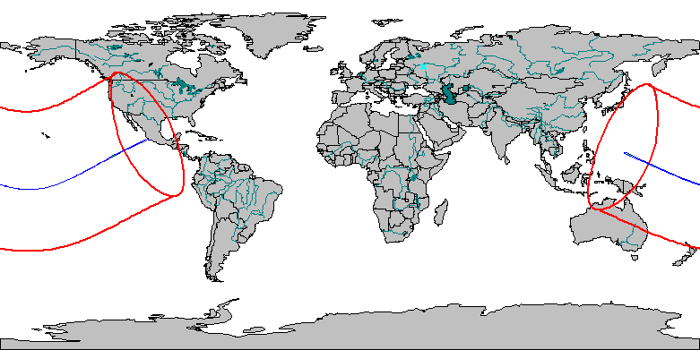

|||
|-|-|
| Начало частного затмения | `19:49:12 UTC` |
| Начало полного затмения | `20:50:6 UTC` |
| Максимальная фаза | `22:34:57 UTC` |
| Конец полного затмения | `0:19:43 UTC` |
| Конец частного затмения | `1:20:34 UTC` |

**Наибольшее затмение:**

| Долгота: | Широта: |
|-|-|
| `160° 47.4' Зап.` | `7° 15.1' Южн.` |

## Полное солнечное затмение `11 июня 2086г`.

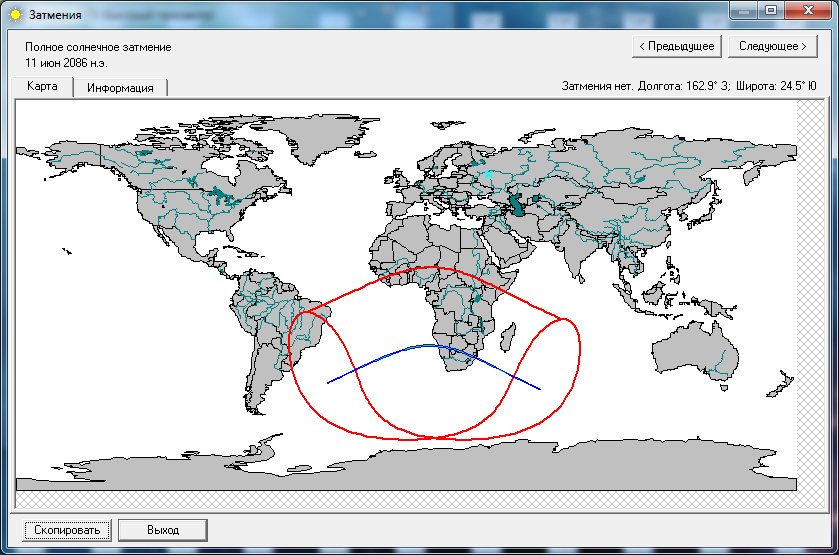

|||
|-|-|
| Начало частного затмения | `8:35:46 UTC` |
| Начало полного затмения | `9:48:52 UTC` |
| Максимальная фаза | `11:4:19 UTC` |
| Конец полного затмения | `12:19:42 UTC` |
| Конец частного затмения | `13:32:56 UTC` |

**Наибольшее затмение:**

| Долгота: | Широта: |
|-|-|
| `12° 30.0' Вос.` | `23° 12.6' Южн.` |

## Частное солнечное затмение `6 декабря 2086г`.

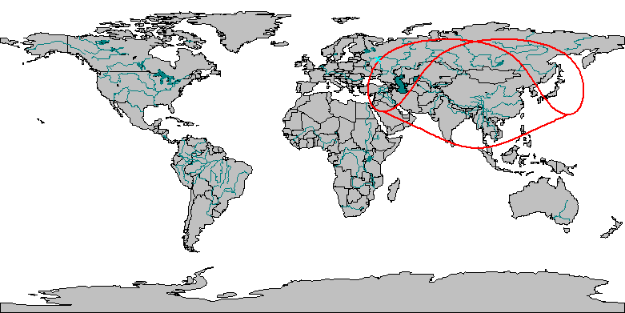

|||
|-|-|
| Начало частного затмения | `3:18:49 UTC` |
| Максимальная фаза | `5:36:2 UTC` |
| Конец частного затмения | `7:53:11 UTC` |

**Наибольшее затмение:**

| Долгота: | Широта: |
|-|-|
| `96° 15.5' Вос.` | `67° 34.9' Сев.` |

## Частное солнечное затмение `2 мая 2087г`.

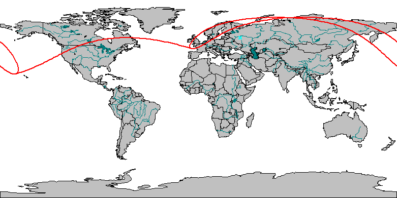

|||
|-|-|
| Начало частного затмения | `16:13:53 UTC` |
| Максимальная фаза | `18:1:48 UTC` |
| Конец частного затмения | `19:49:26 UTC` |

**Наибольшее затмение:**

| Долгота: | Широта: |
|-|-|
| `127° 33.9' Вос.` | `70° 24.9' Сев.` |

## Частное солнечное затмение `1 июня 2087г`.

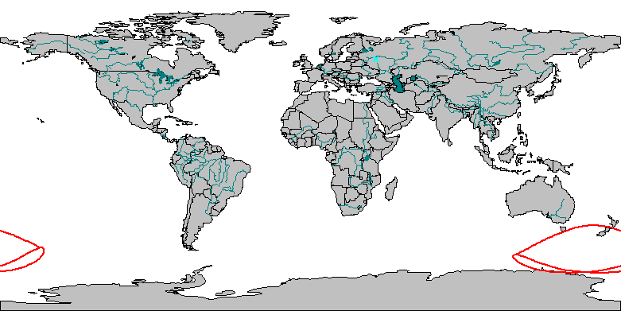

|||
|-|-|
| Начало частного затмения | `0:25:10 UTC` |
| Максимальная фаза | `1:24:22 UTC` |
| Конец частного затмения | `2:23:40 UTC` |

**Наибольшее затмение:**

| Долгота: | Широта: |
|-|-|
| `165° 23.3' Вос.` | `67° 55.4' Южн.` |

## Частное солнечное затмение `26 октября 2087г`.

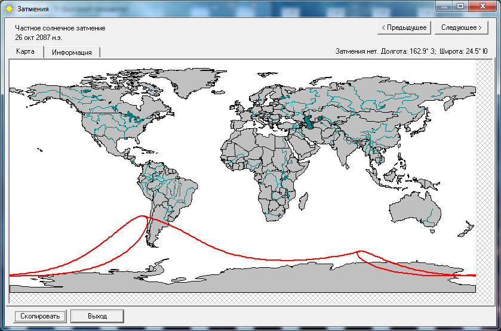

|||
|-|-|
| Начало частного затмения | `9:58:6 UTC` |
| Максимальная фаза | `11:44:1 UTC` |
| Конец частного затмения | `13:29:30 UTC` |

**Наибольшее затмение:**

| Долгота: | Широта: |
|-|-|
| `130° 34.1' Зап.` | `71° 8.4' Южн.` |

## Полное солнечное затмение `21 апреля 2088г`.

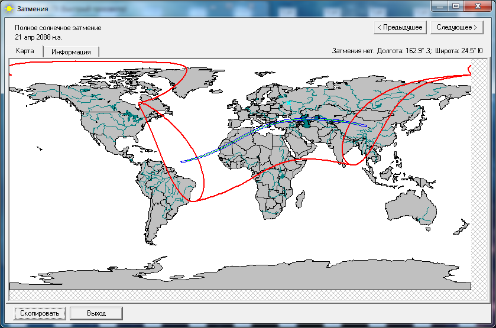

|||
|-|-|
| Начало частного затмения | `7:53:32 UTC` |
| Начало полного затмения | `8:52:30 UTC` |
| Максимальная фаза | `10:28:55 UTC` |
| Конец полного затмения | `12:5:14 UTC` |
| Конец частного затмения | `13:4:6 UTC` |

**Наибольшее затмение:**

| Долгота: | Широта: |
|-|-|
| `15° 5.9' Вос.` | `36° 0.4' Сев.` |

## Кольцеобразное солнечное затмение `14 октября 2088г`.

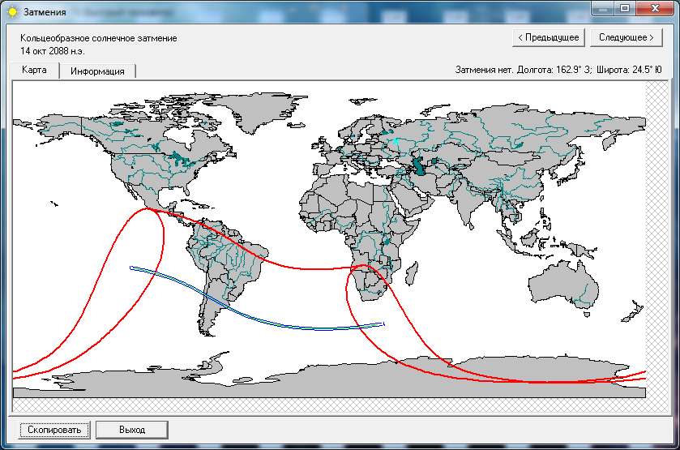

|||
|-|-|
| Начало частного затмения | `12:0:9 UTC` |
| Начало полного затмения | `13:8:23 UTC` |
| Максимальная фаза | `14:45:10 UTC` |
| Конец полного затмения | `16:21:47 UTC` |
| Конец частного затмения | `17:30:4 UTC` |

**Наибольшее затмение:**

| Долгота: | Широта: |
|-|-|
| `55° 59.7' Зап.` | `39° 39.0' Южн.` |

## Кольцеобразное солнечное затмение `10 - 11 апреля 2089г`.

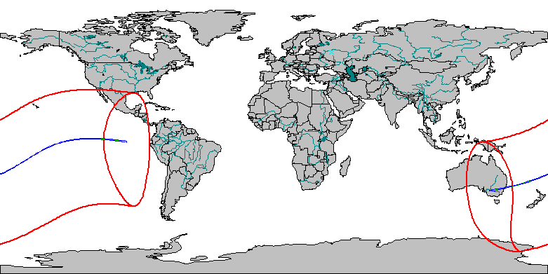

|||
|-|-|
| Начало частного затмения | `19:53:21 UTC` |
| Начало полного затмения | `20:56:19 UTC` |
| Максимальная фаза | `22:41:44 UTC` |
| Конец полного затмения | `0:27:13 UTC` |
| Конец частного затмения | `1:30:9 UTC` |

**Наибольшее затмение:**

| Долгота: | Широта: |
|-|-|
| `154° 46.5' Зап.` | `10° 10.8' Южн.` |

## Полное солнечное затмение `3 - 4 октября 2089г`.

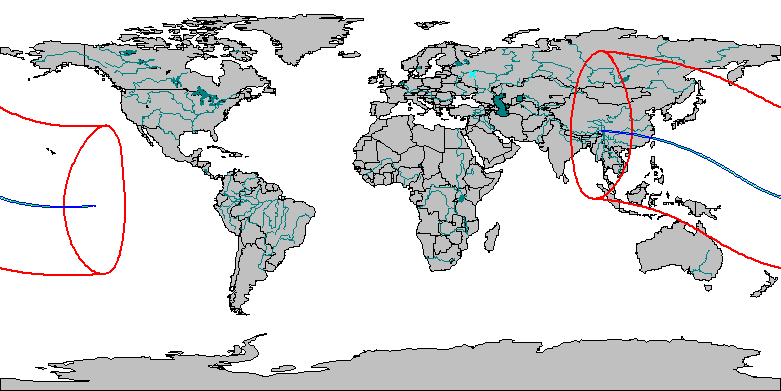

|||
|-|-|
| Начало частного затмения | `22:30:34 UTC` |
| Начало полного затмения | `23:28:25 UTC` |
| Максимальная фаза | `1:12:25 UTC` |
| Конец полного затмения | `2:56:29 UTC` |
| Конец частного затмения | `3:54:26 UTC` |

**Наибольшее затмение:**

| Долгота: | Широта: |
|-|-|
| `162° 47.7' Вос.` | `7° 26.0' Сев.` |

## Частное солнечное затмение `31 марта 2090г`.

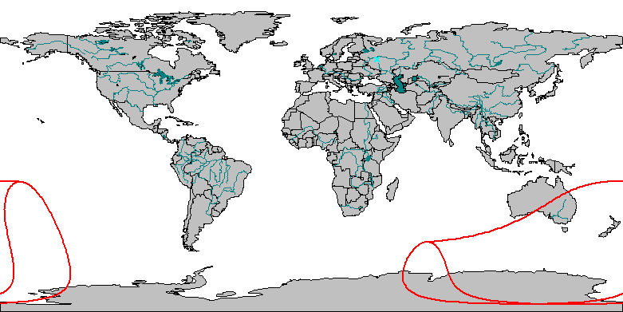

|||
|-|-|
| Начало частного затмения | `1:25:2 UTC` |
| Максимальная фаза | `3:35:9 UTC` |
| Конец частного затмения | `5:45:42 UTC` |

**Наибольшее затмение:**

| Долгота: | Широта: |
|-|-|
| `156° 16.6' Зап.` | `72° 10.6' Южн.` |

## Полное солнечное затмение `23 сентября 2090г`.

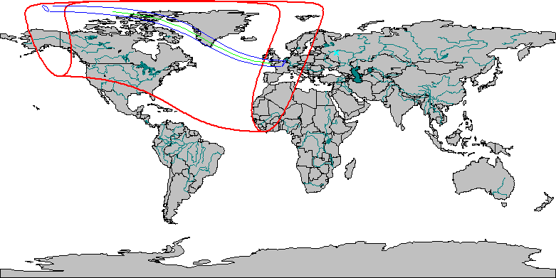

|||
|-|-|
| Начало частного затмения | `14:47:35 UTC` |
| Начало полного затмения | `16:9:54 UTC` |
| Максимальная фаза | `16:53:37 UTC` |
| Конец полного затмения | `17:37:41 UTC` |
| Конец частного затмения | `19:0:1 UTC` |

**Наибольшее затмение:**

| Долгота: | Широта: |
|-|-|
| `40° 28.2' Зап.` | `60° 41.5' Сев.` |

## Частное солнечное затмение `18 февраля 2091г`.

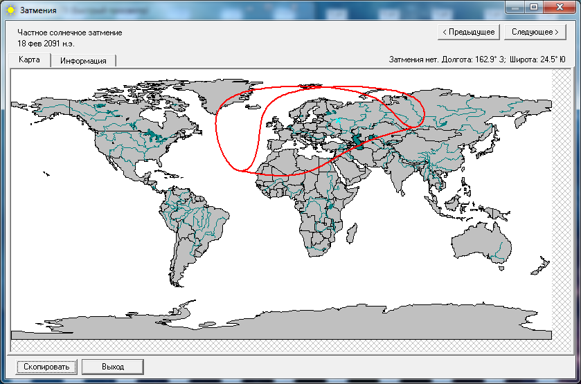

|||
|-|-|
| Начало частного затмения | `7:50:45 UTC` |
| Максимальная фаза | `9:51:40 UTC` |
| Конец частного затмения | `11:52:12 UTC` |

**Наибольшее затмение:**

| Долгота: | Широта: |
|-|-|
| `17° 48.9' Зап.` | `71° 20.6' Сев.` |

## Полное солнечное затмение `14 - 15 августа 2091г`.

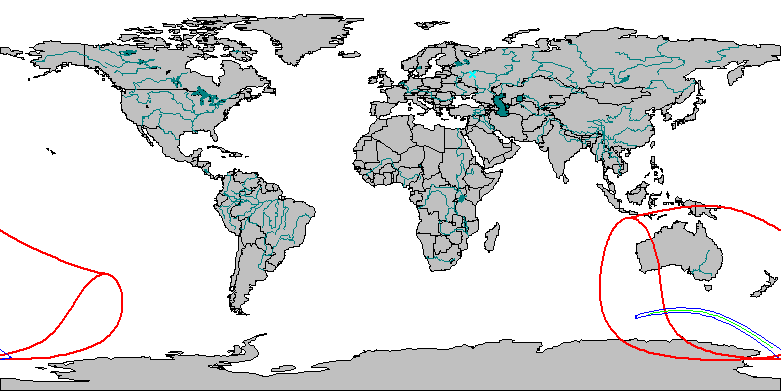

|||
|-|-|
| Начало частного затмения | `22:21:17 UTC` |
| Начало полного затмения | `23:57:5 UTC` |
| Максимальная фаза | `0:31:43 UTC` |
| Конец полного затмения | `1:6:6 UTC` |
| Конец частного затмения | `2:41:46 UTC` |

**Наибольшее затмение:**

| Долгота: | Широта: |
|-|-|
| `150° 28.4' Вос.` | `55° 34.8' Южн.` |

## Кольцеобразное солнечное затмение `7 февраля 2092г`.

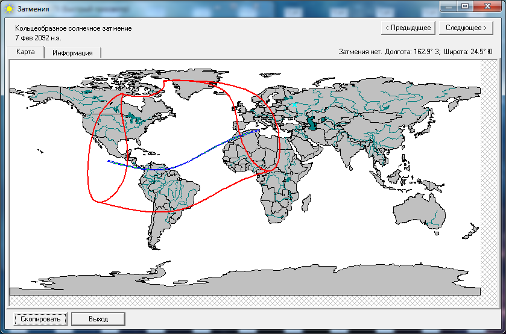

|||
|-|-|
| Начало частного затмения | `12:22:39 UTC` |
| Начало полного затмения | `13:26:52 UTC` |
| Максимальная фаза | `15:7:16 UTC` |
| Конец полного затмения | `16:47:37 UTC` |
| Конец частного затмения | `17:51:52 UTC` |

**Наибольшее затмение:**

| Долгота: | Широта: |
|-|-|
| `48° 43.3' Зап.` | `9° 55.5' Сев.` |

## Кольцеобразное солнечное затмение `3 августа 2092г`.

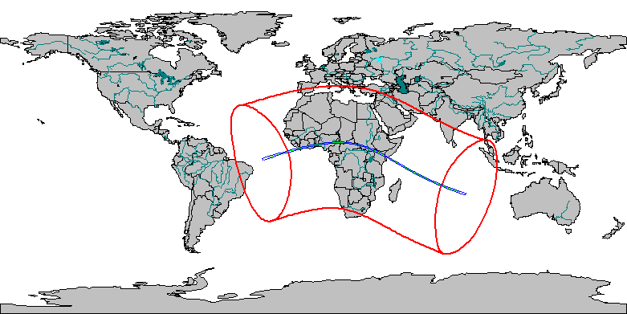

|||
|-|-|
| Начало частного затмения | `7:0:22 UTC` |
| Начало полного затмения | `8:3:37 UTC` |
| Максимальная фаза | `9:56:31 UTC` |
| Конец полного затмения | `11:49:20 UTC` |
| Конец частного затмения | `12:52:31 UTC` |

**Наибольшее затмение:**

| Долгота: | Широта: |
|-|-|
| `30° 17.5' Вос.` | `5° 34.3' Сев.` |

## Полное солнечное затмение `27 января 2093г`.

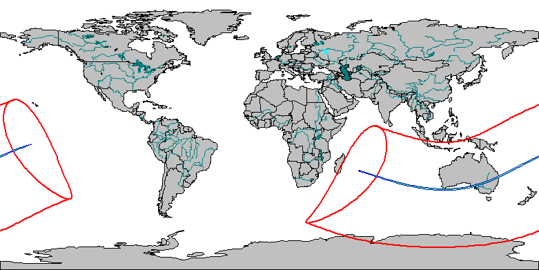

|||
|-|-|
| Начало частного затмения | `0:40:52 UTC` |
| Начало полного затмения | `1:38:19 UTC` |
| Максимальная фаза | `3:19:12 UTC` |
| Конец полного затмения | `5:0:7 UTC` |
| Конец частного затмения | `5:57:39 UTC` |

**Наибольшее затмение:**

| Долгота: | Широта: |
|-|-|
| `136° 24.1' Вос.` | `34° 8.1' Южн.` |

## Кольцеобразное солнечное затмение `23 июля 2093г`.

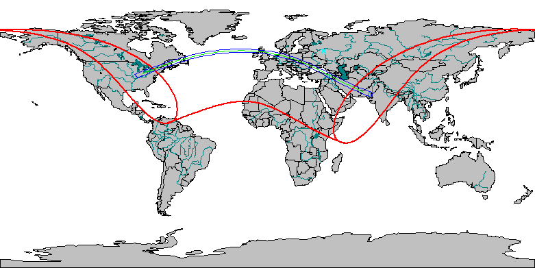

|||
|-|-|
| Начало частного затмения | `9:36:24 UTC` |
| Начало полного затмения | `10:49:12 UTC` |
| Максимальная фаза | `12:29:0 UTC` |
| Конец полного затмения | `14:8:52 UTC` |
| Конец частного затмения | `15:21:40 UTC` |

**Наибольшее затмение:**

| Долгота: | Широта: |
|-|-|
| `1° 19.6' Вос.` | `54° 33.7' Сев.` |

## Полное солнечное затмение `16 января 2094г`.

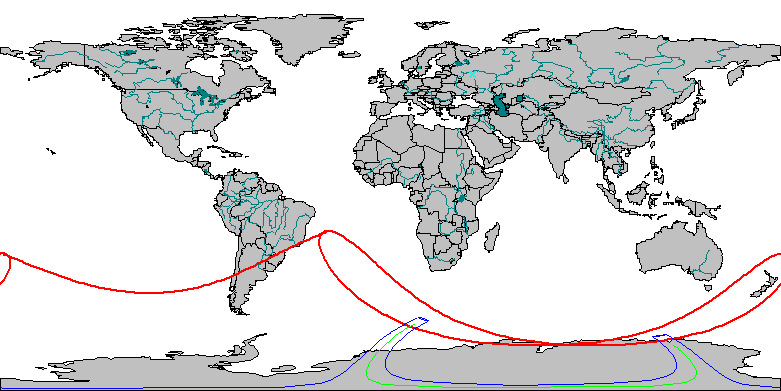

|||
|-|-|
| Начало частного затмения | `16:50:7 UTC` |
| Начало полного затмения | `18:17:40 UTC` |
| Максимальная фаза | `18:55:59 UTC` |
| Конец полного затмения | `19:34:25 UTC` |
| Конец частного затмения | `21:1:56 UTC` |

**Наибольшее затмение:**

| Долгота: | Широта: |
|-|-|
| `10° 7.0' Зап.` | `84° 46.1' Южн.` |

## Частное солнечное затмение `12 - 13 июня 2094г`.

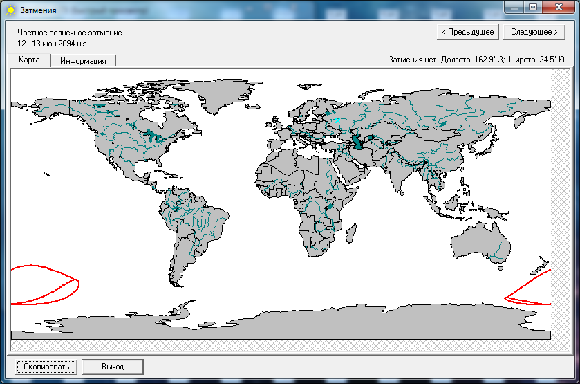

|||
|-|-|
| Начало частного затмения | `23:19:50 UTC` |
| Максимальная фаза | `0:19:6 UTC` |
| Конец частного затмения | `1:18:43 UTC` |

**Наибольшее затмение:**

| Долгота: | Широта: |
|-|-|
| `163° 37.8' Зап.` | `65° 27.1' Южн.` |

## Частное солнечное затмение `12 июля 2094г`.

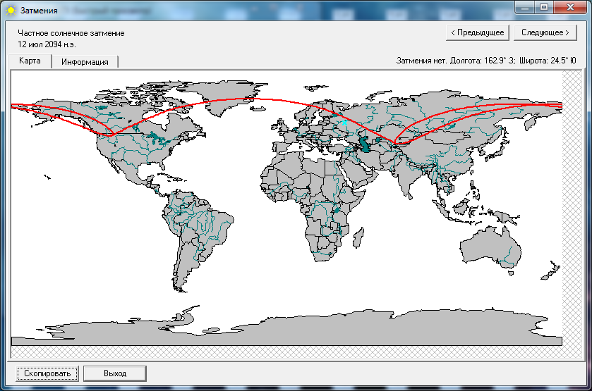

|||
|-|-|
| Начало частного затмения | `11:43:59 UTC` |
| Максимальная фаза | `13:21:30 UTC` |
| Конец частного затмения | `14:59:11 UTC` |

**Наибольшее затмение:**

| Долгота: | Широта: |
|-|-|
| `152° 44.1' Вос.` | `68° 6.1' Сев.` |

## Частное солнечное затмение `7 декабря 2094г`.

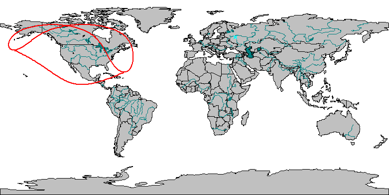

|||
|-|-|
| Начало частного затмения | `18:8:3 UTC` |
| Максимальная фаза | `20:2:50 UTC` |
| Конец частного затмения | `21:57:50 UTC` |

**Наибольшее затмение:**

| Долгота: | Широта: |
|-|-|
| `94° 58.9' Зап.` | `64° 49.1' Сев.` |

## Полное солнечное затмение `2 июня 2095г`.

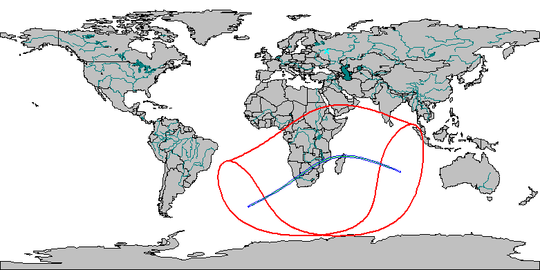

|||
|-|-|
| Начало частного затмения | `7:34:41 UTC` |
| Начало полного затмения | `8:41:43 UTC` |
| Максимальная фаза | `10:4:34 UTC` |
| Конец полного затмения | `11:27:33 UTC` |
| Конец частного затмения | `12:34:42 UTC` |

**Наибольшее затмение:**

| Долгота: | Широта: |
|-|-|
| `37° 8.0' Вос.` | `16° 42.0' Южн.` |

## Кольцеобразное солнечное затмение `26 - 27 ноября 2095г`.

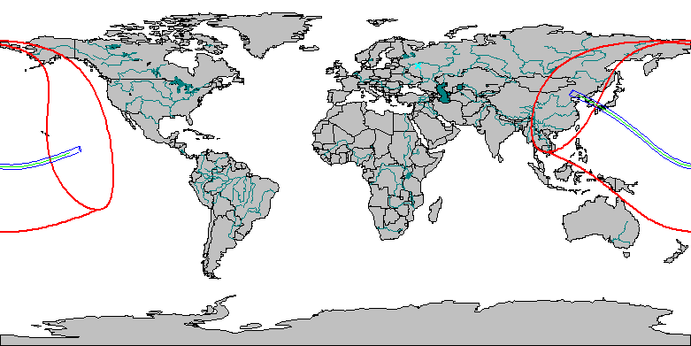

|||
|-|-|
| Начало частного затмения | `22:5:14 UTC` |
| Начало полного затмения | `23:14:45 UTC` |
| Максимальная фаза | `0:59:49 UTC` |
| Конец полного затмения | `2:45:1 UTC` |
| Конец частного затмения | `3:54:30 UTC` |

**Наибольшее затмение:**

| Долгота: | Широта: |
|-|-|
| `169° 47.4' Вос.` | `7° 14.2' Сев.` |

## Полное солнечное затмение `21 - 22 мая 2096г`.

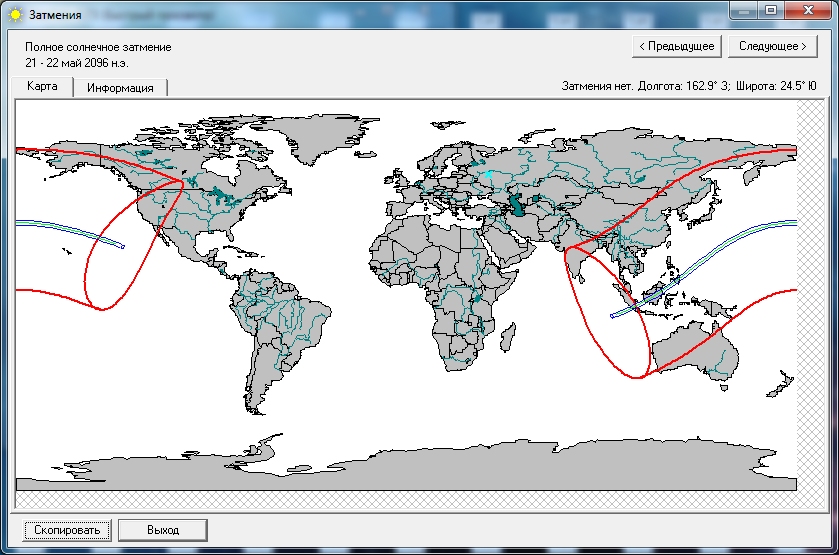

|||
|-|-|
| Начало частного затмения | `22:56:54 UTC` |
| Начало полного затмения | `23:50:25 UTC` |
| Максимальная фаза | `1:34:10 UTC` |
| Конец полного затмения | `3:17:52 UTC` |
| Конец частного затмения | `4:11:25 UTC` |

**Наибольшее затмение:**

| Долгота: | Широта: |
|-|-|
| `153° 24.1' Вос.` | `27° 15.9' Сев.` |

## Кольцеобразное солнечное затмение `14 - 15 ноября 2096г`.

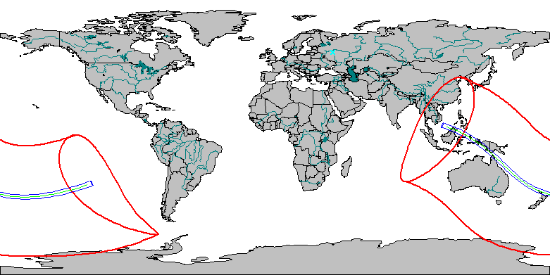

|||
|-|-|
| Начало частного затмения | `21:27:21 UTC` |
| Начало полного затмения | `22:33:13 UTC` |
| Максимальная фаза | `0:33:3 UTC` |
| Конец полного затмения | `2:32:48 UTC` |
| Конец частного затмения | `3:38:41 UTC` |

**Наибольшее затмение:**

| Долгота: | Широта: |
|-|-|
| `163° 17.4' Вос.` | `29° 43.6' Южн.` |

## Полное солнечное затмение `11 мая 2097г`.

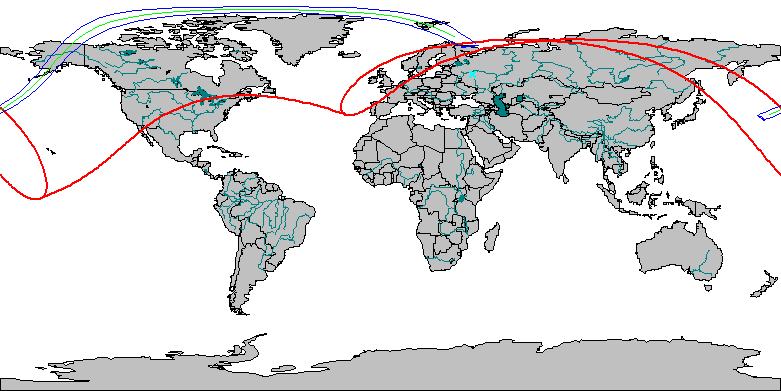

|||
|-|-|
| Начало частного затмения | `16:18:43 UTC` |
| Начало полного затмения | `17:34:49 UTC` |
| Максимальная фаза | `18:31:24 UTC` |
| Конец полного затмения | `19:27:40 UTC` |
| Конец частного затмения | `20:43:41 UTC` |

**Наибольшее затмение:**

| Долгота: | Широта: |
|-|-|
| `149° 30.8' Зап.` | `67° 24.3' Сев.` |

## Кольцеобразное солнечное затмение `3 - 4 ноября 2097г`.

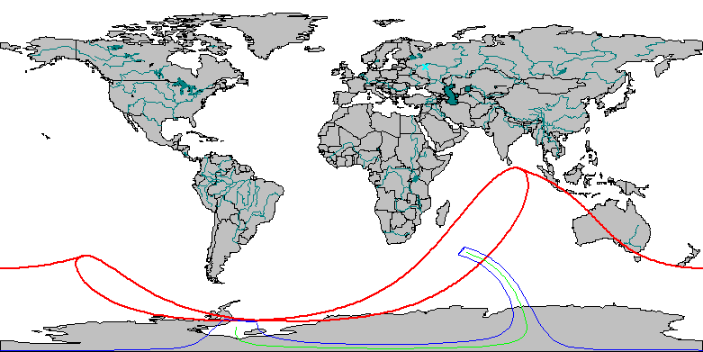

|||
|-|-|
| Начало частного затмения | `23:31:25 UTC` |
| Начало полного затмения | `1:2:54 UTC` |
| Максимальная фаза | `1:58:14 UTC` |
| Конец полного затмения | `2:53:8 UTC` |
| Конец частного затмения | `4:24:41 UTC` |

**Наибольшее затмение:**

| Долгота: | Широта: |
|-|-|
| `86° 43.9' Вос.` | `65° 46.6' Южн.` |

## Частное солнечное затмение `1 апреля 2098г`.

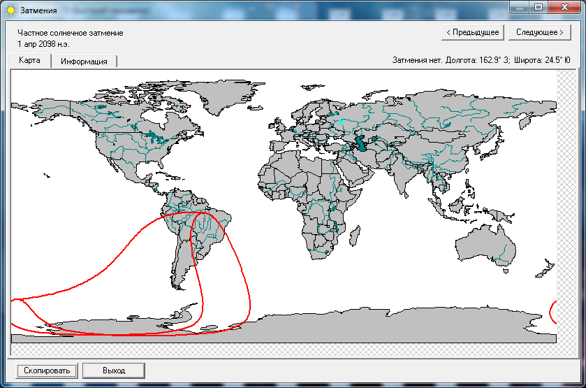

|||
|-|-|
| Начало частного затмения | `17:55:17 UTC` |
| Максимальная фаза | `19:59:18 UTC` |
| Конец частного затмения | `22:3:56 UTC` |

**Наибольшее затмение:**

| Долгота: | Широта: |
|-|-|
| `38° 1.7' Зап.` | `61° 12.3' Южн.` |

## Частное солнечное затмение `24 - 25 сентября 2098г`.

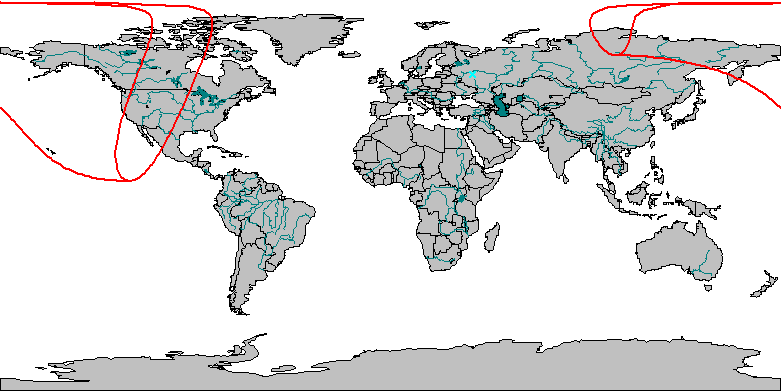

|||
|-|-|
| Начало частного затмения | `22:38:18 UTC` |
| Максимальная фаза | `0:28:3 UTC` |
| Конец частного затмения | `2:18:31 UTC` |

**Наибольшее затмение:**

| Долгота: | Широта: |
|-|-|
| `100° 55.1' Зап.` | `61° 15.3' Сев.` |

## Частное солнечное затмение `24 октября 2098г`.

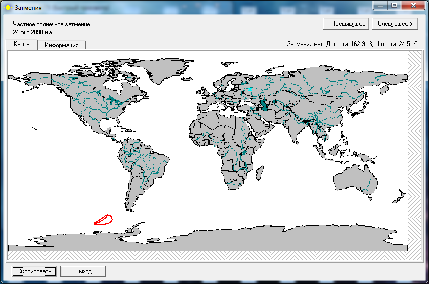

|||
|-|-|
| Начало частного затмения | `10:25:11 UTC` |
| Максимальная фаза | `10:32:58 UTC` |
| Конец частного затмения | `10:39:59 UTC` |

**Наибольшее затмение:**

| Долгота: | Широта: |
|-|-|
| `95° 33.6' Зап.` | `61° 55.3' Южн.` |

## Кольцеобразное солнечное затмение `21 - 22 марта 2099г`.

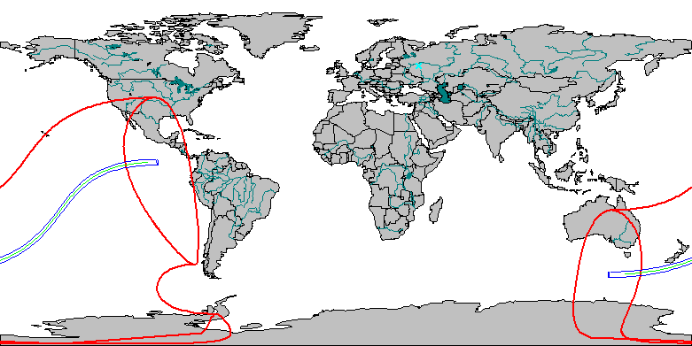

|||
|-|-|
| Начало частного затмения | `19:51:42 UTC` |
| Начало полного затмения | `20:59:58 UTC` |
| Максимальная фаза | `22:51:19 UTC` |
| Конец полного затмения | `0:42:55 UTC` |
| Конец частного затмения | `1:51:10 UTC` |

**Наибольшее затмение:**

| Долгота: | Широта: |
|-|-|
| `149° 4.9' Зап.` | `20° 0.6' Южн.` |

## Полное солнечное затмение `14 сентября 2099г`.

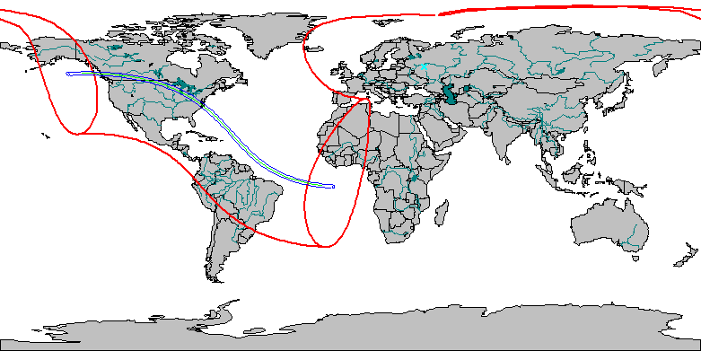

|||
|-|-|
| Начало частного затмения | `14:22:33 UTC` |
| Начало полного затмения | `15:18:50 UTC` |
| Максимальная фаза | `16:54:35 UTC` |
| Конец полного затмения | `18:30:35 UTC` |
| Конец частного затмения | `19:26:52 UTC` |

**Наибольшее затмение:**

| Долгота: | Широта: |
|-|-|
| `62° 49.4' Зап.` | `23° 21.5' Сев.` |

## Ссылки
- Затмения `2000-2010`:
	+ 2000
		* [Частное солнечное затмение `5 февраля 2000г`.](#Частное-солнечное-затмение-5-февраля-2000г)
		* [Частное солнечное затмение `1 июля 2000г`.](#Частное-солнечное-затмение-1-июля-2000г)
		* [Частное солнечное затмение `31 июля 2000г`.](#Частное-солнечное-затмение-31-июля-2000г)
		* [Частное солнечное затмение `25 декабря 2000г`.](#Частное-солнечное-затмение-25-декабря-2000г)
	+ 2001
		* [Полное солнечное затмение `21 июня 2001г`.](#Полное-солнечное-затмение-21-июня-2001г)
		* [Кольцеобразное солнечное затмение `14 декабря 2001г`.](#Кольцеобразное-солнечное-затмение-14-декабря-2001г)
	+ 2002
		* [Кольцеобразное солнечное затмение `10 - 11 июня 2002г`.](#Кольцеобразное-солнечное-затмение-10---11-июня-2002г)
		* [Полное солнечное затмение `4 декабря 2002г`.](#Полное-солнечное-затмение-4-декабря-2002г)
	+ 2003
		* [Кольцеобразное солнечное затмение `31 мая 2003г`.](#Кольцеобразное-солнечное-затмение-31-мая-2003г)
		* [Полное солнечное затмение `23 - 24 ноября 2003г`.](#Полное-солнечное-затмение-23---24-ноября-2003г)
	+ 2004
		* [Частное солнечное затмение `19 апреля 2004г`.](#Частное-солнечное-затмение-19-апреля-2004г)
		* [Частное солнечное затмение `14 октября 2004г`.](#Частное-солнечное-затмение-14-октября-2004г)
	+ 2005
		* [Полное солнечное затмение `8 апреля 2005г`.](#Полное-солнечное-затмение-8-апреля-2005г)
		* [Кольцеобразное солнечное затмение `3 октября 2005г`.](#Кольцеобразное-солнечное-затмение-3-октября-2005г)
	+ 2006
		* [Полное солнечное затмение `29 марта 2006г`.](#Полное-солнечное-затмение-29-марта-2006г)
		* [Кольцеобразное солнечное затмение `22 сентября 2006г`.](#Кольцеобразное-солнечное-затмение-22-сентября-2006г)
	+ 2007
		* [Частное солнечное затмение `19 марта 2007г`.](#Частное-солнечное-затмение-19-марта-2007г)
		* [Частное солнечное затмение `11 сентября 2007г`.](#Частное-солнечное-затмение-11-сентября-2007г)
	+ 2008
		* [Кольцеобразное солнечное затмение `7 февраля 2008г`.](#Кольцеобразное-солнечное-затмение-7-февраля-2008г)
		* [Полное солнечное затмение `1 августа 2008г`.](#Полное-солнечное-затмение-1-августа-2008г)
	+ 2009
		* [Кольцеобразное солнечное затмение `26 января 2009г`.](#Кольцеобразное-солнечное-затмение-26-января-2009г)
		* [Полное солнечное затмение `21 - 22 июля 2009г`.](#Полное-солнечное-затмение-21---22-июля-2009г)
- Затмения `2010-2020`:
	+ 2010
		* [Кольцеобразное солнечное затмение `15 января 2010г`.](#Кольцеобразное-солнечное-затмение-15-января-2010г)
		* [Полное солнечное затмение `11 июля 2010г`.](#Полное-солнечное-затмение-11-июля-2010г)
	+ 2011
		* [Частное солнечное затмение `4 января 2011г`.](#Частное-солнечное-затмение-4-января-2011г)
		* [Частное солнечное затмение `1 июня 2011г`.](#Частное-солнечное-затмение-1-июня-2011г)
		* [Частное солнечное затмение `1 июля 2011г`.](#Частное-солнечное-затмение-1-июля-2011г)
		* [Частное солнечное затмение `25 ноября 2011г`.](#Частное-солнечное-затмение-25-ноября-2011г)
	+ 2012
		* [Кольцеобразное солнечное затмение `20 - 21 мая 2012г`.](#Кольцеобразное-солнечное-затмение-20---21-мая-2012г)
		* [Полное солнечное затмение `13 - 14 ноября 2012г`.](#Полное-солнечное-затмение-13---14-ноября-2012г)
	+ 2013
		* [Кольцеобразное солнечное затмение `9 - 10 мая 2013г`.](#Кольцеобразное-солнечное-затмение-9---10-мая-2013г)
		* [Полное солнечное затмение `3 ноября 2013г`.](#Полное-солнечное-затмение-3-ноября-2013г)
	+ 2014
		* [Нецентральное кольцеобразное солнечное затмение `29 апреля 2014г`.](#Нецентральное-кольцеобразное-солнечное-затмение-29-апреля-2014г)
		* [Частное солнечное затмение `23 октября 2014г`.](#Частное-солнечное-затмение-23-октября-2014г)
	+ 2015
		* [Полное солнечное затмение `20 марта 2015г`.](#Полное-солнечное-затмение-20-марта-2015г)
		* [Частное солнечное затмение `13 сентября 2015г`.](#Частное-солнечное-затмение-13-сентября-2015г)
	+ 2016
		* [Полное солнечное затмение `8 - 9 марта 2016г`.](#Полное-солнечное-затмение-8---9-марта-2016г)
		* [Кольцеобразное солнечное затмение `1 сентября 2016г`.](#Кольцеобразное-солнечное-затмение-1-сентября-2016г)
	+ 2017
		* [Кольцеобразное солнечное затмение `26 февраля 2017г`.](#Кольцеобразное-солнечное-затмение-26-февраля-2017г)
		* [Полное солнечное затмение `21 августа 2017г`.](#Полное-солнечное-затмение-21-августа-2017г)
	+ 2018
		* [Частное солнечное затмение `15 февраля 2018г`.](#Частное-солнечное-затмение-15-февраля-2018г)
		* [Частное солнечное затмение `13 июля 2018г`.](#Частное-солнечное-затмение-13-июля-2018г)
		* [Частное солнечное затмение `11 августа 2018г`.](#Частное-солнечное-затмение-11-августа-2018г)
	+ 2019
		* [Частное солнечное затмение `5 - 6 января 2019г`.](#Частное-солнечное-затмение-5---6-января-2019г)
		* [Полное солнечное затмение `2 июля 2019г`.](#Полное-солнечное-затмение-2-июля-2019г)
		* [Кольцеобразное солнечное затмение `26 декабря 2019г`.](#Кольцеобразное-солнечное-затмение-26-декабря-2019г)
- Затмения `2020-2030`:
	+ 2020
		* [Кольцеобразное солнечное затмение `21 июня 2020г`.](#Кольцеобразное-солнечное-затмение-21-июня-2020г)
		* [Полное солнечное затмение `14 декабря 2020г`.](#Полное-солнечное-затмение-14-декабря-2020г)
	+ 2021
		* [Кольцеобразное солнечное затмение `10 июня 2021г`.](#Кольцеобразное-солнечное-затмение-10-июня-2021г)
		* [Полное солнечное затмение `4 декабря 2021г`.](#Полное-солнечное-затмение-4-декабря-2021г)
	+ 2022
		* [Частное солнечное затмение `30 апреля 2022г`.](#Частное-солнечное-затмение-30-апреля-2022г)
		* [Частное солнечное затмение `25 октября 2022г`.](#Частное-солнечное-затмение-25-октября-2022г)
	+ 2023
		* [Полное солнечное затмение `20 апреля 2023г`.](#Полное-солнечное-затмение-20-апреля-2023г)
		* [Кольцеобразное солнечное затмение `14 октября 2023г`.](#Кольцеобразное-солнечное-затмение-14-октября-2023г)
	+ 2024
		* [Полное солнечное затмение `8 апреля 2024г`.](#Полное-солнечное-затмение-8-апреля-2024г)
		* [Кольцеобразное солнечное затмение `2 октября 2024г`.](#Кольцеобразное-солнечное-затмение-2-октября-2024г)
	+ 2025
		* [Частное солнечное затмение `29 марта 2025г`.](#Частное-солнечное-затмение-29-марта-2025г)
		* [Частное солнечное затмение `21 сентября 2025г`.](#Частное-солнечное-затмение-21-сентября-2025г)
	+ 2026
		* [Кольцеобразное солнечное затмение `17 февраля 2026г`.](#Кольцеобразное-солнечное-затмение-17-февраля-2026г)
		* [Полное солнечное затмение `12 августа 2026г`.](#Полное-солнечное-затмение-12-августа-2026г)
	+ 2027
		* [Кольцеобразное солнечное затмение `6 февраля 2027г`.](#Кольцеобразное-солнечное-затмение-6-февраля-2027г)
		* [Полное солнечное затмение `2 августа 2027г`.](#Полное-солнечное-затмение-2-августа-2027г)
	+ 2028
		* [Кольцеобразное солнечное затмение `26 января 2028г`.](#Кольцеобразное-солнечное-затмение-26-января-2028г)
		* [Полное солнечное затмение `22 июля 2028г`.](#Полное-солнечное-затмение-22-июля-2028г)
	+ 2029
		* [Частное солнечное затмение `14 января 2029г`.](#Частное-солнечное-затмение-14-января-2029г)
		* [Частное солнечное затмение `12 июня 2029г`.](#Частное-солнечное-затмение-12-июня-2029г)
		* [Частное солнечное затмение `11 июля 2029г`.](#Частное-солнечное-затмение-11-июля-2029г)
		* [Частное солнечное затмение `5 декабря 2029г`.](#Частное-солнечное-затмение-5-декабря-2029г)
- Затмения `2030-2040`:
	+ 2030
		* [Кольцеобразное солнечное затмение `1 июня 2030г`.](#Кольцеобразное-солнечное-затмение-1-июня-2030г)
		* [Полное солнечное затмение `25 ноября 2030г`.](#Полное-солнечное-затмение-25-ноября-2030г)
	+ 2031
		* [Кольцеобразное солнечное затмение `21 мая 2031г`.](#Кольцеобразное-солнечное-затмение-21-мая-2031г)
		* [Полное солнечное затмение `14 ноября 2031г`.](#Полное-солнечное-затмение-14-ноября-2031г)
	+ 2032
		* [Кольцеобразное солнечное затмение `9 мая 2032г`.](#Кольцеобразное-солнечное-затмение-9-мая-2032г)
		* [Частное солнечное затмение `3 ноября 2032г`.](#Частное-солнечное-затмение-3-ноября-2032г)
	+ 2033
		* [Полное солнечное затмение `30 марта 2033г`.](#Полное-солнечное-затмение-30-марта-2033г)
		* [Частное солнечное затмение `23 сентября 2033г`.](#Частное-солнечное-затмение-23-сентября-2033г)
	+ 2034
		* [Полное солнечное затмение `20 марта 2034г`.](#Полное-солнечное-затмение-20-марта-2034г)
		* [Кольцеобразное солнечное затмение `12 сентября 2034г`.](#Кольцеобразное-солнечное-затмение-12-сентября-2034г)
	+ 2035
		* [Кольцеобразное солнечное затмение `9 - 10 марта 2035г`.](#Кольцеобразное-солнечное-затмение-9---10-марта-2035г)
		* [Полное солнечное затмение `1 - 2 сентября 2035г`.](#Полное-солнечное-затмение-1---2-сентября-2035г)
	+ 2036
		* [Частное солнечное затмение `27 февраля 2036г`.](#Частное-солнечное-затмение-27-февраля-2036г)
		* [Частное солнечное затмение `23 июля 2036г`.](#Частное-солнечное-затмение-23-июля-2036г)
		* [Частное солнечное затмение `21 августа 2036г`.](#Частное-солнечное-затмение-21-августа-2036г)
	+ 2037
		* [Частное солнечное затмение `16 января 2037г`.](#Частное-солнечное-затмение-16-января-2037г)
		* [Полное солнечное затмение `13 июля 2037г`.](#Полное-солнечное-затмение-13-июля-2037г)
	+ 2038
		* [Кольцеобразное солнечное затмение `5 января 2038г`.](#Кольцеобразное-солнечное-затмение-5-января-2038г)
		* [Кольцеобразное солнечное затмение `2 июля 2038г`.](#Кольцеобразное-солнечное-затмение-2-июля-2038г)
		* [Полное солнечное затмение `25 - 26 декабря 2038г`.](#Полное-солнечное-затмение-25---26-декабря-2038г)
	+ 2039
		* [Кольцеобразное солнечное затмение `21 июня 2039г`.](#Кольцеобразное-солнечное-затмение-21-июня-2039г)
		* [Полное солнечное затмение `15 декабря 2039г`.](#Полное-солнечное-затмение-15-декабря-2039г)
- Затмения `2040-2050`:
	+ 2040
		* [Частное солнечное затмение `11 мая 2040г`.](#Частное-солнечное-затмение-11-мая-2040г)
		* [Частное солнечное затмение `4 ноября 2040г`.](#Частное-солнечное-затмение-4-ноября-2040г)
	+ 2041
		* [Полное солнечное затмение `30 апреля 2041г`.](#Полное-солнечное-затмение-30-апреля-2041г)
		* [Кольцеобразное солнечное затмение `24 - 25 октября 2041г`.](#Кольцеобразное-солнечное-затмение-24---25-октября-2041г)
	+ 2042
		* [Полное солнечное затмение `19 - 20 апреля 2042г`.](#Полное-солнечное-затмение-19---20-апреля-2042г)
		* [Кольцеобразное солнечное затмение `13 - 14 октября 2042г`.](#Кольцеобразное-солнечное-затмение-13---14-октября-2042г)
	+ 2043
		* [Нецентральное полное солнечное затмение `9 апреля 2043г`.](#Нецентральное-полное-солнечное-затмение-9-апреля-2043г)
		* [Нецентральное кольцеобразное солнечное затмение `3 октября 2043г`.](#Нецентральное-кольцеобразное-солнечное-затмение-3-октября-2043г)
	+ 2044
		* [Кольцеобразное солнечное затмение `28 февраля 2044г`.](#Кольцеобразное-солнечное-затмение-28-февраля-2044г)
		* [Полное солнечное затмение `22 - 23 августа 2044г`.](#Полное-солнечное-затмение-22---23-августа-2044г)
	+ 2045
		* [Кольцеобразное солнечное затмение `16 - 17 февраля 2045г`.](#Кольцеобразное-солнечное-затмение-16---17-февраля-2045г)
		* [Полное солнечное затмение `12 августа 2045г`.](#Полное-солнечное-затмение-12-августа-2045г)
	+ 2046
		* [Кольцеобразное солнечное затмение `5 - 6 февраля 2046г`.](#Кольцеобразное-солнечное-затмение-5---6-февраля-2046г)
		* [Полное солнечное затмение `2 августа 2046г`.](#Полное-солнечное-затмение-2-августа-2046г)
	+ 2047
		* [Частное солнечное затмение `25 - 26 января 2047г`.](#Частное-солнечное-затмение-25---26-января-2047г)
		* [Частное солнечное затмение `23 июня 2047г`.](#Частное-солнечное-затмение-23-июня-2047г)
		* [Частное солнечное затмение `22 июля 2047г`.](#Частное-солнечное-затмение-22-июля-2047г)
		* [Частное солнечное затмение `16 - 17 декабря 2047г`.](#Частное-солнечное-затмение-16---17-декабря-2047г)
	+ 2048
		* [Кольцеобразное солнечное затмение `11 июня 2048г`.](#Кольцеобразное-солнечное-затмение-11-июня-2048г)
		* [Полное солнечное затмение `5 декабря 2048г`.](#Полное-солнечное-затмение-5-декабря-2048г)
	+ 2049
		* [Кольцеобразное солнечное затмение `31 мая 2049г`.](#Кольцеобразное-солнечное-затмение-31-мая-2049г)
		* [Полное солнечное затмение `25 ноября 2049г`.](#Полное-солнечное-затмение-25-ноября-2049г)
- Затмения `2050-2060`:
	+ 2050
		* [Полное солнечное затмение `20 мая 2050г`.](#Полное-солнечное-затмение-20-мая-2050г)
		* [Частное солнечное затмение `14 ноября 2050г`.](#Частное-солнечное-затмение-14-ноября-2050г)
	+ 2051
		* [Частное солнечное затмение `11 апреля 2051г`.](#Частное-солнечное-затмение-11-апреля-2051г)
		* [Частное солнечное затмение `4 октября 2051г`.](#Частное-солнечное-затмение-4-октября-2051г)
	+ 2052
		* [Полное солнечное затмение `30 марта 2052г`.](#Полное-солнечное-затмение-30-марта-2052г)
		* [Кольцеобразное солнечное затмение `22 - 23 сентября 2052г`.](#Кольцеобразное-солнечное-затмение-22---23-сентября-2052г)
	+ 2053
		* [Кольцеобразное солнечное затмение `20 марта 2053г`.](#Кольцеобразное-солнечное-затмение-20-марта-2053г)
		* [Полное солнечное затмение `12 сентября 2053г`.](#Полное-солнечное-затмение-12-сентября-2053г)
	+ 2054
		* [Частное солнечное затмение `9 марта 2054г`.](#Частное-солнечное-затмение-9-марта-2054г)
		* [Частное солнечное затмение `3 августа 2054г`.](#Частное-солнечное-затмение-3-августа-2054г)
		* [Частное солнечное затмение `1 - 2 сентября 2054г`.](#Частное-солнечное-затмение-1---2-сентября-2054г)
	+ 2055
		* [Частное солнечное затмение `27 января 2055г`.](#Частное-солнечное-затмение-27-января-2055г)
		* [Полное солнечное затмение `24 июля 2055г`.](#Полное-солнечное-затмение-24-июля-2055г)
	+ 2056
		* [Кольцеобразное солнечное затмение `16 - 17 января 2056г`.](#Кольцеобразное-солнечное-затмение-16---17-января-2056г)
		* [Кольцеобразное солнечное затмение `12 июля 2056г`.](#Кольцеобразное-солнечное-затмение-12-июля-2056г)
	+ 2057
		* [Полное солнечное затмение `5 января 2057г`.](#Полное-солнечное-затмение-5-января-2057г)
		* [Кольцеобразное солнечное затмение `1 - 2 июля 2057г`.](#Кольцеобразное-солнечное-затмение-1---2-июля-2057г)
		* [Полное солнечное затмение `25 - 26 декабря 2057г`.](#Полное-солнечное-затмение-25---26-декабря-2057г)
	+ 2058
		* [Частное солнечное затмение `22 мая 2058г`.](#Частное-солнечное-затмение-22-мая-2058г)
		* [Частное солнечное затмение `20 - 21 июня 2058г`.](#Частное-солнечное-затмение-20---21-июня-2058г)
		* [Частное солнечное затмение `16 ноября 2058г`.](#Частное-солнечное-затмение-16-ноября-2058г)
	+ 2059
		* [Полное солнечное затмение `11 мая 2059г`.](#Полное-солнечное-затмение-11-мая-2059г)
		* [Кольцеобразное солнечное затмение `5 ноября 2059г`.](#Кольцеобразное-солнечное-затмение-5-ноября-2059г)
- Затмения `2060-2070`:
	+ 2060
		* [Полное солнечное затмение `30 апреля 2060г`.](#Полное-солнечное-затмение-30-апреля-2060г)
		* [Кольцеобразное солнечное затмение `24 октября 2060г`.](#Кольцеобразное-солнечное-затмение-24-октября-2060г)
	+ 2061
		* [Полное солнечное затмение `20 апреля 2061г`.](#Полное-солнечное-затмение-20-апреля-2061г)
		* [Кольцеобразное солнечное затмение `13 октября 2061г`.](#Кольцеобразное-солнечное-затмение-13-октября-2061г)
	+ 2062
		* [Частное солнечное затмение `11 марта 2062г`.](#Частное-солнечное-затмение-11-марта-2062г)
		* [Частное солнечное затмение `3 сентября 2062г`.](#Частное-солнечное-затмение-3-сентября-2062г)
	+ 2063
		* [Кольцеобразное солнечное затмение `28 февраля 2063г`.](#Кольцеобразное-солнечное-затмение-28-февраля-2063г)
		* [Полное солнечное затмение `23 - 24 августа 2063г`.](#Полное-солнечное-затмение-23---24-августа-2063г)
	+ 2064
		* [Кольцеобразное солнечное затмение `17 февраля 2064г`.](#Кольцеобразное-солнечное-затмение-17-февраля-2064г)
		* [Полное солнечное затмение `12 августа 2064г`.](#Полное-солнечное-затмение-12-августа-2064г)
	+ 2065
		* [Частное солнечное затмение `5 февраля 2065г`.](#Частное-солнечное-затмение-5-февраля-2065г)
		* [Частное солнечное затмение `3 июля 2065г`.](#Частное-солнечное-затмение-3-июля-2065г)
		* [Частное солнечное затмение `2 августа 2065г`.](#Частное-солнечное-затмение-2-августа-2065г)
		* [Частное солнечное затмение `27 декабря 2065г`.](#Частное-солнечное-затмение-27-декабря-2065г)
	+ 2066
		* [Кольцеобразное солнечное затмение `22 июня 2066г`.](#Кольцеобразное-солнечное-затмение-22-июня-2066г)
		* [Полное солнечное затмение `16 - 17 декабря 2066г`.](#Полное-солнечное-затмение-16---17-декабря-2066г)
	+ 2067
		* [Кольцеобразное солнечное затмение `11 июня 2067г`.](#Кольцеобразное-солнечное-затмение-11-июня-2067г)
		* [Полное солнечное затмение `6 декабря 2067г`.](#Полное-солнечное-затмение-6-декабря-2067г)
	+ 2068
		* [Полное солнечное затмение `31 мая 2068г`.](#Полное-солнечное-затмение-31-мая-2068г)
		* [Частное солнечное затмение `24 ноября 2068г`.](#Частное-солнечное-затмение-24-ноября-2068г)
	+ 2069
		* [Частное солнечное затмение `21 апреля 2069г`.](#Частное-солнечное-затмение-21-апреля-2069г)
		* [Частное солнечное затмение `20 мая 2069г`.](#Частное-солнечное-затмение-20-мая-2069г)
		* [Частное солнечное затмение `15 октября 2069г`.](#Частное-солнечное-затмение-15-октября-2069г)
- Затмения `2070-2080`:
	+ 2070
		* [Полное солнечное затмение `10 - 11 апреля 2070г`.](#Полное-солнечное-затмение-10---11-апреля-2070г)
		* [Кольцеобразное солнечное затмение `4 октября 2070г`.](#Кольцеобразное-солнечное-затмение-4-октября-2070г)
	+ 2071
		* [Кольцеобразное солнечное затмение `31 марта 2071г`.](#Кольцеобразное-солнечное-затмение-31-марта-2071г)
		* [Полное солнечное затмение `23 сентября 2071г`.](#Полное-солнечное-затмение-23-сентября-2071г)
	+ 2072
		* [Частное солнечное затмение `19 марта 2072г`.](#Частное-солнечное-затмение-19-марта-2072г)
		* [Полное солнечное затмение `12 сентября 2072г`.](#Полное-солнечное-затмение-12-сентября-2072г)
	+ 2073
		* [Частное солнечное затмение `6 - 7 февраля 2073г`.](#Частное-солнечное-затмение-6---7-февраля-2073г)
		* [Полное солнечное затмение `3 августа 2073г`.](#Полное-солнечное-затмение-3-августа-2073г)
	+ 2074
		* [Кольцеобразное солнечное затмение `27 января 2074г`.](#Кольцеобразное-солнечное-затмение-27-января-2074г)
		* [Кольцеобразное солнечное затмение `24 июля 2074г`.](#Кольцеобразное-солнечное-затмение-24-июля-2074г)
	+ 2075
		* [Полное солнечное затмение `16 января 2075г`.](#Полное-солнечное-затмение-16-января-2075г)
		* [Кольцеобразное солнечное затмение `13 июля 2075г`.](#Кольцеобразное-солнечное-затмение-13-июля-2075г)
	+ 2076
		* [Полное солнечное затмение `6 января 2076г`.](#Полное-солнечное-затмение-6-января-2076г)
		* [Частное солнечное затмение `1 июня 2076г`.](#Частное-солнечное-затмение-1-июня-2076г)
		* [Частное солнечное затмение `1 июля 2076г`.](#Частное-солнечное-затмение-1-июля-2076г)
		* [Частное солнечное затмение `26 ноября 2076г`.](#Частное-солнечное-затмение-26-ноября-2076г)
	+ 2077
		* [Полное солнечное затмение `22 мая 2077г`.](#Полное-солнечное-затмение-22-мая-2077г)
		* [Кольцеобразное солнечное затмение `15 ноября 2077г`.](#Кольцеобразное-солнечное-затмение-15-ноября-2077г)
	+ 2078
		* [Полное солнечное затмение `11 мая 2078г`.](#Полное-солнечное-затмение-11-мая-2078г)
		* [Кольцеобразное солнечное затмение `4 ноября 2078г`.](#Кольцеобразное-солнечное-затмение-4-ноября-2078г)
	+ 2079
		* [Полное солнечное затмение `1 мая 2079г`.](#Полное-солнечное-затмение-1-мая-2079г)
		* [Кольцеобразное солнечное затмение `24 октября 2079г`.](#Кольцеобразное-солнечное-затмение-24-октября-2079г)
- Затмения `2080-2090`:
	+ 2080
		* [Частное солнечное затмение `21 марта 2080г`.](#Частное-солнечное-затмение-21-марта-2080г)
		* [Частное солнечное затмение `13 сентября 2080г`.](#Частное-солнечное-затмение-13-сентября-2080г)
	+ 2081
		* [Кольцеобразное солнечное затмение `10 марта 2081г`.](#Кольцеобразное-солнечное-затмение-10-марта-2081г)
		* [Полное солнечное затмение `3 сентября 2081г`.](#Полное-солнечное-затмение-3-сентября-2081г)
	+ 2082
		* [Кольцеобразное солнечное затмение `27 февраля 2082г`.](#Кольцеобразное-солнечное-затмение-27-февраля-2082г)
		* [Полное солнечное затмение `23 - 24 августа 2082г`.](#Полное-солнечное-затмение-23---24-августа-2082г)
	+ 2083
		* [Частное солнечное затмение `16 февраля 2083г`.](#Частное-солнечное-затмение-16-февраля-2083г)
		* [Частное солнечное затмение `14 - 15 июля 2083г`.](#Частное-солнечное-затмение-14---15-июля-2083г)
		* [Частное солнечное затмение `13 августа 2083г`.](#Частное-солнечное-затмение-13-августа-2083г)
	+ 2084
		* [Частное солнечное затмение `7 января 2084г`.](#Частное-солнечное-затмение-7-января-2084г)
		* [Кольцеобразное солнечное затмение `2 - 3 июля 2084г`.](#Кольцеобразное-солнечное-затмение-2---3-июля-2084г)
		* [Полное солнечное затмение `27 декабря 2084г`.](#Полное-солнечное-затмение-27-декабря-2084г)
	+ 2085
		* [Кольцеобразное солнечное затмение `22 июня 2085г`.](#Кольцеобразное-солнечное-затмение-22-июня-2085г)
		* [Кольцеобразное солнечное затмение `16 - 17 декабря 2085г`.](#Кольцеобразное-солнечное-затмение-16---17-декабря-2085г)
	+ 2086
		* [Полное солнечное затмение `11 июня 2086г`.](#Полное-солнечное-затмение-11-июня-2086г)
		* [Частное солнечное затмение `6 декабря 2086г`.](#Частное-солнечное-затмение-6-декабря-2086г)
	+ 2087
		* [Частное солнечное затмение `2 мая 2087г`.](#Частное-солнечное-затмение-2-мая-2087г)
		* [Частное солнечное затмение `1 июня 2087г`.](#Частное-солнечное-затмение-1-июня-2087г)
		* [Частное солнечное затмение `26 октября 2087г`.](#Частное-солнечное-затмение-26-октября-2087г)
	+ 2088
		* [Полное солнечное затмение `21 апреля 2088г`.](#Полное-солнечное-затмение-21-апреля-2088г)
		* [Кольцеобразное солнечное затмение `14 октября 2088г`.](#Кольцеобразное-солнечное-затмение-14-октября-2088г)
	+ 2089
		* [Кольцеобразное солнечное затмение `10 - 11 апреля 2089г`.](#Кольцеобразное-солнечное-затмение-10---11-апреля-2089г)
		* [Полное солнечное затмение `3 - 4 октября 2089г`.](#Полное-солнечное-затмение-3---4-октября-2089г)
- Затмения `2090-2100`:
	+ 2090
		* [Частное солнечное затмение `31 марта 2090г`.](#Частное-солнечное-затмение-31-марта-2090г)
		* [Полное солнечное затмение `23 сентября 2090г`.](#Полное-солнечное-затмение-23-сентября-2090г)
	+ 2091
		* [Частное солнечное затмение `18 февраля 2091г`.](#Частное-солнечное-затмение-18-февраля-2091г)
		* [Полное солнечное затмение `14 - 15 августа 2091г`.](#Полное-солнечное-затмение-14---15-августа-2091г)
	+ 2092
		* [Кольцеобразное солнечное затмение `7 февраля 2092г`.](#Кольцеобразное-солнечное-затмение-7-февраля-2092г)
		* [Кольцеобразное солнечное затмение `3 августа 2092г`.](#Кольцеобразное-солнечное-затмение-3-августа-2092г)
	+ 2093
		* [Полное солнечное затмение `27 января 2093г`.](#Полное-солнечное-затмение-27-января-2093г)
		* [Кольцеобразное солнечное затмение `23 июля 2093г`.](#Кольцеобразное-солнечное-затмение-23-июля-2093г)
	+ 2094
		* [Полное солнечное затмение `16 января 2094г`.](#Полное-солнечное-затмение-16-января-2094г)
		* [Частное солнечное затмение `12 - 13 июня 2094г`.](#Частное-солнечное-затмение-12---13-июня-2094г)
		* [Частное солнечное затмение `12 июля 2094г`.](#Частное-солнечное-затмение-12-июля-2094г)
		* [Частное солнечное затмение `7 декабря 2094г`.](#Частное-солнечное-затмение-7-декабря-2094г)
	+ 2095
		* [Полное солнечное затмение `2 июня 2095г`.](#Полное-солнечное-затмение-2-июня-2095г)
		* [Кольцеобразное солнечное затмение `26 - 27 ноября 2095г`.](#Кольцеобразное-солнечное-затмение-26---27-ноября-2095г)
	+ 2096
		* [Полное солнечное затмение `21 - 22 мая 2096г`.](#Полное-солнечное-затмение-21---22-мая-2096г)
		* [Кольцеобразное солнечное затмение `14 - 15 ноября 2096г`.](#Кольцеобразное-солнечное-затмение-14---15-ноября-2096г)
	+ 2097
		* [Полное солнечное затмение `11 мая 2097г`.](#Полное-солнечное-затмение-11-мая-2097г)
		* [Кольцеобразное солнечное затмение `3 - 4 ноября 2097г`.](#Кольцеобразное-солнечное-затмение-3---4-ноября-2097г)
	+ 2098
		* [Частное солнечное затмение `1 апреля 2098г`.](#Частное-солнечное-затмение-1-апреля-2098г)
		* [Частное солнечное затмение `24 - 25 сентября 2098г`.](#Частное-солнечное-затмение-24---25-сентября-2098г)
		* [Частное солнечное затмение `24 октября 2098г`.](#Частное-солнечное-затмение-24-октября-2098г)
	+ 2099
		* [Кольцеобразное солнечное затмение `21 - 22 марта 2099г`.](#Кольцеобразное-солнечное-затмение-21---22-марта-2099г)
		* [Полное солнечное затмение `14 сентября 2099г`.](#Полное-солнечное-затмение-14-сентября-2099г)