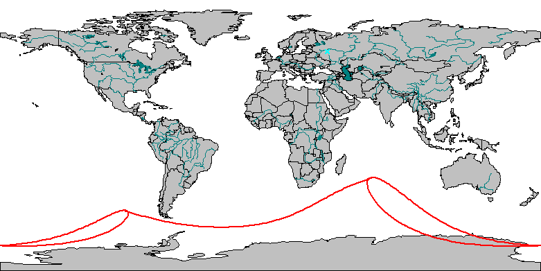

## Частное солнечное затмение `5 фев 2000г`.

Начало частного затмения: 10ч 55м 58с
Максимальная фаза: 12ч 49м 21с
Конец частного затмения: 14ч 43м 0с

Наибольшее затмение:
Долгота: 134° 10.0' В;  Широта: 70° 20.4' Ю

## Частное солнечное затмение `1 июл 2000г`.

Начало частного затмения: 18ч 7м 19с
Максимальная фаза: 19ч 32м 29с
Конец частного затмения: 20ч 57м 40с

Наибольшее затмение:
Долгота: 109° 27.3' З;  Широта: 67° 4.3' Ю

## Частное солнечное затмение `31 июл 2000г`.

Начало частного затмения: 0ч 37м 40с
Максимальная фаза: 2ч 13м 3с
Конец частного затмения: 3ч 48м 42с

Наибольшее затмение:
Долгота: 59° 50.8' З;  Широта: 69° 39.3' С

## Частное солнечное затмение `25 дек 2000г`.

Начало частного затмения: 15ч 26м 46с
Максимальная фаза: 17ч 34м 48с
Конец частного затмения: 19ч 42м 59с

Наибольшее затмение:
Долгота: 74° 6.1' З;  Широта: 66° 28.7' С

## Полное солнечное затмение `21 июн 2001г`.

Начало частного затмения: 9ч 33м 3с
Начало полного затмения: 10ч 35м 55с
Максимальная фаза: 12ч 3м 42с
Конец полного затмения: 13ч 31м 35с
Конец частного затмения: 14ч 34м 21с

Наибольшее затмение:
Долгота: 2° 45.0' В;  Широта: 11° 15.8' Ю

## Кольцеобразное солнечное затмение `14 дек 2001г`.

Начало частного затмения: 18ч 3м 17с
Начало полного затмения: 19ч 8м 5с
Максимальная фаза: 20ч 51м 51с
Конец полного затмения: 22ч 35м 45с
Конец частного затмения: 23ч 40м 36с

Наибольшее затмение:
Долгота: 130° 40.5' З;  Широта: 0° 38.5' С

## Кольцеобразное солнечное затмение `10 - 11 июн 2002г`.

Начало частного затмения: 20ч 51м 46с
Начало полного затмения: 21ч 53м 48с
Максимальная фаза: 23ч 44м 14с
Конец полного затмения: 1ч 34м 33с
Конец частного затмения: 2ч 36м 33с

Наибольшее затмение:
Долгота: 178° 35.9' З;  Широта: 34° 32.5' С

## Полное солнечное затмение `4 дек 2002г`.

Начало частного затмения: 4ч 51м 18с
Начало полного затмения: 5ч 50м 13с
Максимальная фаза: 7ч 31м 7с
Конец полного затмения: 9ч 11м 54с
Конец частного затмения: 10ч 10м 55с

Наибольшее затмение:
Долгота: 59° 35.0' В;  Широта: 39° 26.4' Ю

## Кольцеобразное солнечное затмение `31 май 2003г`.

Начало частного затмения: 1ч 46м 15с
Начало полного затмения: 3ч 45м 1с
Максимальная фаза: 4ч 8м 12с
Конец полного затмения: 4ч 31м 2с
Конец частного затмения: 6ч 29м 46с

Наибольшее затмение:
Долгота: 25° 1.3' З;  Широта: 66° 14.4' С

## Полное солнечное затмение `23 - 24 ноя 2003г`.

Начало частного затмения: 20ч 46м 3с
Начало полного затмения: 22ч 19м 6с
Максимальная фаза: 22ч 49м 16с
Конец полного затмения: 23ч 19м 5с
Конец частного затмения: 0ч 52м 8с

Наибольшее затмение:
Долгота: 88° 42.3' В;  Широта: 72° 42.3' Ю

## Частное солнечное затмение `19 апр 2004г`.

Начало частного затмения: 11ч 30м 5с
Максимальная фаза: 13ч 33м 56с
Конец частного затмения: 15ч 38м 31с

Наибольшее затмение:
Долгота: 44° 21.2' В;  Широта: 61° 45.2' Ю

## Частное солнечное затмение `14 окт 2004г`.

Начало частного затмения: 0ч 54м 46с
Максимальная фаза: 2ч 59м 11с
Конец частного затмения: 5ч 4м 8с

Наибольшее затмение:
Долгота: 153° 36.0' З;  Широта: 61° 24.8' С

## Полное солнечное затмение `8 апр 2005г`.

Начало частного затмения: 17ч 51м 16с
Начало полного затмения: 18ч 53м 19с
Максимальная фаза: 20ч 35м 39с
Конец полного затмения: 22ч 18м 15с
Конец частного затмения: 23ч 20м 20с

Наибольшее затмение:
Долгота: 118° 57.4' З;  Широта: 10° 33.5' Ю

## Кольцеобразное солнечное затмение `3 окт 2005г`.

Начало частного затмения: 7ч 35м 33с
Начало полного затмения: 8ч 40м 54с
Максимальная фаза: 10ч 31м 35с
Конец полного затмения: 12ч 22м 26с
Конец частного затмения: 13ч 27м 44с

Наибольшее затмение:
Долгота: 28° 46.6' В;  Широта: 12° 53.9' С

## Полное солнечное затмение `29 мар 2006г`.

Начало частного затмения: 7ч 36м 44с
Начало полного затмения: 8ч 34м 18с
Максимальная фаза: 10ч 11м 12с
Конец полного затмения: 11ч 47м 52с
Конец частного затмения: 12ч 45м 30с

Наибольшее затмение:
Долгота: 16° 46.1' В;  Широта: 23° 9.6' С

## Кольцеобразное солнечное затмение `22 сен 2006г`.

Начало частного затмения: 8ч 39м 50с
Начало полного затмения: 9ч 48м 26с
Максимальная фаза: 11ч 40м 3с
Конец полного затмения: 13ч 31м 25с
Конец частного затмения: 14ч 40м 0с

Наибольшее затмение:
Долгота: 9° 2.3' З;  Широта: 20° 38.6' Ю

## Частное солнечное затмение `19 мар 2007г`.

Начало частного затмения: 0ч 38м 15с
Максимальная фаза: 2ч 31м 44с
Конец частного затмения: 4ч 24м 33с

Наибольшее затмение:
Долгота: 55° 25.9' В;  Широта: 61° 12.8' С

## Частное солнечное затмение `11 сен 2007г`.

Начало частного затмения: 10ч 25м 37с
Максимальная фаза: 12ч 31м 12с
Конец частного затмения: 14ч 36м 8с

Наибольшее затмение:
Долгота: 90° 17.2' З;  Широта: 61° 10.0' Ю

## Кольцеобразное солнечное затмение `7 фев 2008г`.

Начало частного затмения: 1ч 38м 30с
Начало полного затмения: 3ч 19м 38с
Максимальная фаза: 3ч 54м 56с
Конец полного затмения: 4ч 30м 39с
Конец частного затмения: 6ч 11м 44с

Наибольшее затмение:
Долгота: 150° 31.3' З;  Широта: 67° 34.5' Ю

## Полное солнечное затмение `1 авг 2008г`.

Начало частного затмения: 8ч 4м 3с
Начало полного затмения: 9ч 20м 54с
Максимальная фаза: 10ч 20м 55с
Конец полного затмения: 11ч 21м 17с
Конец частного затмения: 12ч 38м 14с

Наибольшее затмение:
Долгота: 72° 21.2' В;  Широта: 65° 39.1' С

## Кольцеобразное солнечное затмение `26 янв 2009г`.

Начало частного затмения: 4ч 56м 31с
Начало полного затмения: 6ч 2м 31с
Максимальная фаза: 7ч 58м 30с
Конец полного затмения: 9ч 54м 33с
Конец частного затмения: 11ч 0м 32с

Наибольшее затмение:
Долгота: 70° 16.5' В;  Широта: 34° 3.8' Ю

## Полное солнечное затмение `21 - 22 июл 2009г`.

Начало частного затмения: 23ч 58м 7с
Начало полного затмения: 0ч 51м 3с
Максимальная фаза: 2ч 35м 8с
Конец полного затмения: 4ч 19м 15с
Конец частного затмения: 5ч 12м 12с

Наибольшее затмение:
Долгота: 144° 10.1' В;  Широта: 24° 13.0' С

## Кольцеобразное солнечное затмение `15 янв 2010г`.

Начало частного затмения: 4ч 5м 16с
Начало полного затмения: 5ч 13м 45с
Максимальная фаза: 7ч 6м 21с
Конец полного затмения: 8ч 58м 50с
Конец частного затмения: 10ч 7м 20с

Наибольшее затмение:
Долгота: 69° 20.9' В;  Широта: 1° 37.2' С

## Полное солнечное затмение `11 июл 2010г`.

Начало частного затмения: 17ч 9м 28с
Начало полного затмения: 18ч 15м 1с
Максимальная фаза: 19ч 33м 21с
Конец полного затмения: 20ч 51м 32с
Конец частного затмения: 21ч 57м 0с

Наибольшее затмение:
Долгота: 121° 49.5' З;  Широта: 19° 45.2' Ю

## Частное солнечное затмение `4 янв 2011г`.

Начало частного затмения: 6ч 40м 2с
Максимальная фаза: 8ч 50м 22с
Конец частного затмения: 11ч 0м 32с

Наибольшее затмение:
Долгота: 20° 49.8' В;  Широта: 64° 48.0' С

## Частное солнечное затмение `1 июн 2011г`.

Начало частного затмения: 19ч 25м 17с
Максимальная фаза: 21ч 15м 59с
Конец частного затмения: 23ч 6м 32с

Наибольшее затмение:
Долгота: 46° 50.2' В;  Широта: 67° 55.0' С

## Частное солнечное затмение `1 июл 2011г`.

Начало частного затмения: 7ч 54м 5с
Максимальная фаза: 8ч 38м 14с
Конец частного затмения: 9ч 22м 0с

Наибольшее затмение:
Долгота: 28° 39.5' В;  Широта: 65° 18.2' Ю

## Частное солнечное затмение `25 ноя 2011г`.

Начало частного затмения: 4ч 23м 12с
Максимальная фаза: 6ч 20м 6с
Конец частного затмения: 8ч 16м 55с

Наибольшее затмение:
Долгота: 82° 23.6' З;  Широта: 68° 41.9' Ю

## Кольцеобразное солнечное затмение `20 - 21 май 2012г`.

Начало частного затмения: 20ч 55м 54с
Начало полного затмения: 22ч 6м 5с
Максимальная фаза: 23ч 52м 33с
Конец полного затмения: 1ч 38м 56с
Конец частного затмения: 2ч 49м 6с

Наибольшее затмение:
Долгота: 176° 20.7' В;  Широта: 49° 5.2' С

## Полное солнечное затмение `13 - 14 ноя 2012г`.

Начало частного затмения: 19ч 37м 48с
Начало полного затмения: 20ч 34м 58с
Максимальная фаза: 22ч 11м 38с
Конец полного затмения: 23ч 48м 14с
Конец частного затмения: 0ч 45м 21с

Наибольшее затмение:
Долгота: 161° 17.4' З;  Широта: 39° 59.3' Ю

## Кольцеобразное солнечное затмение `9 - 10 май 2013г`.

Начало частного затмения: 21ч 24м 59с
Начало полного затмения: 22ч 30м 24с
Максимальная фаза: 0ч 25м 0с
Конец полного затмения: 2ч 19м 44с
Конец частного затмения: 3ч 25м 10с

Наибольшее затмение:
Долгота: 175° 31.8' В;  Широта: 2° 12.7' С

## Полное солнечное затмение `3 ноя 2013г`.

Начало частного затмения: 10ч 4м 24с
Начало полного затмения: 11ч 5м 7с
Максимальная фаза: 12ч 46м 18с
Конец полного затмения: 14ч 27м 34с
Конец частного затмения: 15ч 28м 11с

Наибольшее затмение:
Долгота: 11° 38.8' З;  Широта: 3° 28.3' С

## Нецентральное кольцеобразное солнечное затмение `29 апр 2014г`.

Начало частного затмения: 3ч 52м 37с
Начало полного затмения: 5ч 58м 36с
Максимальная фаза: 6ч 3м 12с
Конец полного затмения: 6ч 8м 10с
Конец частного затмения: 8ч 14м 12с

Наибольшее затмение:
Долгота: 131° 21.1' В;  Широта: 70° 45.9' Ю

## Частное солнечное затмение `23 окт 2014г`.

Начало частного затмения: 19ч 37м 29с
Максимальная фаза: 21ч 44м 17с
Конец частного затмения: 23ч 51м 23с

Наибольшее затмение:
Долгота: 97° 3.8' З;  Широта: 71° 17.2' С

## Полное солнечное затмение `20 мар 2015г`.

Начало частного затмения: 7ч 40м 40с
Начало полного затмения: 9ч 9м 13с
Максимальная фаза: 9ч 45м 26с
Конец полного затмения: 10ч 21м 16с
Конец частного затмения: 11ч 49м 51с

Наибольшее затмение:
Долгота: 6° 32.1' З;  Широта: 64° 24.6' С

## Частное солнечное затмение `13 сен 2015г`.

Начало частного затмения: 4ч 41м 33с
Максимальная фаза: 6ч 53м 58с
Конец частного затмения: 9ч 5м 55с

Наибольшее затмение:
Долгота: 2° 18.3' З;  Широта: 72° 13.2' Ю

## Полное солнечное затмение `8 - 9 мар 2016г`.

Начало частного затмения: 23ч 19м 6с
Начало полного затмения: 0ч 15м 41с
Максимальная фаза: 1ч 56м 57с
Конец полного затмения: 3ч 38м 8с
Конец частного затмения: 4ч 34м 39с

Наибольшее затмение:
Долгота: 148° 51.6' В;  Широта: 10° 6.6' С

## Кольцеобразное солнечное затмение `1 сен 2016г`.

Начало частного затмения: 6ч 12м 55с
Начало полного затмения: 7ч 17м 38с
Максимальная фаза: 9ч 6м 41с
Конец полного затмения: 10ч 55м 39с
Конец частного затмения: 12ч 0м 25с

Наибольшее затмение:
Долгота: 37° 49.2' В;  Широта: 10° 40.6' Ю

## Кольцеобразное солнечное затмение `26 фев 2017г`.

Начало частного затмения: 12ч 10м 37с
Начало полного затмения: 13ч 15м 5с
Максимальная фаза: 14ч 53м 10с
Конец полного затмения: 16ч 31м 22с
Конец частного затмения: 17ч 35м 48с

Наибольшее затмение:
Долгота: 31° 7.8' З;  Широта: 34° 40.5' Ю

## Полное солнечное затмение `21 авг 2017г`.

Начало частного затмения: 15ч 46м 41с
Начало полного затмения: 16ч 48м 21с
Максимальная фаза: 18ч 25м 17с
Конец полного затмения: 20ч 2м 21с
Конец частного затмения: 21ч 4м 9с

Наибольшее затмение:
Долгота: 87° 36.2' З;  Широта: 36° 59.0' С

## Частное солнечное затмение `15 фев 2018г`.

Начало частного затмения: 18ч 55м 53с
Максимальная фаза: 20ч 51м 9с
Конец частного затмения: 22ч 46м 48с

Наибольшее затмение:
Долгота: 0° 44.6' В;  Широта: 71° 8.7' Ю

## Частное солнечное затмение `13 июл 2018г`.

Начало частного затмения: 1ч 48м 23с
Максимальная фаза: 3ч 0м 51с
Конец частного затмения: 4ч 13м 14с

Наибольшее затмение:
Долгота: 127° 29.1' В;  Широта: 68° 3.5' Ю

## Частное солнечное затмение `11 авг 2018г`.

Начало частного затмения: 8ч 2м 6с
Максимальная фаза: 9ч 46м 4с
Конец частного затмения: 11ч 30м 23с

Наибольшее затмение:
Долгота: 174° 33.5' В;  Широта: 70° 30.6' С

## Частное солнечное затмение `5 - 6 янв 2019г`.

Начало частного затмения: 23ч 34м 1с
Максимальная фаза: 1ч 41м 11с
Конец частного затмения: 3ч 48м 22с

Наибольшее затмение:
Долгота: 153° 37.8' В;  Широта: 67° 34.3' С

## Полное солнечное затмение `2 июл 2019г`.

Начало частного затмения: 16ч 55м 0с
Начало полного затмения: 18ч 0м 53с
Максимальная фаза: 19ч 22м 43с
Конец полного затмения: 20ч 44м 35с
Конец частного затмения: 21ч 50м 21с

Наибольшее затмение:
Долгота: 108° 56.0' З;  Широта: 17° 23.5' Ю

## Кольцеобразное солнечное затмение `26 дек 2019г`.

Начало частного затмения: 2ч 29м 33с
Начало полного затмения: 3ч 34м 15с
Максимальная фаза: 5ч 17м 24с
Конец полного затмения: 7ч 0м 39с
Конец частного затмения: 8ч 5м 24с

Наибольшее затмение:
Долгота: 102° 19.8' В;  Широта: 1° 1.0' С

## Кольцеобразное солнечное затмение `21 июн 2020г`.

Начало частного затмения: 3ч 45м 43с
Начало полного затмения: 4ч 47м 29с
Максимальная фаза: 6ч 39м 49с
Конец полного затмения: 8ч 32м 4с
Конец частного затмения: 9ч 33м 47с

Наибольшее затмение:
Долгота: 79° 44.5' В;  Широта: 30° 30.8' С

## Полное солнечное затмение `14 дек 2020г`.

Начало частного затмения: 13ч 33м 37с
Начало полного затмения: 14ч 32м 15с
Максимальная фаза: 16ч 13м 12с
Конец полного затмения: 17ч 54м 5с
Конец частного затмения: 18ч 52м 49с

Наибольшее затмение:
Долгота: 67° 52.8' З;  Широта: 40° 19.1' Ю

## Кольцеобразное солнечное затмение `10 июн 2021г`.

Начало частного затмения: 8ч 12м 6с
Начало полного затмения: 9ч 49м 38с
Максимальная фаза: 10ч 41м 38с
Конец полного затмения: 11ч 33м 24с
Конец частного затмения: 13ч 10м 55с

Наибольшее затмение:
Долгота: 66° 56.8' З;  Широта: 80° 49.0' С

## Полное солнечное затмение `4 дек 2021г`.

Начало частного затмения: 5ч 29м 2с
Начало полного затмения: 6ч 59м 42с
Максимальная фаза: 7ч 33м 14с
Конец полного затмения: 8ч 6м 31с
Конец частного затмения: 9ч 37м 10с

Наибольшее затмение:
Долгота: 45° 52.4' З;  Широта: 76° 48.7' Ю

## Частное солнечное затмение `30 апр 2022г`.

Начало частного затмения: 18ч 45м 17с
Максимальная фаза: 20ч 41м 8с
Конец частного затмения: 22ч 37м 41с

Наибольшее затмение:
Долгота: 71° 20.3' З;  Широта: 62° 16.6' Ю

## Частное солнечное затмение `25 окт 2022г`.

Начало частного затмения: 8ч 58м 16с
Максимальная фаза: 10ч 59м 49с
Конец частного затмения: 13ч 1м 52с

Наибольшее затмение:
Долгота: 77° 29.9' В;  Широта: 61° 48.6' С

## Полное солнечное затмение `20 апр 2023г`.

Начало частного затмения: 1ч 34м 9с
Начало полного затмения: 2ч 36м 46с
Максимальная фаза: 4ч 16м 26с
Конец полного затмения: 5ч 56м 22с
Конец частного затмения: 6ч 59м 1с

Наибольшее затмение:
Долгота: 125° 51.6' В;  Широта: 9° 35.2' Ю

## Кольцеобразное солнечное затмение `14 окт 2023г`.

Начало частного затмения: 15ч 3м 33с
Начало полного затмения: 16ч 9м 51с
Максимальная фаза: 17ч 59м 9с
Конец полного затмения: 19ч 48м 39с
Конец частного затмения: 20ч 54м 54с

Наибольшее затмение:
Долгота: 83° 0.5' З;  Широта: 11° 22.8' С

## Полное солнечное затмение `8 апр 2024г`.

Начало частного затмения: 15ч 41м 56с
Начало полного затмения: 16ч 38м 32с
Максимальная фаза: 18ч 17м 2с
Конец полного затмения: 19ч 55м 19с
Конец частного затмения: 20ч 51м 58с

Наибольшее затмение:
Долгота: 104° 4.1' З;  Широта: 25° 17.7' С

## Кольцеобразное солнечное затмение `2 окт 2024г`.

Начало частного затмения: 15ч 42м 37с
Начало полного затмения: 16ч 50м 15с
Максимальная фаза: 18ч 44м 41с
Конец полного затмения: 20ч 38м 53с
Конец частного затмения: 21ч 46м 31с

Наибольшее затмение:
Долгота: 114° 25.0' З;  Широта: 21° 57.0' Ю

## Частное солнечное затмение `29 мар 2025г`.

Начало частного затмения: 8ч 50м 23с
Максимальная фаза: 10ч 47м 5с
Конец частного затмения: 12ч 43м 9с

Наибольшее затмение:
Долгота: 77° 4.6' З;  Широта: 61° 15.8' С

## Частное солнечное затмение `21 сен 2025г`.

Начало частного затмения: 17ч 29м 21с
Максимальная фаза: 19ч 41м 33с
Конец частного затмения: 21ч 53м 7с

Наибольшее затмение:
Долгота: 153° 29.9' В;  Широта: 61° 3.9' Ю

## Кольцеобразное солнечное затмение `17 фев 2026г`.

Начало частного затмения: 9ч 56м 16с
Начало полного затмения: 11ч 42м 34с
Максимальная фаза: 12ч 11м 33с
Конец полного затмения: 12ч 41м 2с
Конец частного затмения: 14ч 27м 17с

Наибольшее затмение:
Долгота: 86° 50.6' В;  Широта: 64° 43.1' Ю

## Полное солнечное затмение `12 авг 2026г`.

Начало частного затмения: 15ч 33м 58с
Начало полного затмения: 16ч 57м 39с
Максимальная фаза: 17ч 45м 31с
Конец полного затмения: 18ч 33м 47с
Конец частного затмения: 19ч 57м 34с

Наибольшее затмение:
Долгота: 25° 9.7' З;  Широта: 65° 12.9' С

## Кольцеобразное солнечное затмение `6 фев 2027г`.

Начало частного затмения: 12ч 57м 17с
Начало полного затмения: 14ч 3м 33с
Максимальная фаза: 15ч 59м 14с
Конец полного затмения: 17ч 55м 2с
Конец частного затмения: 19ч 1м 16с

Наибольшее затмение:
Долгота: 48° 22.5' З;  Широта: 31° 17.5' Ю

## Полное солнечное затмение `2 авг 2027г`.

Начало частного затмения: 7ч 29м 48с
Начало полного затмения: 8ч 23м 1с
Максимальная фаза: 10ч 6м 14с
Конец полного затмения: 11ч 49м 31с
Конец частного затмения: 12ч 42м 45с

Наибольшее затмение:
Долгота: 33° 17.2' В;  Широта: 25° 29.8' С

## Кольцеобразное солнечное затмение `26 янв 2028г`.

Начало частного затмения: 12ч 6м 17с
Начало полного затмения: 13ч 14м 29с
Максимальная фаза: 15ч 7м 23с
Конец полного затмения: 17ч 0м 7с
Конец частного затмения: 18ч 8м 21с

Наибольшее затмение:
Долгота: 51° 27.2' З;  Широта: 2° 57.3' С

## Полное солнечное затмение `22 июл 2028г`.

Начало частного затмения: 0ч 27м 10с
Начало полного затмения: 1ч 30м 15с
Максимальная фаза: 2ч 55м 4с
Конец полного затмения: 4ч 19м 42с
Конец частного затмения: 5ч 22м 42с

Наибольшее затмение:
Долгота: 126° 48.3' В;  Широта: 15° 34.9' Ю

## Частное солнечное затмение `14 янв 2029г`.

Начало частного затмения: 15ч 1м 33с
Максимальная фаза: 17ч 12м 9с
Конец частного затмения: 19ч 22м 28с

Наибольшее затмение:
Долгота: 114° 9.4' З;  Широта: 63° 51.3' С

## Частное солнечное затмение `12 июн 2029г`.

Начало частного затмения: 2ч 26м 19с
Максимальная фаза: 4ч 4м 36с
Конец частного затмения: 5ч 42м 51с

Наибольшее затмение:
Долгота: 66° 4.5' З;  Широта: 66° 54.2' С

## Частное солнечное затмение `11 июл 2029г`.

Начало частного затмения: 14ч 27м 37с
Максимальная фаза: 15ч 35м 44с
Конец частного затмения: 16ч 43м 20с

Наибольшее затмение:
Долгота: 85° 33.9' З;  Широта: 64° 24.8' Ю

## Частное солнечное затмение `5 дек 2029г`.

Начало частного затмения: 13ч 6м 24с
Максимальная фаза: 15ч 2м 21с
Конец частного затмения: 16ч 58м 19с

Наибольшее затмение:
Долгота: 135° 44.6' В;  Широта: 67° 38.9' Ю

## Кольцеобразное солнечное затмение `1 июн 2030г`.

Начало частного затмения: 3ч 34м 15с
Начало полного затмения: 4ч 46м 48с
Максимальная фаза: 6ч 27м 34с
Конец полного затмения: 8ч 8м 17с
Конец частного затмения: 9ч 20м 49с

Наибольшее затмение:
Долгота: 80° 10.8' В;  Широта: 56° 30.9' С

## Полное солнечное затмение `25 ноя 2030г`.

Начало частного затмения: 4ч 16м 19с
Начало полного затмения: 5ч 13м 56с
Максимальная фаза: 6ч 49м 59с
Конец полного затмения: 8ч 26м 0с
Конец частного затмения: 9ч 23м 35с

Наибольшее затмение:
Долгота: 71° 19.9' В;  Широта: 43° 38.6' Ю

## Кольцеобразное солнечное затмение `21 май 2031г`.

Начало частного затмения: 4ч 13м 45с
Начало полного затмения: 5ч 18м 16с
Максимальная фаза: 7ч 14м 26с
Конец полного затмения: 9ч 10м 40с
Конец частного затмения: 10ч 15м 13с

Наибольшее затмение:
Долгота: 71° 50.2' В;  Широта: 8° 55.1' С

## Полное солнечное затмение `14 ноя 2031г`.

Начало частного затмения: 18ч 22м 49с
Начало полного затмения: 19ч 23м 28с
Максимальная фаза: 21ч 5м 52с
Конец полного затмения: 22ч 48м 17с
Конец частного затмения: 23ч 48м 53с

Наибольшее затмение:
Долгота: 137° 32.3' З;  Широта: 0° 39.1' Ю

## Кольцеобразное солнечное затмение `9 май 2032г`.

Начало частного затмения: 11ч 9м 35с
Начало полного затмения: 12ч 46м 55с
Максимальная фаза: 13ч 25м 2с
Конец полного затмения: 14ч 3м 25с
Конец частного затмения: 15ч 40м 48с

Наибольшее затмение:
Долгота: 6° 56.8' З;  Широта: 51° 17.7' Ю

## Частное солнечное затмение `3 ноя 2032г`.

Начало частного затмения: 3ч 22м 2с
Максимальная фаза: 5ч 32м 30с
Конец частного затмения: 7ч 43м 13с

Наибольшее затмение:
Долгота: 132° 45.5' В;  Широта: 70° 33.0' С

## Полное солнечное затмение `30 мар 2033г`.

Начало частного затмения: 15ч 59м 6с
Начало полного затмения: 17ч 35м 14с
Максимальная фаза: 18ч 0м 55с
Конец полного затмения: 18ч 26м 11с
Конец частного затмения: 20ч 2м 21с

Наибольшее затмение:
Долгота: 155° 38.2' З;  Широта: 71° 18.4' С

## Частное солнечное затмение `23 сен 2033г`.

Начало частного затмения: 11ч 47м 32с
Максимальная фаза: 13ч 52м 50с
Конец частного затмения: 15ч 57м 36с

Наибольшее затмение:
Долгота: 121° 12.2' З;  Широта: 72° 18.9' Ю

## Полное солнечное затмение `20 мар 2034г`.

Начало частного затмения: 7ч 39м 30с
Начало полного затмения: 8ч 36м 26с
Максимальная фаза: 10ч 17м 3с
Конец полного затмения: 11ч 57м 35с
Конец частного затмения: 12ч 54м 26с

Наибольшее затмение:
Долгота: 22° 19.9' В;  Широта: 16° 3.4' С

## Кольцеобразное солнечное затмение `12 сен 2034г`.

Начало частного затмения: 13ч 26м 12с
Начало полного затмения: 14ч 31м 43с
Максимальная фаза: 16ч 17м 46с
Конец полного затмения: 18ч 3м 42с
Конец частного затмения: 19ч 9м 16с

Наибольшее затмение:
Долгота: 72° 30.6' З;  Широта: 18° 14.1' Ю

## Кольцеобразное солнечное затмение `9 - 10 мар 2035г`.

Начало частного затмения: 20ч 20м 24с
Начало полного затмения: 21ч 24м 36с
Максимальная фаза: 23ч 4м 10с
Конец полного затмения: 0ч 43м 50с
Конец частного затмения: 1ч 48м 0с

Наибольшее затмение:
Долгота: 154° 51.1' З;  Широта: 29° 1.8' Ю

## Полное солнечное затмение `1 - 2 сен 2035г`.

Начало частного затмения: 23ч 15м 6с
Начало полного затмения: 0ч 15м 21с
Максимальная фаза: 1ч 55м 3с
Конец полного затмения: 3ч 34м 51с
Конец частного затмения: 4ч 35м 14с

Наибольшее затмение:
Долгота: 158° 8.3' В;  Широта: 29° 6.5' С

## Частное солнечное затмение `27 фев 2036г`.

Начало частного затмения: 2ч 47м 9с
Максимальная фаза: 4ч 45м 5с
Конец частного затмения: 6ч 43м 27с

Наибольшее затмение:
Долгота: 131° 17.6' З;  Широта: 71° 45.8' Ю

## Частное солнечное затмение `23 июл 2036г`.

Начало частного затмения: 9ч 33м 57с
Максимальная фаза: 10ч 30м 21с
Конец частного затмения: 11ч 26м 32с

Наибольшее затмение:
Долгота: 3° 38.0' В;  Широта: 69° 0.7' Ю

## Частное солнечное затмение `21 авг 2036г`.

Начало частного затмения: 15ч 32м 57с
Максимальная фаза: 17ч 24м 2с
Конец частного затмения: 19ч 15м 29с

Наибольшее затмение:
Долгота: 47° 7.9' В;  Широта: 71° 14.3' С

## Частное солнечное затмение `16 янв 2037г`.

Начало частного затмения: 7ч 41м 1с
Максимальная фаза: 9ч 47м 8с
Конец частного затмения: 11ч 53м 9с

Наибольшее затмение:
Долгота: 20° 54.0' В;  Широта: 68° 39.1' С

## Полное солнечное затмение `13 июл 2037г`.

Начало частного затмения: 0ч 14м 44с
Начало полного затмения: 1ч 24м 40с
Максимальная фаза: 2ч 38м 53с
Конец полного затмения: 3ч 53м 6с
Конец частного затмения: 5ч 2м 55с

Наибольшее затмение:
Долгота: 139° 9.6' В;  Широта: 24° 46.1' Ю

## Кольцеобразное солнечное затмение `5 янв 2038г`.

Начало частного затмения: 10ч 58м 15с
Начало полного затмения: 12ч 2м 48с
Максимальная фаза: 13ч 45м 23с
Конец полного затмения: 15ч 28м 0с
Конец частного затмения: 16ч 32м 36с

Наибольшее затмение:
Долгота: 25° 20.2' З;  Широта: 2° 6.1' С

## Кольцеобразное солнечное затмение `2 июл 2038г`.

Начало частного затмения: 10ч 35м 51с
Начало полного затмения: 11ч 37м 35с
Максимальная фаза: 13ч 31м 10с
Конец полного затмения: 15ч 24м 41с
Конец частного затмения: 16ч 26м 22с

Наибольшее затмение:
Долгота: 21° 47.8' З;  Широта: 25° 25.3' С

## Полное солнечное затмение `25 - 26 дек 2038г`.

Начало частного затмения: 22ч 19м 5с
Начало полного затмения: 23ч 17м 27с
Максимальная фаза: 0ч 58м 24с
Конец полного затмения: 2ч 39м 17с
Конец частного затмения: 3ч 37м 45с

Наибольшее затмение:
Долгота: 164° 2.9' В;  Широта: 40° 15.9' Ю

## Кольцеобразное солнечное затмение `21 июн 2039г`.

Начало частного затмения: 14ч 34м 40с
Начало полного затмения: 16ч 2м 2с
Максимальная фаза: 17ч 11м 5с
Конец полного затмения: 18ч 20м 1с
Конец частного затмения: 19ч 47м 23с

Наибольшее затмение:
Долгота: 102° 4.9' З;  Широта: 78° 54.4' С

## Полное солнечное затмение `15 дек 2039г`.

Начало частного затмения: 14ч 17м 13с
Начало полного затмения: 15ч 46м 41с
Максимальная фаза: 16ч 22м 0с
Конец полного затмения: 16ч 57м 10с
Конец частного затмения: 18ч 26м 37с

Наибольшее затмение:
Долгота: 173° 2.8' В;  Широта: 80° 52.7' Ю

## Частное солнечное затмение `11 май 2040г`.

Начало частного затмения: 1ч 55м 12с
Максимальная фаза: 3ч 41м 12с
Конец частного затмения: 5ч 27м 52с

Наибольшее затмение:
Долгота: 174° 34.4' В;  Широта: 62° 55.5' Ю

## Частное солнечное затмение `4 ноя 2040г`.

Начало частного затмения: 17ч 8м 3с
Максимальная фаза: 19ч 7м 12с
Конец частного затмения: 21ч 6м 48с

Наибольшее затмение:
Долгота: 53° 12.8' З;  Широта: 62° 21.6' С

## Полное солнечное затмение `30 апр 2041г`.

Начало частного затмения: 9ч 10м 41с
Начало полного затмения: 10ч 13м 49с
Максимальная фаза: 11ч 50м 30с
Конец полного затмения: 13ч 27м 22с
Конец частного затмения: 14ч 30м 38с

Наибольшее затмение:
Долгота: 12° 17.8' В;  Широта: 9° 37.0' Ю

## Кольцеобразное солнечное затмение `24 - 25 окт 2041г`.

Начало частного затмения: 22ч 39м 16с
Начало полного затмения: 23ч 46м 28с
Максимальная фаза: 1ч 34м 29с
Конец полного затмения: 3ч 22м 42с
Конец частного затмения: 4ч 29м 52с

Наибольшее затмение:
Долгота: 162° 58.4' В;  Широта: 9° 56.3' С

## Полное солнечное затмение `19 - 20 апр 2042г`.

Начало частного затмения: 23ч 39м 58с
Начало полного затмения: 0ч 35м 37с
Максимальная фаза: 2ч 15м 42с
Конец полного затмения: 3ч 55м 37с
Конец частного затмения: 4ч 51м 19с

Наибольшее затмение:
Долгота: 137° 24.4' В;  Широта: 26° 57.3' С

## Кольцеобразное солнечное затмение `13 - 14 окт 2042г`.

Начало частного затмения: 22ч 55м 21с
Начало полного затмения: 0ч 2м 18с
Максимальная фаза: 1ч 58м 48с
Конец полного затмения: 3ч 55м 7с
Конец частного затмения: 5ч 2м 4с

Наибольшее затмение:
Долгота: 137° 56.0' В;  Широта: 23° 44.9' Ю

## Нецентральное полное солнечное затмение `9 апр 2043г`.

Начало частного затмения: 16ч 55м 43с
Начало полного затмения: 18ч 45м 12с
Максимальная фаза: 18ч 55м 56с
Конец полного затмения: 19ч 6м 8с
Конец частного затмения: 20ч 55м 34с

Наибольшее затмение:
Долгота: 152° 0.2' В;  Широта: 61° 28.4' С

## Нецентральное кольцеобразное солнечное затмение `3 окт 2043г`.

Начало частного затмения: 0ч 42м 25с
Начало полного затмения: 2ч 50м 13с
Максимальная фаза: 2ч 59м 55с
Конец полного затмения: 3ч 9м 1с
Конец частного затмения: 5ч 16м 52с

Наибольшее затмение:
Долгота: 35° 17.4' В;  Широта: 61° 7.5' Ю

## Полное солнечное затмение `22 - 23 авг 2044г`.

Начало частного затмения: 23ч 9м 7с
Начало полного затмения: 0ч 43м 59с
Максимальная фаза: 1ч 15м 6с
Конец полного затмения: 1ч 46м 42с
Конец частного затмения: 3ч 21м 40с

Наибольшее затмение:
Долгота: 120° 23.7' З;  Широта: 64° 19.8' С

## Кольцеобразное солнечное затмение `16 - 17 фев 2045г`.

Начало частного затмения: 20ч 52м 27с
Начало полного затмения: 21ч 59м 2с
Максимальная фаза: 23ч 54м 11с
Конец полного затмения: 1ч 49м 30с
Конец частного затмения: 2ч 56м 3с

Наибольшее затмение:
Долгота: 166° 5.1' З;  Широта: 28° 14.9' Ю

## Полное солнечное затмение `12 авг 2045г`.

Начало частного затмения: 15ч 5м 8с
Начало полного затмения: 15ч 58м 50с
Максимальная фаза: 17ч 40м 43с
Конец полного затмения: 19ч 22м 42с
Конец частного затмения: 20ч 16м 25с

Наибольшее затмение:
Долгота: 78° 25.3' З;  Широта: 25° 54.0' С

## Кольцеобразное солнечное затмение `5 - 6 фев 2046г`.

Начало частного затмения: 20ч 3м 21с
Начало полного затмения: 21ч 11м 12с
Максимальная фаза: 23ч 4м 29с
Конец полного затмения: 0ч 57м 35с
Конец частного затмения: 2ч 5м 27с

Наибольшее затмение:
Долгота: 171° 16.0' З;  Широта: 4° 46.7' С

## Полное солнечное затмение `2 авг 2046г`.

Начало частного затмения: 7ч 47м 53с
Начало полного затмения: 8ч 49м 15с
Максимальная фаза: 10ч 19м 17с
Конец полного затмения: 11ч 49м 7с
Конец частного затмения: 12ч 50м 23с

Наибольшее затмение:
Долгота: 15° 17.5' В;  Широта: 12° 44.7' Ю

## Частное солнечное затмение `25 - 26 янв 2047г`.

Начало частного затмения: 23ч 20м 12с
Максимальная фаза: 1ч 31м 18с
Конец частного затмения: 3ч 42м 3с

Наибольшее затмение:
Долгота: 111° 48.6' В;  Широта: 63° 1.3' С

## Частное солнечное затмение `23 июн 2047г`.

Начало частного затмения: 9ч 27м 55с
Максимальная фаза: 10ч 50м 33с
Конец частного затмения: 12ч 13м 19с

Наибольшее затмение:
Долгота: 177° 52.3' З;  Широта: 65° 54.6' С

## Частное солнечное затмение `22 июл 2047г`.

Начало частного затмения: 21ч 9м 32с
Максимальная фаза: 22ч 34м 21с
Конец частного затмения: 23ч 58м 34с

Наибольшее затмение:
Долгота: 160° 14.1' В;  Широта: 63° 35.6' Ю

## Частное солнечное затмение `16 - 17 дек 2047г`.

Начало частного затмения: 21ч 53м 1с
Максимальная фаза: 23ч 48м 13с
Конец частного затмения: 1ч 43м 32с

Наибольшее затмение:
Долгота: 6° 28.3' З;  Широта: 66° 35.0' Ю

## Кольцеобразное солнечное затмение `11 июн 2048г`.

Начало частного затмения: 10ч 7м 47с
Начало полного затмения: 11ч 23м 35с
Максимальная фаза: 12ч 56м 53с
Конец полного затмения: 14ч 30м 12с
Конец частного затмения: 15ч 45м 59с

Наибольшее затмение:
Долгота: 11° 22.4' З;  Широта: 63° 40.9' С

## Полное солнечное затмение `5 дек 2048г`.

Начало частного затмения: 12ч 59м 52с
Начало полного затмения: 13ч 57м 53с
Максимальная фаза: 15ч 33м 29с
Конец полного затмения: 17ч 9м 6с
Конец частного затмения: 18ч 7м 5с

Наибольшее затмение:
Долгота: 56° 15.3' З;  Широта: 46° 9.3' Ю

## Кольцеобразное солнечное затмение `31 май 2049г`.

Начало частного затмения: 10ч 57м 0с
Начало полного затмения: 12ч 0м 48с
Максимальная фаза: 13ч 57м 57с
Конец полного затмения: 15ч 55м 8с
Конец частного затмения: 16ч 58м 59с

Наибольшее затмение:
Долгота: 29° 43.0' З;  Широта: 15° 18.2' С

## Полное солнечное затмение `25 ноя 2049г`.

Начало частного затмения: 2ч 47м 45с
Начало полного затмения: 3ч 48м 26с
Максимальная фаза: 5ч 31м 48с
Конец полного затмения: 7ч 15м 9с
Конец частного затмения: 8ч 15м 47с

Наибольшее затмение:
Долгота: 95° 22.3' В;  Широта: 3° 48.7' Ю

## Полное солнечное затмение `20 май 2050г`.

Начало частного затмения: 18ч 20м 34с
Начало полного затмения: 19ч 46м 49с
Максимальная фаза: 20ч 40м 47с
Конец полного затмения: 21ч 34м 56с
Конец частного затмения: 23ч 1м 14с

Наибольшее затмение:
Долгота: 123° 34.9' З;  Широта: 40° 6.3' Ю

## Частное солнечное затмение `14 ноя 2050г`.

Начало частного затмения: 11ч 15м 33с
Максимальная фаза: 13ч 28м 49с
Конец частного затмения: 15ч 42м 14с

Наибольшее затмение:
Долгота: 1° 10.6' В;  Широта: 69° 39.2' С

## Частное солнечное затмение `11 апр 2051г`.

Начало частного затмения: 0ч 10м 30с
Максимальная фаза: 2ч 8м 35с
Конец частного затмения: 4ч 6м 18с

Наибольшее затмение:
Долгота: 32° 15.7' В;  Широта: 71° 44.5' С

## Частное солнечное затмение `4 окт 2051г`.

Начало частного затмения: 19ч 1м 52с
Максимальная фаза: 21ч 0м 11с
Конец частного затмения: 22ч 57м 59с

Наибольшее затмение:
Долгота: 117° 47.4' В;  Широта: 72° 9.5' Ю

## Полное солнечное затмение `30 мар 2052г`.

Начало частного затмения: 15ч 52м 43с
Начало полного затмения: 16ч 50м 7с
Максимальная фаза: 18ч 29м 48с
Конец полного затмения: 20ч 9м 23с
Конец частного затмения: 21ч 6м 42с

Наибольшее затмение:
Долгота: 102° 24.6' З;  Широта: 22° 22.8' С

## Кольцеобразное солнечное затмение `22 - 23 сен 2052г`.

Начало частного затмения: 20ч 47м 47с
Начало полного затмения: 21ч 54м 12с
Максимальная фаза: 23ч 37м 6с
Конец полного затмения: 1ч 19м 51с
Конец частного затмения: 2ч 26м 19с

Наибольшее затмение:
Долгота: 175° 6.2' В;  Широта: 25° 40.7' Ю

## Кольцеобразное солнечное затмение `20 мар 2053г`.

Начало частного затмения: 4ч 21м 4с
Начало полного затмения: 5ч 24м 56с
Максимальная фаза: 7ч 6м 14с
Конец полного затмения: 8ч 47м 40с
Конец частного затмения: 9ч 51м 28с

Наибольшее затмение:
Долгота: 83° 4.0' В;  Широта: 23° 0.2' Ю

## Полное солнечное затмение `12 сен 2053г`.

Начало частного затмения: 6ч 51м 10с
Начало полного затмения: 7ч 50м 22с
Максимальная фаза: 9ч 32м 4с
Конец полного затмения: 11ч 13м 52с
Конец частного затмения: 12ч 13м 11с

Наибольшее затмение:
Долгота: 41° 50.1' В;  Широта: 21° 29.0' С

## Частное солнечное затмение `9 мар 2054г`.

Начало частного затмения: 10ч 30м 20с
Максимальная фаза: 12ч 31м 34с
Конец частного затмения: 14ч 33м 16с

Наибольшее затмение:
Долгота: 98° 5.0' В;  Широта: 72° 9.3' Ю

## Частное солнечное затмение `3 авг 2054г`.

Начало частного затмения: 17ч 29м 25с
Максимальная фаза: 18ч 1м 52с
Конец частного затмения: 18ч 33м 58с

Наибольшее затмение:
Долгота: 121° 15.9' З;  Широта: 69° 53.9' Ю

## Частное солнечное затмение `1 - 2 сен 2054г`.

Начало частного затмения: 23ч 10м 25с
Максимальная фаза: 1ч 7м 26с
Конец частного затмения: 3ч 4м 50с

Наибольшее затмение:
Долгота: 82° 12.0' З;  Широта: 71° 47.7' С

## Частное солнечное затмение `27 янв 2055г`.

Начало частного затмения: 15ч 47м 8с
Максимальная фаза: 17ч 51м 57с
Конец частного затмения: 19ч 56м 35с

Наибольшее затмение:
Долгота: 112° 10.7' З;  Широта: 69° 40.5' С

## Полное солнечное затмение `24 июл 2055г`.

Начало частного затмения: 7ч 35м 37с
Начало полного затмения: 8ч 50м 57с
Максимальная фаза: 9ч 55м 43с
Конец полного затмения: 11ч 0м 24с
Конец частного затмения: 12ч 15м 37с

Наибольшее затмение:
Долгота: 25° 53.4' В;  Широта: 33° 16.5' Ю

## Кольцеобразное солнечное затмение `16 - 17 янв 2056г`.

Начало частного затмения: 19ч 28м 10с
Начало полного затмения: 20ч 32м 34с
Максимальная фаза: 22ч 14м 34с
Конец полного затмения: 23ч 56м 35с
Конец частного затмения: 1ч 1м 2с

Наибольшее затмение:
Долгота: 153° 25.3' З;  Широта: 3° 54.8' С

## Кольцеобразное солнечное затмение `12 июл 2056г`.

Начало частного затмения: 17ч 23м 48с
Начало полного затмения: 18ч 25м 46с
Максимальная фаза: 20ч 19м 51с
Конец полного затмения: 22ч 13м 53с
Конец частного затмения: 23ч 15м 49с

Наибольшее затмение:
Долгота: 123° 38.4' З;  Широта: 19° 26.3' С

## Полное солнечное затмение `5 янв 2057г`.

Начало частного затмения: 7ч 6м 43с
Начало полного затмения: 8ч 4м 49с
Максимальная фаза: 9ч 45м 42с
Конец полного затмения: 11ч 26м 35с
Конец частного затмения: 12ч 24м 46с

Наибольшее затмение:
Долгота: 35° 17.4' В;  Широта: 39° 12.9' Ю

## Кольцеобразное солнечное затмение `1 - 2 июл 2057г`.

Начало частного затмения: 20ч 55м 28с
Начало полного затмения: 22ч 16м 18с
Максимальная фаза: 23ч 38м 3с
Конец полного затмения: 0ч 59м 46с
Конец частного затмения: 2ч 20м 34с

Наибольшее затмение:
Долгота: 176° 5.9' З;  Широта: 71° 30.7' С

## Полное солнечное затмение `25 - 26 дек 2057г`.

Начало частного затмения: 23ч 7м 11с
Начало полного затмения: 0ч 35м 47с
Максимальная фаза: 1ч 12м 25с
Конец полного затмения: 1ч 49м 0с
Конец частного затмения: 3ч 17м 35с

Наибольшее затмение:
Долгота: 21° 56.1' В;  Широта: 84° 51.8' Ю

## Частное солнечное затмение `22 май 2058г`.

Начало частного затмения: 9ч 3м 6с
Максимальная фаза: 10ч 37м 13с
Конец частного затмения: 12ч 11м 54с

Наибольшее затмение:
Долгота: 61° 16.8' В;  Широта: 63° 41.0' Ю

## Частное солнечное затмение `20 - 21 июн 2058г`.

Начало частного затмения: 23ч 22м 27с
Максимальная фаза: 0ч 17м 22с
Конец частного затмения: 1ч 12м 8с

Наибольшее затмение:
Долгота: 9° 57.4' В;  Широта: 66° 5.6' С

## Частное солнечное затмение `16 ноя 2058г`.

Начало частного затмения: 1ч 23м 37с
Максимальная фаза: 3ч 20м 53с
Конец частного затмения: 5ч 18м 31с

Наибольшее затмение:
Долгота: 174° 19.8' В;  Широта: 63° 3.4' С

## Полное солнечное затмение `11 май 2059г`.

Начало частного затмения: 16ч 43м 3с
Начало полного затмения: 17ч 46м 58с
Максимальная фаза: 19ч 20м 1с
Конец полного затмения: 20ч 53м 15с
Конец частного затмения: 21ч 57м 19с

Наибольшее затмение:
Долгота: 100° 18.2' З;  Широта: 10° 42.7' Ю

## Кольцеобразное солнечное затмение `5 ноя 2059г`.

Начало частного затмения: 6ч 21м 6с
Начало полного затмения: 7ч 29м 10с
Максимальная фаза: 9ч 15м 59с
Конец полного затмения: 11ч 2м 58с
Конец частного затмения: 12ч 11м 0с

Наибольшее затмение:
Долгота: 47° 11.0' В;  Широта: 8° 44.8' С

## Полное солнечное затмение `30 апр 2060г`.

Начало частного затмения: 7ч 31м 27с
Начало полного затмения: 8ч 26м 16с
Максимальная фаза: 10ч 7м 49с
Конец полного затмения: 11ч 49м 14с
Конец частного затмения: 12ч 44м 6с

Наибольшее затмение:
Долгота: 20° 59.4' В;  Широта: 27° 57.4' С

## Кольцеобразное солнечное затмение `24 окт 2060г`.

Начало частного затмения: 6ч 17м 23с
Начало полного затмения: 7ч 23м 51с
Максимальная фаза: 9ч 21м 52с
Конец полного затмения: 11ч 19м 43с
Конец частного затмения: 12ч 26м 12с

Наибольшее затмение:
Долгота: 28° 13.3' В;  Широта: 25° 47.3' Ю

## Полное солнечное затмение `20 апр 2061г`.

Начало частного затмения: 0ч 50м 19с
Начало полного затмения: 2ч 21м 28с
Максимальная фаза: 2ч 54м 35с
Конец полного затмения: 3ч 27м 13с
Конец частного затмения: 4ч 58м 18с

Наибольшее затмение:
Долгота: 59° 16.7' В;  Широта: 64° 32.1' С

## Кольцеобразное солнечное затмение `13 окт 2061г`.

Начало частного затмения: 8ч 8м 21с
Начало полного затмения: 9ч 53м 28с
Максимальная фаза: 10ч 29м 53с
Конец полного затмения: 11ч 5м 44с
Конец частного затмения: 12ч 50м 53с

Наибольшее затмение:
Долгота: 54° 21.6' З;  Широта: 62° 8.7' Ю

## Частное солнечное затмение `11 мар 2062г`.

Начало частного затмения: 2ч 12м 34с
Максимальная фаза: 4ч 23м 58с
Конец частного затмения: 6ч 35м 54с

Наибольшее затмение:
Долгота: 146° 58.0' З;  Широта: 61° 8.0' Ю

## Частное солнечное затмение `3 сен 2062г`.

Начало частного затмения: 6ч 51м 41с
Максимальная фаза: 8ч 52м 8с
Конец частного затмения: 10ч 53м 15с

Наибольшее затмение:
Долгота: 150° 28.8' В;  Широта: 61° 28.0' С

## Кольцеобразное солнечное затмение `28 фев 2063г`.

Начало частного затмения: 4ч 39м 53с
Начало полного затмения: 5ч 46м 54с
Максимальная фаза: 7ч 41м 12с
Конец полного затмения: 9ч 35м 41с
Конец частного затмения: 10ч 42м 40с

Наибольшее затмение:
Долгота: 77° 49.4' В;  Широта: 25° 13.6' Ю

## Полное солнечное затмение `23 - 24 авг 2063г`.

Начало частного затмения: 22ч 45м 17с
Начало полного затмения: 23ч 39м 42с
Максимальная фаза: 1ч 19м 49с
Конец полного затмения: 3ч 0м 6с
Конец частного затмения: 3ч 54м 30с

Наибольшее затмение:
Долгота: 168° 31.5' В;  Широта: 25° 33.1' С

## Кольцеобразное солнечное затмение `17 фев 2064г`.

Начало частного затмения: 3ч 56м 53с
Начало полного затмения: 5ч 4м 19с
Максимальная фаза: 6ч 58м 3с
Конец полного затмения: 8ч 51м 35с
Конец частного затмения: 9ч 59м 3с

Наибольшее затмение:
Долгота: 69° 49.7' В;  Широта: 7° 1.8' С

## Полное солнечное затмение `12 авг 2064г`.

Начало частного затмения: 15ч 9м 15с
Начало полного затмения: 16ч 9м 23с
Максимальная фаза: 17ч 43м 46с
Конец полного затмения: 19ч 17м 57с
Конец частного затмения: 20ч 17м 59с

Наибольшее затмение:
Долгота: 95° 53.9' З;  Широта: 10° 56.2' Ю

## Частное солнечное затмение `5 фев 2065г`.

Начало частного затмения: 7ч 38м 25с
Максимальная фаза: 9ч 50м 3с
Конец частного затмения: 12ч 1м 15с

Наибольшее затмение:
Долгота: 21° 52.8' З;  Широта: 62° 19.2' С

## Частное солнечное затмение `3 июл 2065г`.

Начало частного затмения: 16ч 30м 54с
Максимальная фаза: 17ч 31м 31с
Конец частного затмения: 18ч 32м 24с

Наибольшее затмение:
Долгота: 71° 58.0' В;  Широта: 64° 58.2' С

## Частное солнечное затмение `2 авг 2065г`.

Начало частного затмения: 3ч 53м 31с
Максимальная фаза: 5ч 31м 55с
Конец частного затмения: 7ч 9м 39с

Наибольшее затмение:
Долгота: 46° 33.1' В;  Широта: 62° 52.1' Ю

## Частное солнечное затмение `27 дек 2065г`.

Начало частного затмения: 6ч 42м 50с
Максимальная фаза: 8ч 37м 31с
Конец частного затмения: 10ч 32м 26с

Наибольшее затмение:
Долгота: 149° 3.4' З;  Широта: 65° 32.5' Ю

## Кольцеобразное солнечное затмение `22 июн 2066г`.

Начало частного затмения: 16ч 39м 25с
Начало полного затмения: 17ч 59м 41с
Максимальная фаза: 19ч 23м 25с
Конец полного затмения: 20ч 47м 16с
Конец частного затмения: 22ч 7м 32с

Наибольшее затмение:
Долгота: 96° 16.8' З;  Широта: 70° 7.9' С

## Полное солнечное затмение `16 - 17 дек 2066г`.

Начало частного затмения: 21ч 47м 34с
Начало полного затмения: 22ч 45м 54с
Максимальная фаза: 0ч 21м 14с
Конец полного затмения: 1ч 56м 36с
Конец частного затмения: 2ч 54м 54с

Наибольшее затмение:
Долгота: 175° 51.9' В;  Широта: 47° 22.8' Ю

## Кольцеобразное солнечное затмение `11 июн 2067г`.

Начало частного затмения: 17ч 39м 17с
Начало полного затмения: 18ч 42м 38с
Максимальная фаза: 20ч 40м 1с
Конец полного затмения: 22ч 37м 27с
Конец частного затмения: 23ч 40м 50с

Наибольшее затмение:
Долгота: 130° 6.0' З;  Широта: 21° 2.3' С

## Полное солнечное затмение `6 дек 2067г`.

Начало частного затмения: 11ч 16м 20с
Начало полного затмения: 12ч 17м 6с
Максимальная фаза: 14ч 1м 17с
Конец полного затмения: 15ч 45м 25с
Конец частного затмения: 16ч 46м 9с

Наибольшее затмение:
Долгота: 32° 18.1' З;  Широта: 6° 3.2' Ю

## Полное солнечное затмение `31 май 2068г`.

Начало частного затмения: 1ч 29м 37с
Начало полного затмения: 2ч 48м 26с
Максимальная фаза: 3ч 54м 11с
Конец полного затмения: 4ч 59м 56с
Конец частного затмения: 6ч 18м 54с

Наибольшее затмение:
Долгота: 123° 18.5' В;  Широта: 31° 1.3' Ю

## Частное солнечное затмение `24 ноя 2068г`.

Начало частного затмения: 19ч 14м 31с
Максимальная фаза: 21ч 30м 1с
Конец частного затмения: 23ч 45м 33с

Наибольшее затмение:
Долгота: 130° 59.2' З;  Широта: 68° 38.9' С

## Частное солнечное затмение `21 апр 2069г`.

Начало частного затмения: 8ч 15м 11с
Максимальная фаза: 10ч 8м 41с
Конец частного затмения: 12ч 1м 51с

Наибольшее затмение:
Долгота: 101° 14.7' З;  Широта: 71° 9.8' С

## Частное солнечное затмение `20 май 2069г`.

Начало частного затмения: 17ч 12м 51с
Максимальная фаза: 17ч 50м 52с
Конец частного затмения: 18ч 29м 7с

Наибольшее затмение:
Долгота: 69° 50.3' З;  Широта: 68° 53.4' Ю

## Частное солнечное затмение `15 окт 2069г`.

Начало частного затмения: 2ч 25м 38с
Максимальная фаза: 4ч 17м 28с
Конец частного затмения: 6ч 8м 48с

Наибольшее затмение:
Долгота: 5° 27.1' З;  Широта: 71° 45.5' Ю

## Полное солнечное затмение `10 - 11 апр 2070г`.

Начало частного затмения: 23ч 57м 17с
Начало полного затмения: 0ч 55м 21с
Максимальная фаза: 2ч 33м 40с
Конец полного затмения: 4ч 11м 52с
Конец частного затмения: 5ч 9м 51с

Наибольшее затмение:
Долгота: 135° 8.0' В;  Широта: 29° 3.8' С

## Кольцеобразное солнечное затмение `4 окт 2070г`.

Начало частного затмения: 4ч 19м 21с
Начало полного затмения: 5ч 26м 42с
Максимальная фаза: 7ч 6м 27с
Конец полного затмения: 8ч 46м 4с
Конец частного затмения: 9ч 53м 27с

Наибольшее затмение:
Долгота: 60° 28.0' В;  Широта: 32° 50.4' Ю

## Кольцеобразное солнечное затмение `31 мар 2071г`.

Начало частного затмения: 12ч 11м 52с
Начало полного затмения: 13ч 15м 18с
Максимальная фаза: 14ч 58м 36с
Конец полного затмения: 16ч 42м 0с
Конец частного затмения: 17ч 45м 23с

Наибольшее затмение:
Долгота: 36° 56.6' З;  Широта: 16° 40.7' Ю

## Полное солнечное затмение `23 сен 2071г`.

Начало частного затмения: 14ч 36м 27с
Начало полного затмения: 15ч 34м 52с
Максимальная фаза: 17ч 17м 57с
Конец полного затмения: 19ч 1м 7с
Конец частного затмения: 19ч 59м 39с

Наибольшее затмение:
Долгота: 76° 41.2' З;  Широта: 14° 14.3' С

## Частное солнечное затмение `19 мар 2072г`.

Начало частного затмения: 18ч 2м 37с
Максимальная фаза: 20ч 7м 59с
Конец частного затмения: 22ч 13м 49с

Наибольшее затмение:
Долгота: 30° 15.6' З;  Широта: 72° 17.7' Ю

## Полное солнечное затмение `12 сен 2072г`.

Начало частного затмения: 6ч 54м 51с
Начало полного затмения: 8ч 26м 20с
Максимальная фаза: 8ч 56м 49с
Конец полного затмения: 9ч 27м 41с
Конец частного затмения: 10ч 59м 11с

Наибольшее затмение:
Долгота: 102° 6.9' В;  Широта: 69° 47.0' С

## Частное солнечное затмение `6 - 7 фев 2073г`.

Начало частного затмения: 23ч 50м 20с
Максимальная фаза: 1ч 53м 25с
Конец частного затмения: 3ч 56м 12с

Наибольшее затмение:
Долгота: 114° 55.5' В;  Широта: 70° 35.3' С

## Полное солнечное затмение `3 авг 2073г`.

Начало частного затмения: 14ч 57м 21с
Начало полного затмения: 16ч 20м 26с
Максимальная фаза: 17ч 12м 52с
Конец полного затмения: 18ч 5м 7с
Конец частного затмения: 19ч 28м 5с

Наибольшее затмение:
Долгота: 89° 21.3' З;  Широта: 43° 14.3' Ю

## Кольцеобразное солнечное затмение `27 янв 2074г`.

Начало частного затмения: 3ч 56м 6с
Начало полного затмения: 5ч 0м 24с
Максимальная фаза: 6ч 41м 39с
Конец полного затмения: 8ч 22м 53с
Конец частного затмения: 9ч 27м 13с

Наибольшее затмение:
Долгота: 78° 50.5' В;  Широта: 6° 33.7' С

## Кольцеобразное солнечное затмение `24 июл 2074г`.

Начало частного затмения: 0ч 11м 39с
Начало полного затмения: 1ч 14м 8с
Максимальная фаза: 3ч 8м 0с
Конец полного затмения: 5ч 1м 47с
Конец частного затмения: 6ч 4м 13с

Наибольшее затмение:
Долгота: 133° 45.8' В;  Широта: 12° 46.5' С

## Полное солнечное затмение `16 янв 2075г`.

Начало частного затмения: 15ч 54м 49с
Начало полного затмения: 16ч 52м 37с
Максимальная фаза: 18ч 33м 28с
Конец полного затмения: 20ч 14м 19с
Конец частного затмения: 21ч 12м 12с

Наибольшее затмение:
Долгота: 94° 2.9' З;  Широта: 37° 10.5' Ю

## Кольцеобразное солнечное затмение `13 июл 2075г`.

Начало частного затмения: 3ч 15м 8с
Начало полного затмения: 4ч 31м 19с
Максимальная фаза: 6ч 3м 7с
Конец полного затмения: 7ч 34м 58с
Конец частного затмения: 8ч 51м 8с

Наибольшее затмение:
Долгота: 95° 15.0' В;  Широта: 63° 8.0' С

## Полное солнечное затмение `6 янв 2076г`.

Начало частного затмения: 7ч 59м 19с
Начало полного затмения: 9ч 27м 29с
Максимальная фаза: 10ч 4м 51с
Конец полного затмения: 10ч 42м 14с
Конец частного затмения: 12ч 10м 23с

Наибольшее затмение:
Долгота: 173° 40.5' З;  Широта: 87° 9.4' Ю

## Частное солнечное затмение `1 июн 2076г`.

Начало частного затмения: 16ч 9м 39с
Максимальная фаза: 17ч 28м 43с
Конец частного затмения: 18ч 48м 16с

Наибольшее затмение:
Долгота: 51° 9.4' З;  Широта: 64° 32.0' Ю

## Частное солнечное затмение `1 июл 2076г`.

Начало частного затмения: 5ч 28м 4с
Максимальная фаза: 6ч 48м 4с
Конец частного затмения: 8ч 8м 6с

Наибольшее затмение:
Долгота: 98° 4.9' З;  Широта: 67° 5.4' С

## Частное солнечное затмение `26 ноя 2076г`.

Начало частного затмения: 9ч 44м 30с
Максимальная фаза: 11ч 40м 23с
Конец частного затмения: 13ч 36м 34с

Наибольшее затмение:
Долгота: 40° 11.3' В;  Широта: 63° 53.0' С

## Полное солнечное затмение `22 май 2077г`.

Начало частного затмения: 0ч 9м 48с
Начало полного затмения: 1ч 15м 0с
Максимальная фаза: 2ч 43м 26с
Конец полного затмения: 4ч 12м 2с
Конец частного затмения: 5ч 17м 22с

Наибольшее затмение:
Долгота: 148° 21.4' В;  Широта: 13° 6.5' Ю

## Кольцеобразное солнечное затмение `15 ноя 2077г`.

Начало частного затмения: 14ч 10м 35с
Начало полного затмения: 15ч 19м 26с
Максимальная фаза: 17ч 5м 16с
Конец полного затмения: 18ч 51м 16с
Конец частного затмения: 20ч 0м 5с

Наибольшее затмение:
Долгота: 70° 46.6' З;  Широта: 7° 47.5' С

## Полное солнечное затмение `11 май 2078г`.

Начало частного затмения: 15ч 17м 23с
Начало полного затмения: 16ч 11м 29с
Максимальная фаза: 17ч 54м 17с
Конец полного затмения: 19ч 36м 59с
Конец частного затмения: 20ч 31м 7с

Наибольшее затмение:
Долгота: 93° 41.3' З;  Широта: 28° 8.3' С

## Кольцеобразное солнечное затмение `4 ноя 2078г`.

Начало частного затмения: 13ч 47м 48с
Начало полного затмения: 14ч 53м 55с
Максимальная фаза: 16ч 53м 1с
Конец полного затмения: 18ч 52м 0с
Конец частного затмения: 19ч 58м 8с

Наибольшее затмение:
Долгота: 83° 16.2' З;  Широта: 27° 49.9' Ю

## Полное солнечное затмение `1 май 2079г`.

Начало частного затмения: 8ч 39м 10с
Начало полного затмения: 10ч 1м 35с
Максимальная фаза: 10ч 47м 32с
Конец полного затмения: 11ч 33м 3с
Конец частного затмения: 12ч 55м 25с

Наибольшее затмение:
Долгота: 46° 17.3' З;  Широта: 66° 10.0' С

## Кольцеобразное солнечное затмение `24 окт 2079г`.

Начало частного затмения: 15ч 44м 0с
Начало полного затмения: 17ч 20м 29с
Максимальная фаза: 18ч 8м 38с
Конец полного затмения: 18ч 56м 17с
Конец частного затмения: 20ч 32м 49с

Наибольшее затмение:
Долгота: 160° 32.6' З;  Широта: 63° 25.1' Ю

## Частное солнечное затмение `21 мар 2080г`.

Начало частного затмения: 10ч 9м 12с
Максимальная фаза: 12ч 17м 31с
Конец частного затмения: 14ч 26м 25с

Наибольшее затмение:
Долгота: 86° 2.4' В;  Широта: 61° 5.2' Ю

## Частное солнечное затмение `13 сен 2080г`.

Начало частного затмения: 14ч 40м 29с
Максимальная фаза: 16ч 35м 25с
Конец частного затмения: 18ч 31м 2с

Наибольшее затмение:
Долгота: 25° 56.1' В;  Широта: 61° 17.0' С

## Кольцеобразное солнечное затмение `10 мар 2081г`.

Начало частного затмения: 12ч 20м 8с
Начало полного затмения: 13ч 27м 41с
Максимальная фаза: 15ч 20м 46с
Конец полного затмения: 17ч 14м 4с
Конец частного затмения: 18ч 21м 36с

Наибольшее затмение:
Долгота: 36° 41.1' З;  Широта: 22° 23.3' Ю

## Полное солнечное затмение `3 сен 2081г`.

Начало частного затмения: 6ч 31м 21с
Начало полного затмения: 7ч 26м 37с
Максимальная фаза: 9ч 4м 41с
Конец полного затмения: 10ч 42м 58с
Конец частного затмения: 11ч 38м 13с

Наибольшее затмение:
Долгота: 53° 40.8' В;  Широта: 24° 37.0' С

## Кольцеобразное солнечное затмение `27 фев 2082г`.

Начало частного затмения: 11ч 42м 56с
Начало полного затмения: 12ч 49м 52с
Максимальная фаза: 14ч 44м 13с
Конец полного затмения: 16ч 38м 24с
Конец частного затмения: 17ч 45м 22с

Наибольшее затмение:
Долгота: 47° 5.4' З;  Широта: 9° 25.7' С

## Полное солнечное затмение `23 - 24 авг 2082г`.

Начало частного затмения: 22ч 36м 25с
Начало полного затмения: 23ч 35м 45с
Максимальная фаза: 1ч 13м 33с
Конец полного затмения: 2ч 51м 9с
Конец частного затмения: 3ч 50м 23с

Наибольшее затмение:
Долгота: 151° 47.5' В;  Широта: 10° 17.6' Ю

## Частное солнечное затмение `16 фев 2083г`.

Начало частного затмения: 15ч 51м 12с
Максимальная фаза: 18ч 3м 47с
Конец частного затмения: 20ч 15м 54с

Наибольшее затмение:
Долгота: 154° 8.6' З;  Широта: 61° 46.0' С

## Частное солнечное затмение `14 - 15 июл 2083г`.

Начало частного затмения: 23ч 53м 26с
Максимальная фаза: 0ч 11м 36с
Конец частного затмения: 0ч 30м 13с

Наибольшее затмение:
Долгота: 37° 39.5' З;  Широта: 64° 6.1' С

## Частное солнечное затмение `13 авг 2083г`.

Начало частного затмения: 10ч 42м 19с
Максимальная фаза: 12ч 31м 54с
Конец частного затмения: 14ч 20м 45с

Наибольшее затмение:
Долгота: 67° 31.4' З;  Широта: 62° 15.1' Ю

## Частное солнечное затмение `7 янв 2084г`.

Начало частного затмения: 15ч 33м 21с
Максимальная фаза: 17ч 27м 31с
Конец частного затмения: 19ч 22м 1с

Наибольшее затмение:
Долгота: 68° 35.8' В;  Широта: 64° 33.6' Ю

## Кольцеобразное солнечное затмение `2 - 3 июл 2084г`.

Начало частного затмения: 23ч 9м 40с
Начало полного затмения: 0ч 36м 24с
Максимальная фаза: 1ч 47м 36с
Конец полного затмения: 2ч 59м 1с
Конец частного затмения: 4ч 25м 45с

Наибольшее затмение:
Долгота: 168° 59.8' З;  Широта: 75° 0.9' С

## Полное солнечное затмение `27 дек 2084г`.

Начало частного затмения: 6ч 37м 11с
Начало полного затмения: 7ч 35м 48с
Максимальная фаза: 9ч 10м 56с
Конец полного затмения: 10ч 46м 10с
Конец частного затмения: 11ч 44м 44с

Наибольшее затмение:
Долгота: 47° 43.1' В;  Широта: 47° 19.2' Ю

## Кольцеобразное солнечное затмение `22 июн 2085г`.

Начало частного затмения: 0ч 18м 23с
Начало полного затмения: 1ч 21м 33с
Максимальная фаза: 3ч 18м 25с
Конец полного затмения: 5ч 15м 20с
Конец частного затмения: 6ч 18м 32с

Наибольшее затмение:
Долгота: 131° 17.3' В;  Широта: 26° 9.1' С

## Кольцеобразное солнечное затмение `16 - 17 дек 2085г`.

Начало частного затмения: 19ч 49м 12с
Начало полного затмения: 20ч 50м 6с
Максимальная фаза: 22ч 34м 57с
Конец полного затмения: 0ч 19м 43с
Конец частного затмения: 1ч 20м 34с

Наибольшее затмение:
Долгота: 160° 47.4' З;  Широта: 7° 15.1' Ю

## Полное солнечное затмение `11 июн 2086г`.

Начало частного затмения: 8ч 35м 46с
Начало полного затмения: 9ч 48м 52с
Максимальная фаза: 11ч 4м 19с
Конец полного затмения: 12ч 19м 42с
Конец частного затмения: 13ч 32м 56с

Наибольшее затмение:
Долгота: 12° 30.0' В;  Широта: 23° 12.6' Ю

## Частное солнечное затмение `6 дек 2086г`.

Начало частного затмения: 3ч 18м 49с
Максимальная фаза: 5ч 36м 2с
Конец частного затмения: 7ч 53м 11с

Наибольшее затмение:
Долгота: 96° 15.5' В;  Широта: 67° 34.9' С

## Частное солнечное затмение `2 май 2087г`.

Начало частного затмения: 16ч 13м 53с
Максимальная фаза: 18ч 1м 48с
Конец частного затмения: 19ч 49м 26с

Наибольшее затмение:
Долгота: 127° 33.9' В;  Широта: 70° 24.9' С

## Частное солнечное затмение `1 июн 2087г`.

Начало частного затмения: 0ч 25м 10с
Максимальная фаза: 1ч 24м 22с
Конец частного затмения: 2ч 23м 40с

Наибольшее затмение:
Долгота: 165° 23.3' В;  Широта: 67° 55.4' Ю

## Частное солнечное затмение `26 окт 2087г`.

Начало частного затмения: 9ч 58м 6с
Максимальная фаза: 11ч 44м 1с
Конец частного затмения: 13ч 29м 30с

Наибольшее затмение:
Долгота: 130° 34.1' З;  Широта: 71° 8.4' Ю

## Полное солнечное затмение `21 апр 2088г`.

Начало частного затмения: 7ч 53м 32с
Начало полного затмения: 8ч 52м 30с
Максимальная фаза: 10ч 28м 55с
Конец полного затмения: 12ч 5м 14с
Конец частного затмения: 13ч 4м 6с

Наибольшее затмение:
Долгота: 15° 5.9' В;  Широта: 36° 0.4' С

## Кольцеобразное солнечное затмение `14 окт 2088г`.

Начало частного затмения: 12ч 0м 9с
Начало полного затмения: 13ч 8м 23с
Максимальная фаза: 14ч 45м 10с
Конец полного затмения: 16ч 21м 47с
Конец частного затмения: 17ч 30м 4с

Наибольшее затмение:
Долгота: 55° 59.7' З;  Широта: 39° 39.0' Ю

## Кольцеобразное солнечное затмение `10 - 11 апр 2089г`.

Начало частного затмения: 19ч 53м 21с
Начало полного затмения: 20ч 56м 19с
Максимальная фаза: 22ч 41м 44с
Конец полного затмения: 0ч 27м 13с
Конец частного затмения: 1ч 30м 9с

Наибольшее затмение:
Долгота: 154° 46.5' З;  Широта: 10° 10.8' Ю

## Полное солнечное затмение `3 - 4 окт 2089г`.

Начало частного затмения: 22ч 30м 34с
Начало полного затмения: 23ч 28м 25с
Максимальная фаза: 1ч 12м 25с
Конец полного затмения: 2ч 56м 29с
Конец частного затмения: 3ч 54м 26с

Наибольшее затмение:
Долгота: 162° 47.7' В;  Широта: 7° 26.0' С

## Частное солнечное затмение `31 мар 2090г`.

Начало частного затмения: 1ч 25м 2с
Максимальная фаза: 3ч 35м 9с
Конец частного затмения: 5ч 45м 42с

Наибольшее затмение:
Долгота: 156° 16.6' З;  Широта: 72° 10.6' Ю

## Полное солнечное затмение `23 сен 2090г`.

Начало частного затмения: 14ч 47м 35с
Начало полного затмения: 16ч 9м 54с
Максимальная фаза: 16ч 53м 37с
Конец полного затмения: 17ч 37м 41с
Конец частного затмения: 19ч 0м 1с

Наибольшее затмение:
Долгота: 40° 28.2' З;  Широта: 60° 41.5' С

## Частное солнечное затмение `18 фев 2091г`.

Начало частного затмения: 7ч 50м 45с
Максимальная фаза: 9ч 51м 40с
Конец частного затмения: 11ч 52м 12с

Наибольшее затмение:
Долгота: 17° 48.9' З;  Широта: 71° 20.6' С

## Полное солнечное затмение `14 - 15 авг 2091г`.

Начало частного затмения: 22ч 21м 17с
Начало полного затмения: 23ч 57м 5с
Максимальная фаза: 0ч 31м 43с
Конец полного затмения: 1ч 6м 6с
Конец частного затмения: 2ч 41м 46с

Наибольшее затмение:
Долгота: 150° 28.4' В;  Широта: 55° 34.8' Ю

## Кольцеобразное солнечное затмение `7 фев 2092г`.

Начало частного затмения: 12ч 22м 39с
Начало полного затмения: 13ч 26м 52с
Максимальная фаза: 15ч 7м 16с
Конец полного затмения: 16ч 47м 37с
Конец частного затмения: 17ч 51м 52с

Наибольшее затмение:
Долгота: 48° 43.3' З;  Широта: 9° 55.5' С

## Кольцеобразное солнечное затмение `3 авг 2092г`.

Начало частного затмения: 7ч 0м 22с
Начало полного затмения: 8ч 3м 37с
Максимальная фаза: 9ч 56м 31с
Конец полного затмения: 11ч 49м 20с
Конец частного затмения: 12ч 52м 31с

Наибольшее затмение:
Долгота: 30° 17.5' В;  Широта: 5° 34.3' С

## Полное солнечное затмение `27 янв 2093г`.

Начало частного затмения: 0ч 40м 52с
Начало полного затмения: 1ч 38м 19с
Максимальная фаза: 3ч 19м 12с
Конец полного затмения: 5ч 0м 7с
Конец частного затмения: 5ч 57м 39с

Наибольшее затмение:
Долгота: 136° 24.1' В;  Широта: 34° 8.1' Ю

## Кольцеобразное солнечное затмение `23 июл 2093г`.

Начало частного затмения: 9ч 36м 24с
Начало полного затмения: 10ч 49м 12с
Максимальная фаза: 12ч 29м 0с
Конец полного затмения: 14ч 8м 52с
Конец частного затмения: 15ч 21м 40с

Наибольшее затмение:
Долгота: 1° 19.6' В;  Широта: 54° 33.7' С

## Полное солнечное затмение `16 янв 2094г`.

Начало частного затмения: 16ч 50м 7с
Начало полного затмения: 18ч 17м 40с
Максимальная фаза: 18ч 55м 59с
Конец полного затмения: 19ч 34м 25с
Конец частного затмения: 21ч 1м 56с

Наибольшее затмение:
Долгота: 10° 7.0' З;  Широта: 84° 46.1' Ю

## Частное солнечное затмение `12 - 13 июн 2094г`.

Начало частного затмения: 23ч 19м 50с
Максимальная фаза: 0ч 19м 6с
Конец частного затмения: 1ч 18м 43с

Наибольшее затмение:
Долгота: 163° 37.8' З;  Широта: 65° 27.1' Ю

## Частное солнечное затмение `12 июл 2094г`.

Начало частного затмения: 11ч 43м 59с
Максимальная фаза: 13ч 21м 30с
Конец частного затмения: 14ч 59м 11с

Наибольшее затмение:
Долгота: 152° 44.1' В;  Широта: 68° 6.1' С

## Частное солнечное затмение `7 дек 2094г`.

Начало частного затмения: 18ч 8м 3с
Максимальная фаза: 20ч 2м 50с
Конец частного затмения: 21ч 57м 50с

Наибольшее затмение:
Долгота: 94° 58.9' З;  Широта: 64° 49.1' С

## Полное солнечное затмение `2 июн 2095г`.

Начало частного затмения: 7ч 34м 41с
Начало полного затмения: 8ч 41м 43с
Максимальная фаза: 10ч 4м 34с
Конец полного затмения: 11ч 27м 33с
Конец частного затмения: 12ч 34м 42с

Наибольшее затмение:
Долгота: 37° 8.0' В;  Широта: 16° 42.0' Ю

## Кольцеобразное солнечное затмение `26 - 27 ноя 2095г`.

Начало частного затмения: 22ч 5м 14с
Начало полного затмения: 23ч 14м 45с
Максимальная фаза: 0ч 59м 49с
Конец полного затмения: 2ч 45м 1с
Конец частного затмения: 3ч 54м 30с

Наибольшее затмение:
Долгота: 169° 47.4' В;  Широта: 7° 14.2' С

## Полное солнечное затмение `21 - 22 май 2096г`.

Начало частного затмения: 22ч 56м 54с
Начало полного затмения: 23ч 50м 25с
Максимальная фаза: 1ч 34м 10с
Конец полного затмения: 3ч 17м 52с
Конец частного затмения: 4ч 11м 25с

Наибольшее затмение:
Долгота: 153° 24.1' В;  Широта: 27° 15.9' С

## Кольцеобразное солнечное затмение `14 - 15 ноя 2096г`.

Начало частного затмения: 21ч 27м 21с
Начало полного затмения: 22ч 33м 13с
Максимальная фаза: 0ч 33м 3с
Конец полного затмения: 2ч 32м 48с
Конец частного затмения: 3ч 38м 41с

Наибольшее затмение:
Долгота: 163° 17.4' В;  Широта: 29° 43.6' Ю

## Полное солнечное затмение `11 май 2097г`.

Начало частного затмения: 16ч 18м 43с
Начало полного затмения: 17ч 34м 49с
Максимальная фаза: 18ч 31м 24с
Конец полного затмения: 19ч 27м 40с
Конец частного затмения: 20ч 43м 41с

Наибольшее затмение:
Долгота: 149° 30.8' З;  Широта: 67° 24.3' С

## Кольцеобразное солнечное затмение `3 - 4 ноя 2097г`.

Начало частного затмения: 23ч 31м 25с
Начало полного затмения: 1ч 2м 54с
Максимальная фаза: 1ч 58м 14с
Конец полного затмения: 2ч 53м 8с
Конец частного затмения: 4ч 24м 41с

Наибольшее затмение:
Долгота: 86° 43.9' В;  Широта: 65° 46.6' Ю

## Частное солнечное затмение `1 апр 2098г`.

Начало частного затмения: 17ч 55м 17с
Максимальная фаза: 19ч 59м 18с
Конец частного затмения: 22ч 3м 56с

Наибольшее затмение:
Долгота: 38° 1.7' З;  Широта: 61° 12.3' Ю

## Частное солнечное затмение `24 - 25 сен 2098г`.

Начало частного затмения: 22ч 38м 18с
Максимальная фаза: 0ч 28м 3с
Конец частного затмения: 2ч 18м 31с

Наибольшее затмение:
Долгота: 100° 55.1' З;  Широта: 61° 15.3' С

## Частное солнечное затмение `24 окт 2098г`.

Начало частного затмения: 10ч 25м 11с
Максимальная фаза: 10ч 32м 58с
Конец частного затмения: 10ч 39м 59с

Наибольшее затмение:
Долгота: 95° 33.6' З;  Широта: 61° 55.3' Ю

## Кольцеобразное солнечное затмение `21 - 22 мар 2099г`.

Начало частного затмения: 19ч 51м 42с
Начало полного затмения: 20ч 59м 58с
Максимальная фаза: 22ч 51м 19с
Конец полного затмения: 0ч 42м 55с
Конец частного затмения: 1ч 51м 10с

Наибольшее затмение:
Долгота: 149° 4.9' З;  Широта: 20° 0.6' Ю

## Полное солнечное затмение `14 сен 2099г`.

Начало частного затмения: 14ч 22м 33с
Начало полного затмения: 15ч 18м 50с
Максимальная фаза: 16ч 54м 35с
Конец полного затмения: 18ч 30м 35с
Конец частного затмения: 19ч 26м 52с

Наибольшее затмение:
Долгота: 62° 49.4' З;  Широта: 23° 21.5' С

